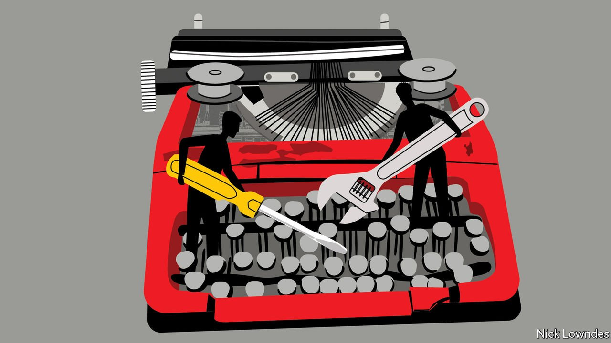

###### Johnson

# Why it’s so hard to fix maddening spelling systems 

##### Those who have mastered the old ones hold all the power 

 

> Apr 10th 2021 

“KEEPING SCHOOLS closed has DEVESTATING effects” on children, America’s Republican Party tweeted from its official account, before hastily deleting the post amid mockery. It’s not just American conservatives who stumble with their spelling even when writing about education. Replying to a parliamentary query, the head of the schools inspectorate in Spain’s Balearic Islands misspelled “recoge” (“to collect”, among other things) as “recoje”.

Writing systems flummox people around the world. These days many in China use the roman alphabet to find and enter the complex Chinese characters on phones and computers, meaning they increasingly cannot write many characters without help. French children fear the dictée, an exercise in which they must write down a passage read aloud by teachers. And many who haven’t mastered the notoriously difficult spelling system of English are publicly humiliated in the ritual of the school spelling bee. Rare is the system that seems elegant, accurate and well-suited to its language. (Korean’s Hangul script is one; it is so beloved that an annual Hangul Day commemorates its invention.) Why aren’t illogical writing systems ever reformed?


Every language’s sounds can be described with the International Phonetic Alphabet (IPA), a collection of symbols that covers the phonemes—basic units of sound—in every known tongue. Any given language uses just a subset of these, usually several dozen or so. Memorise a few squiggles and you can write any word you can say, and say any word that you read, accurately.

But the IPA is a modern invention; prior writing systems arose in chaotic circumstances. For instance, English’s messy spelling came from a confluence of factors. The Latin alphabet was pressed into service for a Germanic language; then the Normans conquered England and brought French spelling customs. As spelling norms were still settling, the English vowel system underwent a major change called the Great Vowel Shift. Scribal errors muddied things further.

An update seems sensible. But a counter-argument made by traditionalists is that, by reflecting etymology, spelling reveals important information. Early English scribes put a “p” into receipt to make clear its connection to Latin’s receptus, even though the letter was silent. That “p” also usefully links the word to receptive and recipient, which “reseet” would not. Interesting as etymology can be, however, it is hardly so crucial as to require painfully counterintuitive spellings unto eternity. Most people do not know that the English words whole and health come from the same Germanic root (roughly meaning “undamaged”) as holy. No one would propose respelling them as “hole” and “holth” to advertise the association.

Other arguments for inertia are more compelling. One is regional variety. English, American, Irish, Scottish and other accents differ widely—no new arrangement could possibly reflect them all. Another is simply that pronunciations are always shifting, albeit gradually. Even a successful reform would only buy time; in two centuries many spellings would look odd again, because their pronunciations will have changed anew.

Modest tweaks might work better than drastic revisions; they need not create a perfect or timeless system, merely one easier than today’s. But even small changes are hard to push through. Some years ago a limited German reform—which included replacing the ß character with “ss” in some contexts—produced a national uproar before it finally settled in. The types of sweeping change needed to make English regular might be socially unacceptable. Where root-and-branch orthographical reform has been implemented it has usually been in autocracies, like Turkey in the 1920s, when Kemal Ataturk replaced the Arabic script with a revised Latin one—or, indeed, Mao Zedong’s simplification of Chinese characters in the 1950s.

A big reason spelling systems never seem to get overhauled in more liberal societies is that those in a position to change the rules have learned the old ones. Put another way, the type of folk who were once good at spelling bees now run the world. Those who would benefit most from reform, meanwhile, hardly have a voice, being either children or illiterate adults whom politicians can safely ignore. For the broad middle who muddle through, technology has made it easier to hide what they don’t know. It seems the illogical systems are here to stay. In which case, politicians had better learn to spell-check their tweets.

