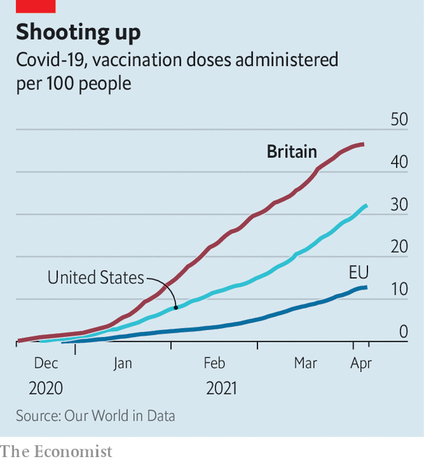

###### Opening shots

# Britain, the covid-19 laboratory 

##### Having led the way with vaccines, the country is now figuring out a new era of the pandemic 

 

> Apr 10th 2021 

BORIS JOHNSON has long promised that Britain’s emergence from lockdown would be “cautious but irreversible”. Announcing the latest easing of restrictions on April 5th, the prime minister looked forward to a pub trip where he would “cautiously but irreversibly” raise a pint of beer to his lips. It was the sort of informality that annoys critics and cheers supporters. 

There are growing numbers of the latter, with more people approving of Mr Johnson’s performance than at any point since the early stages of the pandemic. Nearly half of Britons have received a vaccine, and jabs have been dished out according to a schedule that many deemed absurdly ambitious. As a result of this and a tight lockdown, cases have collapsed from almost 900 per 1m people in January to fewer than 50 (see chart). 


Thus Britain is grappling with something that will soon confront much of the West: how to manage the transition to a world in which covid-19 is less deadly. The government has settled on a dual approach: lifting restrictions slowly (they will not disappear in England until June 21st at the soonest) and introducing a range of measures to reduce transmission, some on a scale matched by few other countries.

 


Of the interventions, vaccine passports have attracted the most attention—and are the farthest from being introduced. The government is experimenting at events that include a club night and the FA Cup final. Although it has ruled out their use in pubs and restaurants when they open again, which will be no earlier than May 17th, it has not ruled out their introduction in such locations later in the year.

There are technical issues to overcome, including how to incorporate negative test results and how to knit together various databases. There are also political issues. Labour and the Liberal Democrats have indicated opposition, as have some Conservatives upset at the slow pace of the return to normality, who are fond of quoting Mr Johnson’s jeremiads against ID cards from his time as a journalist.

Polls show strong public support. And the mere possibility of their introduction serves a purpose. According to Ipsos-MORI, a pollster, just one in 20 people would now turn down a vaccine, compared with one in seven in December. The main reason for this change is the expectation that vaccination will be necessary for travel or other leisure activities.

 


Britons may be enthusiastic about vaccines, but they are less keen on assisting a tracing system that is, in the words of an insider, “leakier than a…sieve”. Nearly a quarter of those who test positive are not reached by tracers or decline to give their details. On average people who are reached pass on four contacts, compared with the 15-20 expected at the start. There are also worries about how many people who have symptoms self-isolate, with Rishi Sunak, the chancellor, stubbornly resisting attempts to increase sick pay.

But more rigorous treatment is now being given to worrying variants. Thanks to Britain’s enormous genetic-sequencing capacity, by the middle of March nearly half of positive PCR results were being examined. The government has deployed what it calls “enhanced contact tracing” for cases of the South African variant, against which the Oxford-AstraZeneca vaccine appears to offer less protection. This involves door-to-door testing and close scrutiny of the transmission chain (ie, what is known simply as “contact tracing” in China or South Korea).

Falling cases provide other opportunities, too. Of England’s 343 local authorities, which tend to have more success finding cases, 59 are involved in a “Local-0” pilot, taking responsibility for tracing all cases in the area. When hospitality venues re-open, all visitors will be required to check in using the national contact-tracing app, rather than just one member in each group, which ought to provide their tracers with many more contact details.

But the biggest change, and where Britain stands out most internationally, is its testing capacity. It carries out around 1m tests a day, roughly the same number as America, which has five times the population. Numbers will soon grow larger still. On April 5th the government announced that everyone in England would have access to twice-weekly lateral-flow tests, which are less likely to pick up the virus than PCR ones but offer a fast turnaround. 

The twice-weekly offer was previously available to medics and families with children at school. According to a scientist advising the government, by early March tests in hospitals had picked up around 30,000 cases among staff who would otherwise have gone into work.

Research published by the Department of Health and Social Care (DHSC) suggests that the false-positive rate of the Innova lateral-flow test, one type in use, is 0.03%. That may seem low, but when the virus is rare and millions of tests are in use, it means that lots of positive results are false. Critics worry that many people will get a nasty shock, and be forced to isolate unnecessarily. To mitigate this, last month the government changed its policy, offering all those who test positive a confirmatory PCR test.

The other worry is that lateral-flow tests pick up fewer genuine cases, thus offering misplaced assurance to some who test negative. But while they are less likely to pick up those with low viral loads than PCR tests, they pick up most infectious people. A pre-print by researchers at the University of Oxford, the DHSC and Public Health England suggests lateral-flow tests would catch 83-89.5% of cases that now lead to detected transmission events.

How effective the experiment will be depends on a huge number of variables, not least uptake. The tests will be available in pharmacies and by delivery free of charge, as many advocates have called for in America. The impact of Britain’s fast vaccine roll-out has been closely studied across the world. Its entry into a new era of the pandemic will be, too. ■

Dig deeper

All our stories relating to the pandemic and the vaccines can be found on our . You can also listen to , our new podcast on the race between injections and infections, and find trackers showing ,  and the virus’s spread across  and .

