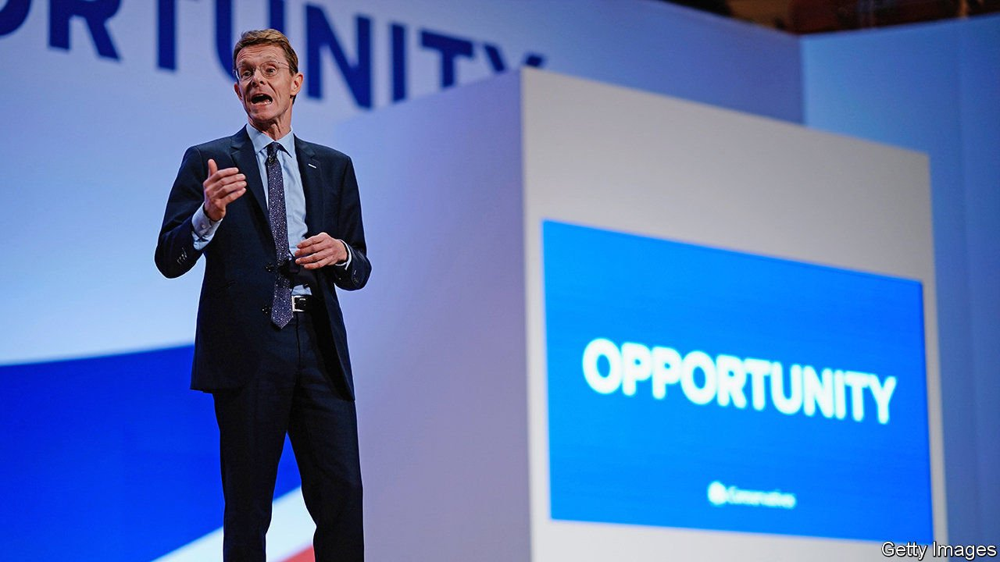
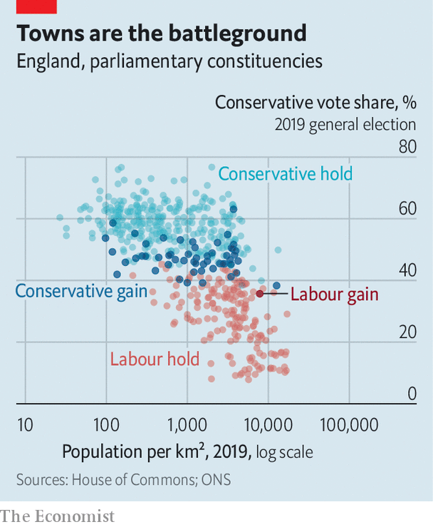

###### Men about town

# Two Conservative mayors have very different ideas about cities 

##### Andy Street and Ben Houchen illustrate deep Tory confusion about urban areas and their needs 

 

> Apr 8th 2021 

FOUR YEARS ago two men were elected as regional mayors, giving them powers over planning, transport and housing—and some of the highest profiles and biggest mandates in British politics. They have a lot in common. Andy Street, the mayor of the West Midlands, and Ben Houchen, the mayor of Tees Valley, in north-east England, were both businessmen before they became politicians. Both are Conservatives in places where the Labour Party has traditionally been strong, and won narrowly. Both face re-election in May. Because they have done their jobs well, both are quite likely to serve another term.

There the similarities end, however. Mr Houchen and Mr Street have wildly different ideas about cities. They disagree about what makes them prosper, and use different words to describe them. One is a proud metropolitan, the other is anti-metropolitan. This is not only a matter of two men’s distinct political styles, or the practical differences between the West Midlands and the Tees Valley. The gap between Mr Street and Mr Houchen illustrates the Conservative Party’s deep confusion about urban areas and their needs.


Mr Street’s agenda for the West Midlands is evident from the diggers and hard-hatted men now making a mess of Birmingham city centre. A tram network known as the Metro, which was partly built before he took office, is being hurried along, with new tracks reaching into suburbs and nearby cities such as Wolverhampton. The aim is to get a car-dominated, frequently traffic-jammed conurbation moving—and, in effect, to make its workforce bigger. Before covid-19 struck, Tom Forth of the Open Data Institute calculated that at peak times only 0.9m people can reach central Birmingham by bus within half an hour. With an extensive tram network, 1.7m could.

In a fractious region, Mr Street has persuaded local politicians to co-operate. Patrick Harley, the leader of Dudley council, says that he was sceptical of the idea of a regional mayor at first. But he reckons that Mr Street has managed to attract investment and focus attention on big issues. Without him, he thinks, Dudley (which is 15km west of central Birmingham) would not now be building a Metro station. In Solihull, another town in the metropolis, council leader Ian Courts agrees: “What’s good for the West Midlands is good, more or less, for Solihull,” he says.

In short, Mr Street is doing the job much as David Cameron expected when his government began to create regional mayors in the early 2010s. The hope was that people like Mr Street, who work with local authorities rather than replacing them, would knock heads together, cajoling local politicians to set aside turf wars and sort out problems affecting all of them. The model was Greater Manchester, a conurbation of ten local authorities that had begun to behave like a united metropolis even before it got a regional mayor.

Small is beautiful

But the Tory party now thinks differently. The general election of 2019 revealed an England divided by population density (see chart), between solidly Labour cities and a uniformly Conservative countryside, with towns as the battleground. Genuflecting to the new political map, Boris Johnson’s government talks about helping “left behind” towns; big-city projects such as the High Speed 2 railway line are seldom mentioned. Ministers sneer not only at the “north London metropolitan liberal elite” (in the words of Priti Patel, the home secretary) but also at Manchester’s equivalent.

 


Although new regional mayors are still being created (West Yorkshire will get one next month) the energy has gone out of the project. A plan for devolving power to cities and regions, expected last year, keeps being delayed. Instead of giving mayors and councillors more control over money raised locally, the Treasury has created pots of cash such as the Towns Fund, for which local authorities are invited to bid. It then hands out the cash according to rules which it says are objective, but happen to favour Conservative constituencies with small majorities. It’s not a model for economic development, but it may be one for consolidating a majority.

These political shifts make Mr Street seem out of step with Westminster, and even a little old-fashioned. He doesn’t mind. “We still talk about metropolises,” he says. His vision of the West Midlands is a region with proud local identities, where everybody thrives as part of an economically integrated region. He argues that Britain can only be pulled out of its covid-induced slump by metropolises like his.

More than 200km north, in the Tees Valley, Mr Houchen is doing his job very differently. Soon after taking office, he promised to demand “a larger slice of the cake”, and has got one. The Treasury has showered money on towns in his patch. In March it announced that it would move hundreds of its civil servants to Darlington. Parts of Teesside will be designated a “freeport” with tax breaks. Even the Labour politician Mr Houchen defeated in 2017, Sue Jeffrey, says that a Conservative mayor has been a boon, given how partisan the distribution of money has become.

Mr Houchen did not simply take advantage of the political shift from big cities to towns—he helped steer it. Before the 2019 general election, he argued that the Conservative Party must become the party of towns, and that the Treasury should move not to a northern city like Leeds or Newcastle but to a town like Darlington (which has a population of 105,000). What, he asked, would be the point of swapping the southern metropolis of London for a northern one? Politics these days, he says, is a matter of “cities versus the regions”, with his manor in the second camp.

Some of the differences between Mr Houchen and Mr Street derive from the places they represent. The West Midlands conurbation is much larger than the Tees Valley, and its traffic far worse. Birmingham is unquestionably its centre; several Tees Valley towns vie for primacy. And demanding money from the central government does not come naturally to West Midlanders. Jon Neale of Jones Lang LaSalle, a property company, says that although the region is as poor as much of the north, it is often not seen that way, partly because its industrial decline was more recent.

Still, the Tees Valley is not merely a collection of towns. Four of its five centres—Hartlepool, Middlesbrough, Redcar and Stockton-on-Tees—almost touch each other. Half of the people who work in Middlesbrough live elsewhere. The Centre for Cities, a think-tank that classifies cities according to their built-up areas rather than their political boundaries, reckons that the “primary urban area” around Middlesbrough contains 475,000 people, making it about the size of Belfast. The Tees Valley is more metropolitan than it thinks.

It suffers from a problem Mr Street is trying to solve in the West Midlands: its inhabitants cannot get around easily. Tony Gatehouse, who runs a community centre in Loftus, a former mining town east of Middlesbrough, says that infrequent buses and low aspirations prevent local people from getting jobs in the larger towns. “There are people here who have never even been to Hartlepool,” he says—a town less than an hour’s drive away.

Mr Gatehouse admires the Tees Valley mayor. The region is doubtless better off with Mr Houchen than it would have been without him. But beyond bromides about his patch finally getting the attention it deserves, he lacks a theory about why it is poor and what to do about it. When the political winds change again, and the money stops flowing from Westminster, that is likely to become a problem. If he survives the election next month, the unfashionable Mr Street is really the one to watch. ■

