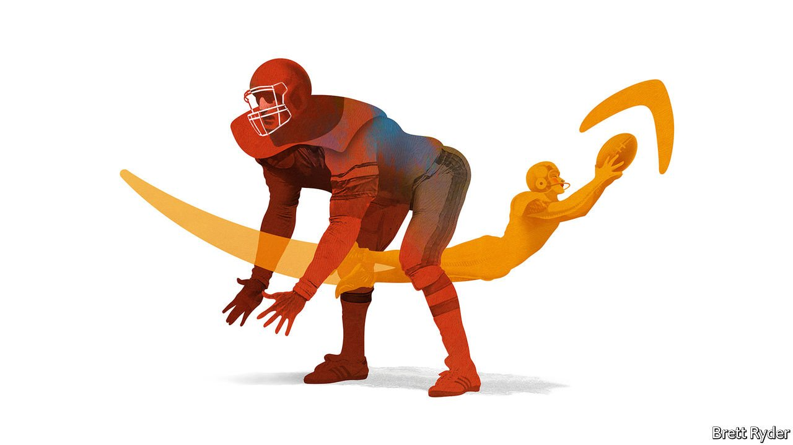

###### Schumpeter

# Brace for the Amazon effect on live sport 

##### The last redoubt of the pay-TV bundle is under siege 

 

> Apr 8th 2021 

IN 1993 FOX, a nascent cable network owned by Rupert Murdoch, an Australian-born tycoon, paid a fortune to scoop the rights to National Football League (NFL) games from under the nose of CBS, a veteran broadcaster. It caused a tremor in American television history. As one CBS reporter put it, “The NFL was ingrained in the walls of CBS like Edward R. Murrow and Walter Cronkite.” With cable, the cost of sports rights took off. So did the cash cow of modern broadcasting—the TV “bundle” of sports and other stuff, most of it barely watchable. At the peak in 2012, almost 90% of American homes subscribed to one pay-TV bundle or another.

Today that share has dwindled to about 65%. That makes the NFL even more important to the fortunes of the TV networks, including Fox and CBS (now merged with Viacom). American football is the most-watched live sport in the country, and sport trumps everything else for TV ratings and ad revenues. At a time when other entertainment is available at a sliver of the price from Netflix and other streaming services, live sport is the only thing left to induce viewers to pay through the nose for pay-TV. 


Now the industry faces another once-in-a-generation upheaval. Last month Amazon, the e-commerce giant, offered about $11bn for the exclusive rights to stream Thursday-night NFL games for a decade on Amazon Prime. That makes the subscription service home to one of the most watched programmes in America. This is not quite 1993 revisited. Fox has willingly surrendered the turf. Amazon’s move was primarily aimed at recruiting Prime customers and promoting e-commerce, rather than ending the pay-TV business as you know it. Still, its incursion into live sports matters, and comes on three fronts. One is Prime. Another is Twitch, its online-gaming platform. The third is Amazon Web Services (AWS), its cloud-computing arm. Combined, they may leave broadcasters looking flat-footed. 

Start with Prime. Unlike TV broadcasters, Amazon does not buy sports rights to flog overpriced subscriptions and advertising. Instead it uses them to attract new Prime subscribers and retain existing ones so that they shop on its platform. According to Omdia, a data-gatherer, Prime’s more than 150m global subscribers spend twice as much on Amazon as non-subscribers. That makes Prime a core part of its retail business. In order to get the best return on its sports investment, it offers not wall-to-wall sports, but selective games likely to lure the highest number of customers, including English Premier League football matches (conveniently played around the Christmas-shopping period). It targets only Amazon’s hottest markets, for instance purchasing rights to show football in Germany and cricket in India. But it does not spend indiscriminately just because, as a $1.7trn tech giant, it can. Instead, thanks to the concurrent decline of pay-TV, it is picking up sports rights as their prices have gone off the boil.

Some Prime subscribers may suspect that using sport to attract them is a bait-and-switch; once they are hooked on free shipping, Amazon can abandon matches. The ten-year NFL deal suggests otherwise. And Amazon has other ways to create an overlap between the sports fan and the shopaholic. That includes targeted ads; online sports, coupled with Amazon’s customer-data trove, are an advertiser’s dream. Another is e-commerce itself. Prime already offers a “buy” function within some sports streams: viewers can buy NFL paraphernalia, for instance. It is only a small business, but the potential is obvious.

Alongside Prime, Amazon offers a parallel way of attracting young, digitally peripatetic types that sports leagues are desperate to reach. Twitch, its e-sports platform whose fans watch and discuss online-gaming tournaments as if they were crosstown derbies, also shows Prime’s NFL matches. The buzz around them suggests a future in which sports programmers can create a chattering class of connected buffs rather than supine couch potatoes.

AWS and its cloud will also shake things up. For a start, it helps Amazon demonstrate that it has the technical ability to stream to mass audiences without crashing. That is of vital importance to leagues and fans alike. The cloud also makes it easier for leagues and clubs to stream directly to consumers, bypassing broadcasters. That will help offset some of their concerns about the end of the TV-rights bonanza. 

Amazon is not the only streaming insurgent. Another platform, DAZN (pronounced Da Zone), is mostly focusing on Europe and Japan. It is backed by Sir Len Blavatnik, a Ukrainian-born music-industry mogul. Last month it outbid Sky, the moneybags of European sport, for rights to stream Italy’s top-flight football matches. Though it is losing pots of cash as it grows, its co-CEO, James Rushton, says advertising revenues, flexible subscriptions and a low-cost structure will eventually enable it to break even. It is studying Twitch to explore the interplay between sports and gaming. One day it may introduce sports betting.

ESPN+ ça change

At present mainstream American broadcasters act as if they still have faith in the old model. Their combined bids in the $110bn NFL auction dwarfed Amazon’s. Fox has not bothered to start a sports-streaming service. Disney, a big entertainment conglomerate, is unlikely to let ESPN, its lucrative sports channel, be cannibalised by ESPN+, its sports-streaming service. They still believe that for most fans, TV muscle memory will win out over the internet.

But as retailers know, Amazon does not just disrupt industries with new technologies. It does so through relentless customer service. As the Ringer, a sports website, once wrote, Fox sought the NFL rights in 1993 partly because it thought TV football had, in the words of one executive, become “boring as shit”. These days, boredom is not the problem as much as eye-watering prices that bundle-bearing broadcasters inflict on their customers. No wonder young sports fans are turned off. No surprise TVs are, too. ■

