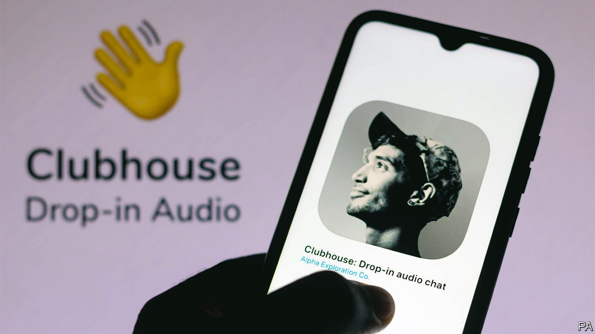

###### Hype club

# Clubhouse may fade. Group voice chat is here to stay 

##### What Silicon Valley’s latest hype cycle says about the future of social media 

 

> Apr 10th 2021 

ONE OF SILICON VALLEY’S most successful inventions is hype. It usually disappoints. In 2015 live-streaming from smartphones became all the rage. But Meerkat, an app which pioneered it, shut down the following year. On April 1st Periscope, its more successful rival, did too (no joke). Will Clubhouse, a buzzy app that hosts live audio gabfests, suffer the same fate?

Launched at the start of the pandemic last March, Clubhouse quickly became Silicon Valley’s most-talked-about app and a favourite stage for rock-star entrepreneurs. Elon Musk offered his views on colonising Mars and rewiring the brain to thousands of listeners. Marc Andreessen and Ben Horowitz, co-founders of a big venture-capital firm, regularly hold forth. More mortal Valleyites discuss everything from the future of San Francisco to the testy relations between tech and the media. This year the Clubhouse craze went global, offering a venue for frank conversations in places from Saudi Arabia to South Korea.


Amid the buzz, problems are emerging. You still need an invitation from an existing user, but these are easy to come by. As newcomers flood the app, the quality of debate has dropped. Without systematic moderation, chats entitled “How to discipline and train your women” or worse are popping up. Despite lower barriers to entry, the app’s downloads were down to 2.7m in March, from 9.6m in February, according to Sensor Tower, a data provider.

On the business side, Clubhouse has yet to work out how to make money (ideas include tipping and membership fees for virtual clubs). And, predictably, big tech firms are jumping on the bandwagon. Twitter is testing a similar feature (and is reported to have considered buying Clubhouse). Facebook is expected to launch a clone soon. On March 30th Spotify acquired Locker Room, a sports-themed group-chat app. Even LinkedIn and Slack, two business-oriented services, are following suit.

It is too early to count Clubhouse out. It has name recognition and could remain the go-to place for virtual talk shows, as Twitter is for instant opinions. It is run by Paul Davison, an experienced social-media entrepreneur. It has plenty of cash: in December it raised $100m, much of it from Andreessen Horowitz. It is reportedly seeking new funding at a valuation of $4bn. And it has yet to release a version of its app for Android, Google’s popular mobile operating system. Optimists point to Snapchat, a social network beloved of teenagers, which has found a lucrative niche in a market dominated by Facebook.

This suggests that even if Clubhouse looks Periscopic in a year’s time, group chats are likely to remain a feature of social media after the pandemic recedes. Meerkat and Periscope may be dead, but live streaming is alive and well—albeit as a service within larger social-media platforms. Tech hype may be grating, but it serves a purpose. Buzz incites consumers to try new things, venture capitalists to put up the cash and entrepreneurs to experiment—even if, more often than not, pioneers wind up in the digital dustbin. ■

