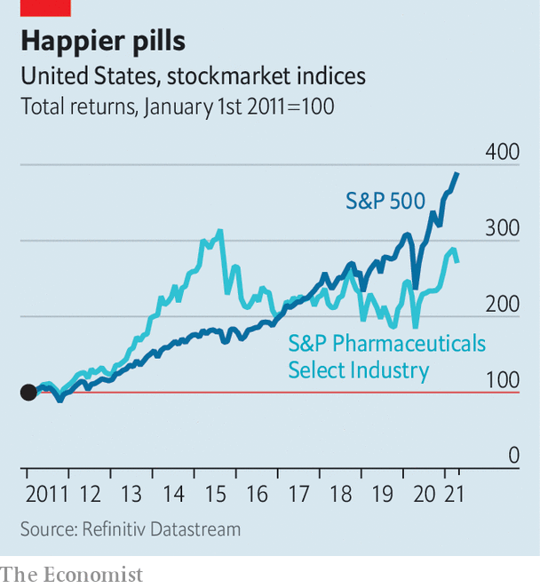

###### Reformulated

# Pfizer’s boss thinks covid-19 is reshaping Big Pharma for the better 

##### The industry is becoming nimbler and more innovative 

 

> Apr 10th 2021 

“THE IMPOSSIBLE can many times become possible,” reflects Albert Bourla, boss of Pfizer. He is talking about the giant American drugmaker’s speedy development (with BioNTech of Germany) of a vaccine against covid-19. The sentiment also applies to the turnaround in the fortunes of the pharmaceutical industry.

Before the pandemic Big Pharma was in big trouble. It was widely criticised for investing more in marketing than in research, for pursuing “me too” drugs over novel therapies, and for alleged price-gouging. When Gallup, a pollster, asked Americans in 2019 to rank two dozen big industries by favourability, the drugs business came in last. That year its bosses were subjected to a Big Tobacco-style bipartisan hazing in Congress, which threatened price controls. Concerns over diminishing research gains, and returns, weighed on drugmakers’ share prices (see chart).


At first, the pandemic looked like another blow. Supply chains for essentials such as precursor chemicals were disrupted. As hospitals focused on covid-19, lucrative elective treatments were postponed. So were clinical trials of new medicines, on which future profits depend. Then something happened. As economies gradually reopened last year, drug sales began to recover. Several firms have, like Pfizer, come up with effective vaccines against covid-19. Pfizer reckons the sales of its jab will surpass $15bn in 2021. The firm reckons it could add more than $4bn to its adjusted profits before tax. Investors are becoming more bullish on the sector.

 


The reasons for optimism extend beyond the covid-19 jab. Another pharma boss recently declared to a private audience that the pandemic was “a significant inflection point for the industry”. Unlikely as it may have seemed a year ago, a nimbler, more innovative business is emerging from adversity.

The breathless race against covid-19 led pharma to “break all of the rules”, says Tim van Biesen of Bain, a consultancy. This prompted CEOs to ask why they weren’t more agile in their day-to-day operations. John Reed, head of research and development (R&amp;D) at Sanofi, a French giant, says the pandemic has pushed decision-making lower down the corporate ladder, helping his firm move with a greater sense of urgency. “We got trial concepts together in three or four days that took three or four months in the past, ” he marvels.

Sam Glick of Oliver Wyman, a consultancy, notes that new patient enrolment for clinical trials, which plunged by nearly 80% amid the pandemic, has rebounded as firms have embraced digital tools such as remote monitoring, electronic patient-screening and tele-consultations. David Ricks, who runs Eli Lilly, another big American drugmaker, has said that virtual trials could prove faster and better, as well as bringing in harder-to-reach populations, for instance in rural areas. Andrew Badley of the Mayo Clinic, a leading American hospital chain, argues that drugmakers’ boffins are for the first time making good use of unstructured data such as clinicians’ notes. Digitisation allowed Pfizer to keep all of its trials on track in 2020. “We wouldn’t have dared to test these things before the pandemic but they passed with flying colours,” Mr Bourla says. They are here to stay.

Pharmaceutical sales reps, whom the pandemic has deprived of the opportunity to put on “educational” junkets for doctors, are also going digital. Eli Lilly’s boss has estimated that his firm’s virtual contacts rose more than ten-fold in 2020 compared with a year earlier. He reckons they, too, will be maintained, as they may allow the firm to “reach those physicians who wouldn’t see our sales representatives”. Mr Bourla agrees, reporting that “doctors like it”. McKinsey Global Institute (MGI), the consultancy’s in-house think-tank, calculates that the shift to digital sales could raise industry-wide productivity by a quarter, since it means a smaller staff and leaner budgets in marketing and sales departments, which account for nearly 40% of drugmakers’ operating costs.

Big Pharma’s sclerotic innovation model is also being shaken up. In the past there were “way fewer targets” for drug firms to pursue, says Mr Bourla, so it made sense to bet big on a few blockbusters. Now, he observes, firms must choose among hundreds of possibilities. This “explosion of new platforms and drug candidates will result in much more collaboration” of the Pfizer-BioNTech sort, predicts David Risinger of Morgan Stanley, an investment bank. Drugmakers are obsessed with guarding intellectual property but many industry watchers, including Mr van Biesen of Bain, have long argued that they should embrace more open-source innovation. A flurry of recent collaborations suggests that they may at last be listening.

Perhaps the most surprising reason for optimism about Big Pharma’s prospects arises from its burnished image. Many Americans had never heard of Pfizer and those that did probably thought of it as money-grubbing. Now the company is hailed by ordinary people as a life-saving innovator. “Big Science is good, and Big Pharma now has a seat firmly at the table and has a chance to be ‘good’ again,” thinks David Frey of KPMG, a consultancy. A recent Harris Poll found that public approval of the industry has shot up from around 30% last year to over 60%.

Will drugmakers seize the moment? Mr Bourla says that Pfizer does not support the status quo on drug prices in America. These are high by global standards, and contribute the lion’s share of profits for the global drugs business. He goes further, insisting that Pfizer is “willing to contribute financially” to reforms that give “access for all”, so long as insurers and government chip in too. If he can persuade his fellow pharma bosses to support this new social contract, it could be an even bigger feat than those incredible covid-19 shots. ■

Dig deeper

All our stories relating to the pandemic and the vaccines can be found on our . You can also listen to , our new podcast on the race between injections and infections, and find trackers showing ,  and the virus’s spread across  and .

