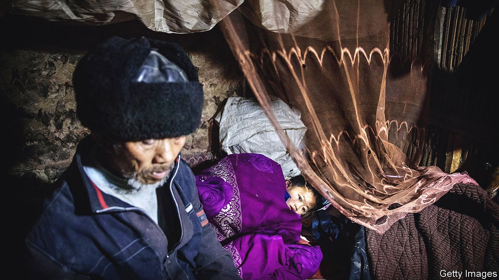
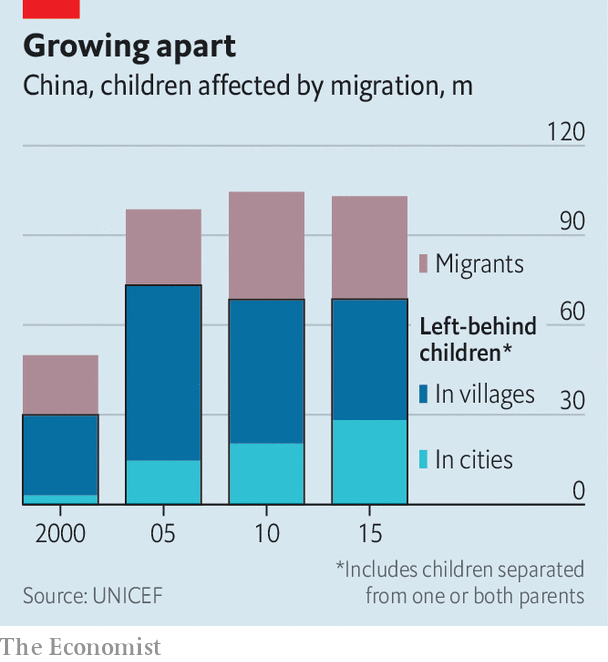
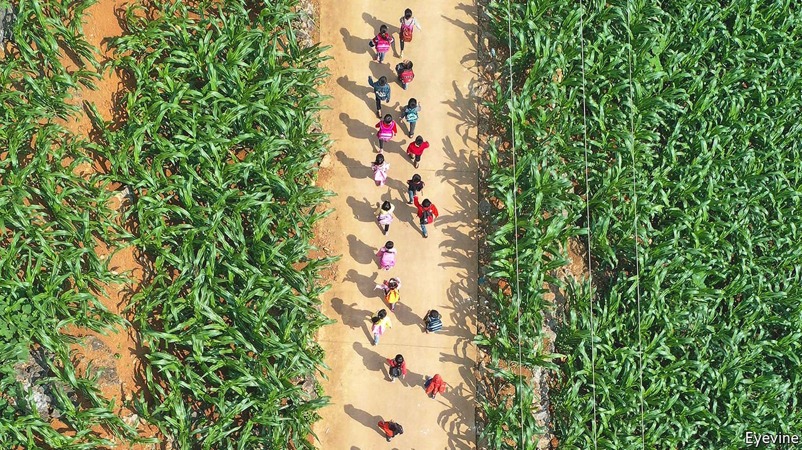

###### In grandpa’s charge

# The plight of China’s “left-behind” children 

##### Some 31m live apart from both parents, who have moved for work in cities 

 

> Apr 8th 2021 

EVERY SPRING, the Qingming festival brings families together for displays of respect and sorrow at the burial sites of their deceased relatives. Some travel a long way to reunite over the three-day holiday, which ended on April 5th. Among them this year were the Zhaos of Leyun, a village in the lush Daba mountains of Sichuan province in the south-west. For migrant parents like them, there are living relationships that cause quiet grief, too. When their daughter, Lin, was just one month old the couple left her with her grandmother to allow them to return to their factory jobs on the coast. That was six years ago. Since then, Lin has spent only about 30 days with her parents. To her, this holiday’s get-together was with virtual strangers.

There are about 31m people in China like Lin—children who have been left behind in their home towns or villages, usually in the care of relatives, while both of their parents work elsewhere. The largest wave of internal migration in history—involving about 300m people who have moved to cities over the past four decades—has battered many other families, too. In 2015 Unicef, the UN agency for children, estimated that more than one in three children in China, or close to 100m, had experienced the prolonged absence of at least one parent. In nine out of ten cases, the main reason was migration.


Another important cause has been China’s rigid system of household registration, known as hukou. Someone without hukou in the city where he or she lives is frequently denied access to local government-funded services, such as health care and schooling. Migrants therefore often have little choice but to leave children behind in their registered place of residence. Across China, many lives are racked by the pain this causes. At first Lin pined for her parents, says the girl’s 57-year-old grandmother, a bean farmer. Then her pleas grew fainter, until one day they stopped. Now Lin refuses to speak to her parents when they ring home. She shrinks from their attempts to hug her during their rare, fleeting visits back to Leyun.

In recent years concern has grown in China about the plight of such children. State media have reported on their sufferings, including the torment of those abandoned with no one to look after them (in 2010 there were at least 2m without carers). About six years ago huge public debate was triggered by two such stories. One involved four siblings in the south who killed themselves with pesticide. They had been left behind with no guardian. The second was about another two left-behind siblings in the same region. They were murdered by two relatives who had been raping one of the children, a disabled 15-year-old girl.

In February 2016 the government responded to the outcry by publishing guidelines for the protection of left-behind children. These called for their numbers to be reduced “significantly” by 2020. They advised local authorities to monitor guardianship arrangements—it is illegal to let minors live alone. They also urged hospitals and schools to do a better job of reporting cases of suspected harm. In 2017 a new rule required village officials to register all left-behind children. Another, in May 2020, made failure to report neglect or abuse a possible crime. According to official figures, in 2018 local governments paired 76,000 unsupervised children with guardians, and helped the return to school of 160,000 left-behind children who had dropped out. Since 2017 the central government has kept a database of left-behind and vulnerable children, based on the records supplied by villages.

Officials have focused their attention on a subset of those affected. The guidelines in 2016 count as left-behind only those who are under 16 and have two parents working elsewhere. That year the government said there were just 9m children who could be classified as left-behind according to this definition. By 2018 the tally had fallen to under 7m. But children who have been separated from only one parent are often harmed, too. And it can matter which parent has left them. A Chinese study published in 2017 found that school drop-out rates were lower among rural children living with only a mother rather than only a father (rates were highest when both parents were away). In 2019 a paper in Frontiers in Psychology, a peer-reviewed journal, concluded that the presence of at least one parent at home, especially a mother, lessened the risk that a left-behind child would self-harm as a teen.

 


Rural parents often believe their presence is most vital when a child starts school. So they are more inclined to work elsewhere before their children reach that age, says Lu Shuang of the University of Hong Kong. More than a quarter of children in China under the age of two are cared for by people who are not their mothers, reports Unicef. The Chinese study of 2017 found that, as a proportion of all left-behind children, the number of under-fives had grown from 30% in 2000 to 40% in 2015. Many are never breastfed, depriving them of lifelong health benefits. That was so for Lin.

As they grow older, children face other traumas. Since 2015 surveys by On the Road to School, an NGO based in Beijing, have revealed consistently high levels of depression among left-behind children. In 2019 nine in ten of them said they had suffered from emotional abuse, and six in ten reported physical harm. Close to one in three had been sexually abused.

Such abuse often goes undetected. “The separation from parents means that children do not have the impulse to open up to them,” says Wan Miaoyan, a lawyer in Chengdu who has worked on cases related to such crime. She recalls one in which relatives discovered what had happened only when they came across a letter that the victim had written to herself. In it she described being raped by a teacher. A child therapist says current systems of support rely on people from the same village who may themselves be abusers, rather than on professional outsiders.

Those systems are thinly stretched. Provinces with high numbers of left-behind children—Sichuan, a populous one, tops the ranking—tend to be among the poorest, with scant resources to devote to the task of protecting the vulnerable. But local governments are making an effort. Keep the Children Company, an official scheme in Sichuan, has involved setting up “children’s homes” (a space in the village where they can play, read books and receive help with their homework), and appointing “mothers” to whom children can turn for emotional support. The central government has helped. Since 2010 it has trained people in 660,000 villages as “child-welfare directors”, that is, to perform social work. It has also allowed the use of poverty-alleviation funds for spending on children’s welfare.

In 2015 Lin’s village of Leyun was among the first to introduce a Keep the Children Company project. Liu Chunhua, an energetic kindergarten teacher, was chosen to lead it. In Chengdu, the provincial capital, she learnt how to broach sex and mental health with the village’s 20 children. Her efforts have paid off. A shy teen in Leyun was bewildered when she got her first period. A friend, also puzzled, prodded her to speak to “Mama Liu”. The teacher explained to the girl what was happening to her body and taught her how to wear pads. Village elders often gossip unkindly about the parents of left-behind children. Ms Liu has put a stop to that. She knows the harm it can do. Villagers had once taunted her own left-behind daughter with the false notion that Ms Liu only came back to see her eldest son. Her daughter became so dejected that Ms Liu quit her factory job and moved back to the village.

 


But keeping tabs on children is getting harder. Most villages once had a school, where teachers could check that students were not hurt, sick or distressed. In the past two decades, however, over 360,000 underused village schools have been closed to save money. Leyun’s hangs on by a thread. A decade ago it had 70 pupils. Now it has only two, in the youngest year-groups. Other children go to a school in Pujia, a town an hour’s walk down the mountain. They usually return to the village at weekends. Lin attends a kindergarten there. Asked if she gets good marks, Lin says she is slapped on the hand fewer times than her classmates.

One glimmer of hope is that growing numbers of migrants are able to find jobs closer to their native villages, as factories move inland. Some parents from Leyun are settling with their children in nearby towns. And the covid-19 pandemic is a cause of unexpected joy for some: it has forced many migrant workers to return to their original homes. Half of Leyun’s youngsters are currently living with both of their parents. That is “unheard of”, says Ms Liu, the teacher.

Many of these parents were also once left-behind children. But rural conditions have improved immensely since those days. Zhu Yidan, a 25-year-old volunteer teacher who grew up as a left-behind child in Sichuan, says that when she was growing up people had to walk cross-country to reach villages. Now there are paved roads and children have enough food, clothing and toys. Parents can video-chat with them daily and buy presents for them online.

But a new problem is emerging. Increasing numbers of children are being left in urban areas by one or both parents who move away for work. There were about 28m such children in 2015, nearly three times as many as in 2000. Those who follow their parents from village to city have better diets and mental health than those who remain in the countryside, studies show. But those who are subsequently left behind in cities suffer higher rates of violence than those who stay in villages. Ms Wan, the lawyer, says there is “a debt owed by this country to its left-behind children”. The account is far from settled. ■

