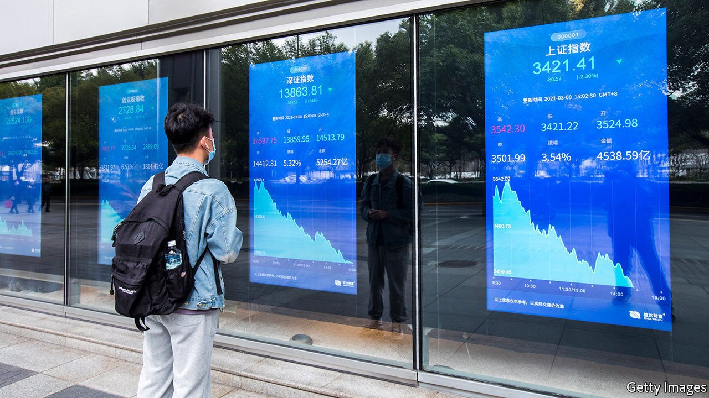
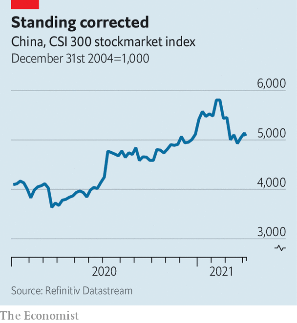

###### A new tack

# As China’s stockmarket corrects, regulators try doing less 

##### So far, they have avoided heavy-handed intervention 

 

> Apr 8th 2021 

THE JOB of China’s top securities cop is a precarious one. Its fortunes are closely linked with the vagaries of the country’s stockmarket. A crash can mean the sack or worse for the man in charge. Xiao Gang, who headed the China Securities Regulatory Commission (CSRC) during the spectacular boom and bust of 2015, was fired and has become an object of scorn among investors. Liu Shiyu, who took over from Mr Xiao and saw China rank among the world’s worst-performing markets in 2018, later faced corruption charges (which might have been overlooked had the market done better). As China’s CSI 300 index of blue-chip stocks tumbled by 14% in late February and early March this year, attention turned to their successor, Yi Huiman. 

Having overseen a steady rise in share prices—often called a “healthy bull” market, in contrast to a speculative rally—since he took over in January 2019, Mr Yi has been held in high regard. Between then and early February this year the CSI 300 rose by more than 90%, and reached a 14-year high on February 10th. The unexpected correction that kicked off on February 22nd was the sharpest in years and revived fears of a collapse similar to those in 2007 and 2015. Many of China’s largest stocks, such as Kweichow Moutai, a liquor-maker, shed a quarter of their market value.


Striking a balance between exuberance and rout is no simple task for technocrats in Beijing. The stockmarket is dominated by retail investors who are highly sensitive to political suggestions on the direction of trading. The practice of pledging shares as collateral to brokers also leads to sudden drops in share prices when margin calls go unmet and collateral is liquidated. Mr Xiao ignored growing leverage and trumpeted exuberance. As the crash began in June 2015 he indicated the rally would go on. Instead the CSI 300 fell by nearly 40% in a matter of months. Mr Liu fared no better. In 2017 he waged an attack on market manipulators, whom he called “giant alligators”. The crackdown, along with poor economic sentiment, sapped risk appetite.

 


Mr Yi faces a more complex correction. This time fundamentals play a role. China’s markets absorbed tens of billions of dollars in foreign funds in 2020 as the country recovered quickly from the pandemic while others continued to ail. With America’s vaccine roll-out now picking up and the outlook in other markets brightening, fewer foreign funds are seeking out China as a haven, says Paul Sandhu of BNP Paribas Asset Management. Moreover, China’s central bank is tightening monetary policy—the first in a big economy to do so—in the wake of the recovery. This is draining funds from the market and dampening sentiment. A  has also hurt the market value of firms traded on the STAR Market, China’s version of Nasdaq.

Much of this turmoil “came and went without a peep from the exchanges or the stockmarket regulator”, a change in tack from past crises, noted Enodo Economics, a research firm. As the market stabilised in late March, Mr Yi was quoted by Chinese media as saying that there was little to worry about as long as leverage was not excessive. As the state media explained, Mr Yi’s philosophy is one of “non-interference” and “avoiding unnecessary administrative intervention”. Regulators appear “very comfortable at this point”, says a manager of a Chinese hedge fund. “They have clearly learned from 2015.”

Whether Mr Yi can keep his hand out of the market has yet to be seen. The government is sensitive to market swings during important anniversaries. A “national team” of powerful state investors often props up share prices on certain dates and in the event of market collapse. Prices plummeted unabated during China’s National People’s Congress in early March until the end of the event, when, many speculate, state forces stepped in to cushion the fall (though this is contested). July 1st marks the Communist Party’s 100th anniversary. Whatever the economic outlook, few investors are expecting a market rout in the weeks before that hallowed date. ■

