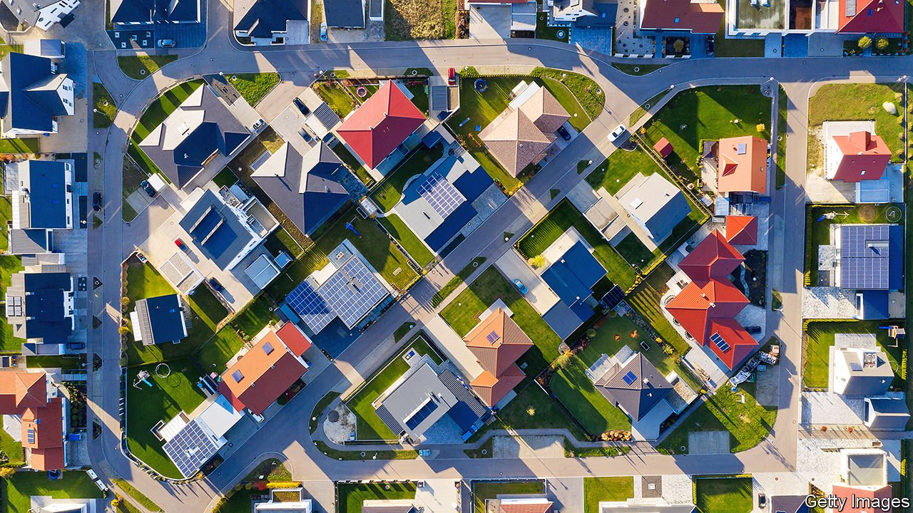
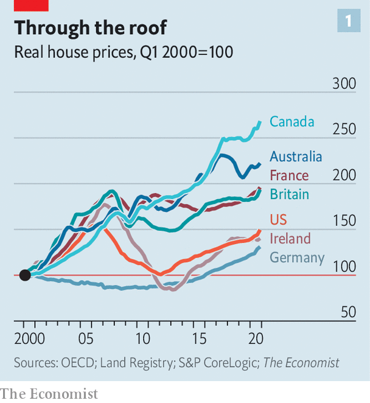
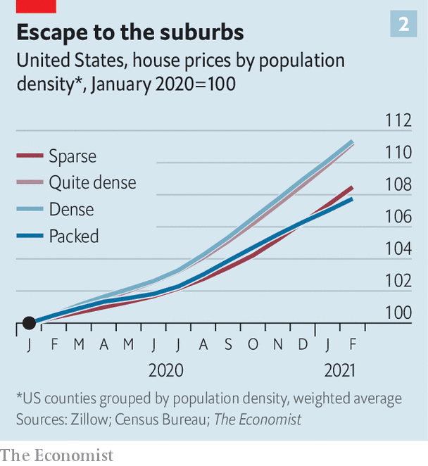

###### The race for space

# House prices in the rich world are booming 

##### Unusually, suburbs not cities are feeling the heat 

 

> Apr 8th 2021 

ON A SUNNY afternoon in Kingsmere, a new suburb of Bicester, a town 50 miles (80km) north-west of London, the streets are abuzz with people strolling and children playing. In ten years 1,600 homes have been built on the site, and another 900 are soon to follow. In the sales office for Bovis Homes, Flip Baglee says she has “never known it to be so busy”. Sentiment in Rhinebeck, a village 80 miles north of New York City, is similarly buoyant. Many of the properties advertised in the window of Gary DiMauro Real Estate—from mansions to cottages—are already taken.

Kingsmere and Rhinebeck are not the only places warming up.  rose by 11% in the year to January, the fastest pace for 15 years.  increased by 8% last year, and in Germany by 9%. The pattern is seen in much of the rich world (see chart 1). Across the 25 countries tracked by The Economist, real house prices have risen by an average of 5% in the latest 12-month period.


In many countries, rises have been rapid enough to attract the attention of politicians and central bankers. In a break with the pattern of the past decade it is prices in less populated, but still commutable, places, rather than city centres, that are rising most. Covid-19 seems to have set off a quest for space that could outlast the pandemic.

 


At first glance, the robustness of house prices in the face of the economic turmoil inflicted by covid-19 might seem baffling: property prices typically move in tandem with the economy. But furlough schemes and fiscal stimulus have limited distressed sales this time. Interest rates are ultra-low: in America those on 30-year mortgages are 1.5 percentage points below their level in 2010. Lockdowns and the reduced opportunity to spend mean that those who have kept their jobs have stashed away cash. Lucian Cook of Savills, a property consultancy in Britain, remarks that home values are being “driven by the haves rather than the have-nots”. In America, 14% of all mortgage applications made in February were for second homes, twice the share in April last year.

As covid-19 spread and many countries locked down, people’s homes also became their offices, schools, gyms and bakeries. Many therefore spent more on their properties. Revenues for Home Depot, America’s largest DIY store, rose by 20% last year. In Britain permissions granted for home improvements, such as extensions, increased by a third in 2020 compared with the average in 2016-19, reckons Barbour ABI, a market-research firm. 

Other people sought new places to live. Homes in America have taken an average of 47 days to sell since May, compared with 59 days in the previous year. In Britain a temporary holiday on stamp duty (a housing-transaction tax) caused the volume of sales to rise in the final quarter of 2020 to a 14-year high.

For those wanting more space the best solution has been to move out of city centres. Prices per square foot in London, for instance, are 40% higher than in surrounding counties. House prices in less densely populated, but still commutable, areas of Britain have risen faster over the past year than in more populous ones. A similar pattern is also evident in America (see chart 2).

 


That bucks a trend of the past decade, when megacities such as London and New York surged ahead of quieter locations—a reversal that Zillow, an American property-listings firm, calls the “great reshuffling”. House prices outside Germany’s seven biggest cities rose by 11% last year, compared with 6% within them. Prices in Sydney’s northern beaches, within commuting range of the city, are up by 10%.

By contrast, house prices in central London and Sydney rose by just 4% and 3% last year, respectively; those in Manhattan fell by 4%. Rental markets are cooling too. Rents for flats in Sydney fell by 5% last year. Those in Melbourne, which endured a 111-day lockdown last year, fell by 8%. Figures from Zillow suggest that rents fell by 9% in New York City and 15% in Manhattan in particular.

The pandemic has disrupted some of the usual flows into cities. In the years before covid-19, London lost residents to the rest of Britain. But the outflows were made up for by people coming in from abroad. The pandemic, and perhaps Brexit, seem likely to have reduced the inflow. One estimate suggests that London’s resident population may have declined by 8% in 2020. Australia’s borders have been shut to non-residents since March 2020. Recent graduates, faced with the prospect of working from a shared home, may still be living with their parents.

Outflows from cities have risen, too. A study by the Federal Reserve Bank of Cleveland finds that migration out of cities in America doubled to 56,000 people per month from March 2020 compared with the 2017-19 average.

Some of the flows to cities will pick up as the pandemic ends. Students and international migrants will return in droves. Some investors are therefore betting big on big cities. A new development in Manhattan selling large flats for $12m offers the “premier answer to post-pandemic living”. AXA Investment Managers, a firm that owns properties in 15 countries, has snapped up 1,233 flats in the heart of London, Britain’s largest residential site.

Yet the allure of less-dense places seems likely to persist. Government advice to work from home, where in place, could be gone by the summer, but remote working may be here to stay. According to a survey of 20,000 employers around the world by Manpower, a recruitment firm, two-fifths of bosses plan to permit their employees to work from home at least some of the time. People might be willing to put up with longer commuting times in return for more living space or lower housing costs, if they are commuting less often. Suburban property prices would then inch towards those in the city.

The fate of overall house-price growth could well rest with policymakers. Emergency support for homebuyers and homeowners will be withdrawn as the pandemic draws to a close: in Britain, tax holidays are due to end later in the year. Other countries may look to take the heat out of housing markets. The government in New Zealand, where prices are rising at an annual rate of 22%, has taken steps to dampen speculation. The governor of the Bank of Canada has worried about “excess exuberance”, and plans to watch the housing market closely. A fear of jeopardising the economic recovery could mean that policymakers tread gently for now. That would give the race for space more room to run. ■

A version of this article was published online on April 3rd 2021

