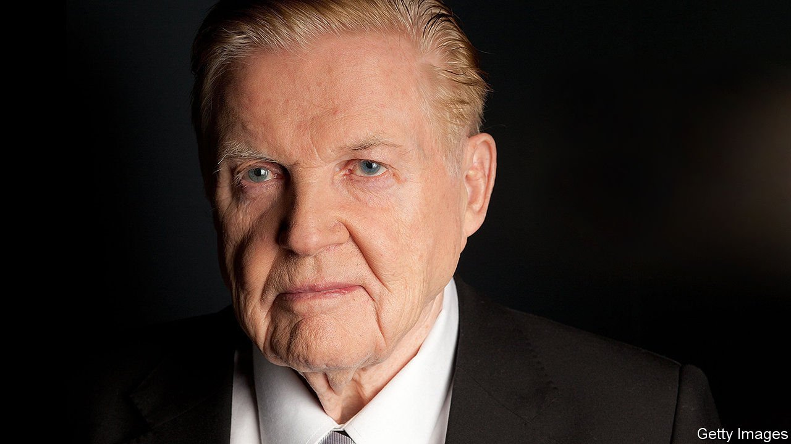

###### Obituary

# Robert Mundell, an influential international economist, has died 

##### He was considered the intellectual father of the euro 

 

> Apr 8th 2021 

AFTER ACCEPTING the Nobel prize in economics in 1999, Robert Mundell crooned “My Way”, the song by Frank Sinatra, to guests at the banquet. His way, as he put it, involved falling in love with economic theory, obtaining a PhD at the Massachusetts Institute of Technology, and spending time in London writing his thesis. It also involved crafting foundational ideas in the field of international economics, including one that earned him the title of a father of the euro. He died on April 4th at the age of 88.

Mr Mundell attributed some of his interest in international economics to Canada, the country of his birth. In the 1950s it had, unusually, a floating not a fixed exchange rate. It also contended with large capital flows to and from America. What became known as the Mundell-Fleming model sought to explain the implications of Canada’s setup.


Foreign investors seek at least the prevailing global rate of return. If the central bank raises interest rates, investors rush in, threatening any currency peg. When exchange rates are fixed and capital is mobile, monetary policy can therefore only reflect global conditions. Canada’s floating rate, however, gave it monetary-policy autonomy. Students today learn about the “trilemma”: countries cannot have mobile capital, control of monetary policy and a currency peg. They must pick two of the three.

If capital is mobile, then choosing a fixed exchange rate means the job of keeping the economy stable falls to fiscal policy alone. But Mr Mundell also showed that if countries choose floating rates, as Canada had, then fiscal stimulus can become less effective. It strengthens the currency, crimps exports and leaves overall demand unchanged.

As fixed exchange rates fell out of favour Mr Mundell’s analysis looked prescient. Yet some countries remained committed to pegs. Partly inspired by deeper European integration, in 1961 he set out the conditions in which an “optimum” currency area could thrive.

A currency union lowers the costs of trade. But it removes a cushion—the exchange rate—that would otherwise protect its members against localised blows. Mr Mundell showed that this need not be a problem if, say, workers moved from depressed areas to thriving ones. In 2006 he noted that he was first called a father of the euro by the currency’s sceptics. But his theory could be used to show that the euro zone lacked the labour mobility needed to be an optimum currency area. Still, he backed the project, noting that the European Commission sends money to depressed regions, reducing the need for emigration.

Mr Mundell also helped found supply-side economics, which advocated tax cuts to encourage investment, and gained favour in the 1980s. If the cuts boosted activity enough, they might even raise revenue (an idea that is debated within the profession). After he won the Nobel, Mr Mundell said he met heads of state as often as finance ministers. “When I say something, people listen. Maybe they shouldn’t, but they do.”

