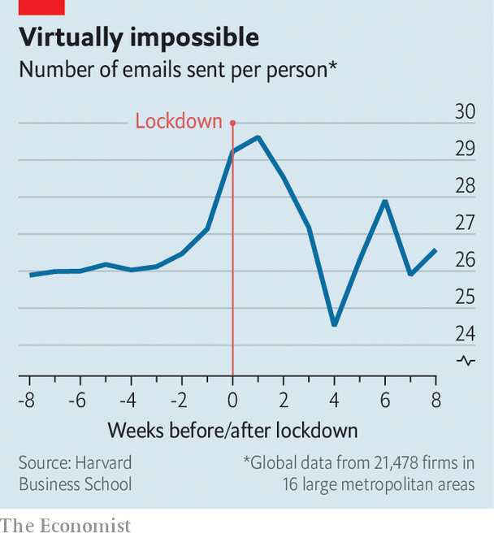
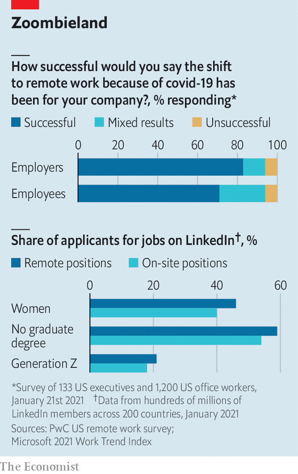

###### Virtual insanity

# Love them or hate them, virtual meetings are here to stay 

##### New research shows the costs and benefits of remote work 

 

> Apr 10th 2021 

GEORGINA IS IN no hurry to get back to the office. The 37-year-old, who works in financial services in Geneva, has been working from home for most of the past year. Doing so allowed her to skip her commute, wear tracksuit bottoms and avoid awkward conversations about her pregnancy. She is now on maternity leave but her colleagues are trickling back into the office. Meetings all still take place via Zoom; her colleagues dial in individually from their desks so those working from home do not feel excluded. But Georgina worries that, as restrictions ease, people will rush back to their pre-pandemic ways and that working from home will once again be the exception.

Videoconferencing platforms, such as Microsoft Teams and Zoom (now so ubiquitous it has become a verb), made remote work possible as covid-19 spread and countries locked down. Staff once needed permission to work from home; they now need it to go to the office. All kinds of work that once took place in person—from yoga classes to medical appointments—have moved online. The daily number of participants in Zoom meetings jumped from around 10m at most at the end of December 2019 to more than 300m four months later.


The shift has been good for the planet. Videoconferencing uses less than a tenth the energy required for in-person meetings once travel and equipment are accounted for. The benefits for people, in terms of their mental health and relationships with colleagues, are less clear. Some have come to enjoy interacting through screens. Others are exhausted by their colleagues’ inability to master the mute button. However people feel, virtual work is here to stay, says Tsedal Neeley of Harvard Business School. The trick, she argues, will be keeping the good parts and finding workarounds for the bad.

A year into the pandemic, many are suffering from Zoom fatigue. New research from Stanford University has laid out the science behind it. The first problem with video calls is that they force people to stare at their colleagues in close-up. Talk to someone on a laptop using the default configuration on Zoom and their face appears as big as it would be if the two of you were standing 50cm apart. At such proximity the brain is hard-wired to expect either a punch or a kiss. Endless eye contact makes the experience more stressful still. People rarely lock eyes for long during meetings in person. On video calls participants peer into their screens constantly and then wonder why they feel as though everyone is staring at them. Jeremy Bailenson, director of Stanford University’s Virtual Human Interaction Lab and the study’s lead author, compares the experience to cramming co-workers into a lift and forbidding them to avert their gazes.

Poor connection

Videoconferencing also eliminates important non-verbal communication. People nod dramatically in an effort to send non-verbal cues that in face-to-face meetings they send naturally. That is tiring. In real life you can see your colleagues fidgeting as your presentation drags on. That is less obvious online. People speak 15% louder on video calls than they do in person, which becomes exhausting. Delays in transmission, common when internet connections are spotty, make communication harder still. A gap of just 1.2 seconds makes participants seem less attentive, friendly and conscientious.

Building trust without these social cues is difficult, says Paul Fisher. Mr Fisher, who teaches negotiation at the Saïd Business School at Oxford University, has recently started a module on virtual communication. Every late response to an email and glance to the side on a video call breeds suspicion. Virtual negotiations are “more likely to reach an impasse”, Mr Fisher says, as negotiators struggle to understand each other’s emotions and grow frustrated.

The constant image of yourself on such calls is also trying. In June 2020 Gabrielle Pfund at Washington University surveyed women—narrowing her search by sex because women often report more issues around body image than men—and found respondents reported spending on average 40% of their time on video calls looking at their own face. Endlessly scrutinising your wrinkles and puffy eyes is not good for your self-esteem.

Virtual meetings have proved a mixed blessing for women in other ways. In one survey of women working in engineering and technology, almost a third of respondents said they were talked over, interrupted or ignored more frequently during such conferences than they were in person. But virtual meetings also free women from tiresome judgments. Bobbi, who is high up at a big consultancy, describes herself as “petite”. She does not miss being sized up in meetings. Deborah Tannen, a professor of linguistics at Georgetown University, points out that deciding what to wear to a virtual meeting is less of a minefield. “You don't have to worry about how long or short your skirt is,” she says.

The past year has also shown that, to the surprise of some bosses, many people labour harder when they barely have to get out of their pyjamas. According to a study of 3m employees at 21,500 companies published in September by Harvard Business School, they worked longer hours, dealt with more emails (see chart) and attended more meetings (a dubious measure of productivity) when the pandemic struck and work first shifted online.

 


That will make it harder in future for managers to refuse when employees ask to work from home. “One of the big questions last March was: would people essentially watch Netflix all day?” says Jared Spataro, head of Modern Work at Microsoft. It seems they do not.

Virtual work does have advantages. On video calls everyone appears as an equally sized, randomly arranged square; that has a certain democracy. Markers of status, such as taking the seat at the head of the table or next to the boss, have disappeared. Time differences permitting, staff anywhere in the world can hear from their bosses directly in mass meetings and can collaborate with distant colleagues.

Some feel uncomfortable about blurring the boundaries between their home and work lives, but it is also helping co-workers get to know one another. One in five people has met colleagues’ pets or families virtually during the pandemic, according to a Microsoft survey. That breeds comradeship. One in six has cried with a co-worker as the stresses of lockdowns take their toll, according to the same poll. “Previously you had a work persona and a home persona,” says Krish Ramakrishnan of BlueJeans, a videoconferencing service owned by Verizon Communications, an American telecoms group. “During the pandemic there is just one persona.”

Take Sherry S. Wang, a radiologist in Utah. Before covid-19 one physician at a local hospital dropped by her room there to show her scans. Now that she works from home, he calls via Skype. She had never seen his office or the tchotchkes it is filled with. “I feel like I know him better now,” she says.

WFH SMH FML

Other aspects are less appealing. Morag Ofili, a lawyer in London, changed jobs last year. Virtual drinks with new colleagues sounded fun at first. But Ms Ofili soon found that socialising with strangers via video call feels awkward and lacks the “energy” of the pub. “Fundamentally, I’m in a room on my own,” she says.

For good or ill, a hybrid model of online and in-person meetings seems inevitable in the aftermath of the pandemic. A survey by PwC at the end of 2020 found that over 80% of employers reckon remote work has been a success. Some 70% of executives are planning to increase investment in virtual-collaboration tools. Almost 65% plan to plough money into training managers to deal with a virtual workforce.

The coming months will be devoted to working out how to avoid the worst aspects of telework. Harry Moseley, chief information officer at Zoom, takes his dog for a walk twice a day in lieu of a commute. He opts for audio-only calls when he is on the go or speaking briefly with colleagues he knows well. Non-stop videoconferencing over an eight-hour workday leaves users exhausted and bottom-sore.

After a year of working from home, over 40% of employees surveyed in 31 countries said they still lacked office essentials such as a printer. One in 10 did not have an adequate internet connection. Managers are using their imaginations to keep their staff engaged. Courtney Hohne is the communications chief of X, a secretive arm of Alphabet, Google’s parent company. She uses flashcards with a series of icebreakers to start frank, unstructured conversations. They range from “It was something you said,” to “You have no idea what’s really going on here.” If nothing else, staff can bond over the misery of such exercises.

 


More sophisticated use of technology will improve the experience of virtual work. Many businesses forced online last year rushed into using videoconferencing for everything. But other tools work well for different tasks. At LeanIn.Org, a women’s organisation that encouraged remote work long before the pandemic, teams rely on shared Google Docs. That allows for “asynchronous work”, where colleagues work on a task together but in their own time. Meetings start with silent brainstorming using Jamboard, a virtual whiteboard. The goal, says Rachel Thomas, the group’s boss, is to communicate in different ways to include different people—slow and fast thinkers, verbal and visual learners, introverts and extroverts.

The makers of such products are trying to improve them, too. To lend structure to the “shapeless workday”, Microsoft Teams is introducing a “virtual commute” that eases users into the day with questions about what they need to get done. BlueJeans now allows people to highlight key moments in a video call and record them for others to watch later in an effort to combat the “FOMO” (fear of missing out) that rages among a remote workforce. With new filters, Zoomers can add a unicorn horn to lighten the mood. The company has also rolled out an end-to-end-encrypted option to allay privacy concerns.

Technology will help those who decide to carry on working from home to feel more included. The Zoom Rooms function for conference rooms is being upgraded with a “smart gallery” tool. Cameras will detect the faces of those physically present at meetings and display them side by side on the screens of those who join virtually.

Such a future may sound lonely and tiring. But those who worked remotely before the pandemic, such as Tara Van Bommel of Catalyst, a non-profit organisation, say things will be different. As Ms Van Bommel points out: “Normally, at the end of the day you go out and see your friends.” Working on Zoom should prove less tiring when the rest of life moves offline. ■

Dig deeper

All our stories relating to the pandemic and the vaccines can be found on our . You can also listen to , our new podcast on the race between injections and infections, and find trackers showing ,  and the virus’s spread across  and .

