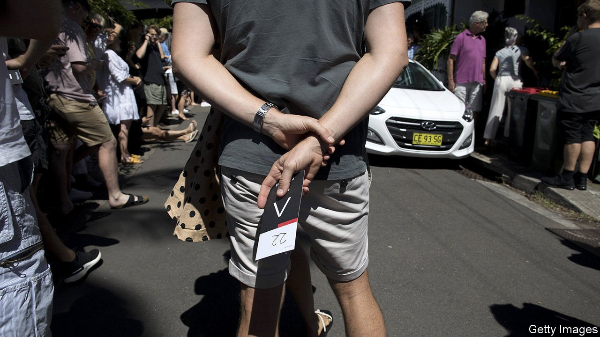

###### House prices

# House prices are going ballistic 

##### Policymakers need to keep their heads 

 

> Apr 10th 2021 

ONE OBSESSION unites the rich world: housing. In the past year billions of people have been cooped up inside their homes for hours on end. As restrictions have eased, house prices have started to go through the roof. In America prices increased by 11% in the year to January, their fastest pace in 15 years. In New Zealand prices are up by 22%. Among the 25 countries that The Economist tracks, real house prices rose by 5% on average in the latest 12-month period, the quickest in over a decade.

Home values, like the price of other assets, have been boosted by low interest rates and fiscal stimulus. Many households have spare cash sloshing around—savings rates have increased by more than half in the rich world—and borrowing has rarely been cheaper. Separately, covid-19 has caused a shift in demand away from big cities to housing in less crowded places. The expectation that commuting may no longer be daily has caused  in suburban locations to rise faster than in cities—reversing a decade-long trend. 


Governments and central banks, haunted by the financial crisis of 2007-09 and aware of public unease about expensive housing, are worrying about exuberance. In New Zealand the finance minister has asked the central bank to “consider the impact on housing” in its monetary-policy decisions. Central bankers from Copenhagen to Ottawa have expressed concern at the pace of housing inflation. In recent years many municipal governments have implemented rent controls as knee-jerk responses to rising prices. Spain may follow at the national level. As attention turns from controlling the virus to the post-pandemic world, the pressure to step in is likely to grow.

Policymakers in rich countries should resist. One reason is that house prices do not look as if they threaten financial stability. Although some people are wild for new properties, overall household borrowing remains restrained in the rich world. In contrast to 15 years ago, banks’ balance-sheets today have solid foundations. If house prices in America fell by one-quarter, its 33 biggest banks would still have 50% more capital than they had going into the crisis of 2007-09.

Key money

Neither is there much evidence that lending standards are slipping, either among banks or among the non-bank lenders that make up a growing share of mortgage origination in America. Underwriting standards remain tight, with lenders keenest on borrowers who have good credit histories. In Britain new lending at high loan-to-income ratios is about one-third below the limit imposed by the central bank.

Another reason to resist intervention is that housing markets are still being distorted by the effect of lockdowns. The price rises in the past year reflect a relatively small number of transactions, as the volume of activity in the  has dropped—it is hard to invite scores of potential buyers to snoop around your bedroom and check your plumbing during a lockdown. In Britain only 3.6% of the stock of homes changed hands last year compared with 6.5% in 2006.

Prices have leapt in part because supply is low. However, the ending of mortgage-forbearance programmes has deferred some sales by those struggling to pay their mortgage. The increase in supply should, our own model suggests, help cool prices. The rate of new construction in America and Britain looks solid which will help, too. If demand does end up shifting permanently to less-crowded places, the pace of  may even pick up. It is easier to build new properties away from America’s coastal cities, with their elaborate regulations and limited free space. 

Instead of being trigger-happy with rent control and other regulations, governments should expend more energy on tackling the housing market’s long-term problems. Top of the list is phasing out tax breaks for homeownership. Mortgage-interest deductions are a windfall to the well-off that does not boost homeownership. Despite recent reforms, America’s tax perks will still cost the Treasury $650bn over the next decade. Governments should liberalise planning rules and support new developments by providing better transport infrastructure. The strength of the property market in the pandemic confounded early expectations of doom and gloom. Even so, the laws of supply and demand dictate that housing will be cheaper if more homes are built. ■

Dig Deeper 

 (Apr 2021)


