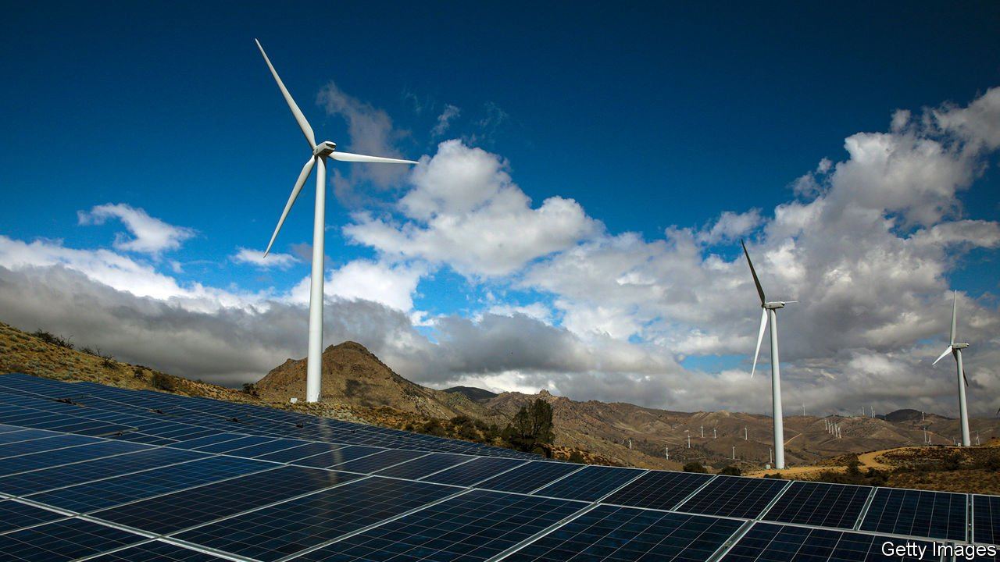
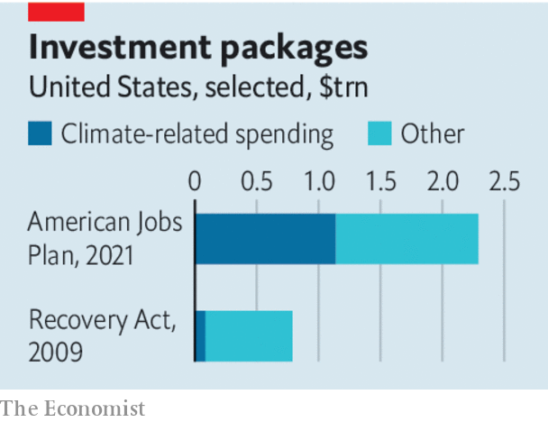

###### America and climate change

# Joe Biden’s climate gamble 

##### Two cheers for the president’s ambitious plan 

 

> Apr 10th 2021 

THE PLAN that President Joe Biden unveiled in Pittsburgh on March 31st proposes over $2trn of spending on jobs and infrastructure. However, at the heart of the American Jobs Plan is action to combat . It bristles with support for electric vehicles and renewable energy, as well as proposals for research and sorely needed large government-funded demonstration projects for potentially crucial technologies. Fans of transmission lines are well served; so are railway enthusiasts.

A highly diverse range of spending commitments often stems from a lack of focus and an excessive attention to special interests. Not so this time. Eliminating the vast majority of America’s greenhouse-gas emissions is a massive problem against which the country’s leaders have failed to make legislative progress for far too long. A sincere attempt to reverse that failure needs to reflect the magnitude of the task, the range of the challenges and the lateness of the hour. The ambition, breadth and generosity of Mr Biden’s plan therefore count in its favour. It would see about $1trn over eight years spent on climate-related projects, or about 0.6% of GDP a year. That is, if anything, a little on the low side of most estimates for the costs of rethinking and largely recreating an industrial civilisation. But if the public investments spur private ones, as they should, it is in the right ballpark.


This is not to say Mr Biden’s proposals are ideal. They are let down by his devotion to the notion that the new jobs should, whenever possible, be union jobs, that all the ships bringing in the raw materials should be American-owned and registered, and that the new supply chains created should curl themselves up neatly within America’s borders. Those things add to the plan’s political appeal for Mr Biden’s supporters, but they have nothing to do with climate change. Worse, they will increase the costs of a given cut in emissions and, if they block the flow of technology, could even become a source of deep frustration.

 


For all that, the plan’s greatest disappointment lies not in its content but in its likely fate. The government is right to support the choices people and industries may make to lower emissions. But it also needs the means to force some of those choices on them.

The stick with which Mr Biden has chosen to apply this decarbonising pressure is an energy-efficiency and clean-electricity standard. Perhaps the administration can finesse matters so that this standard counts as budgetary and can therefore pass the Senate on a simple majority vote. More likely, Senate rules will require it to win a supermajority, which involves the support of at least ten Republican senators—an almost insuperable hurdle.

A far preferable stick, as this newspaper has long argued, would be a price on carbon that applies to much of the economy and rises over time. Such a measure would reveal the costs of different technologies and apply to far more industrial processes than a clean-electricity standard ever could. It could also help pay for some of the costs involved. And because it is unarguably budgetary it would stand a much better chance of getting through the Senate without the need for a supermajority.

Mr Biden has chosen to forgo that option. The prospect of a new tax, especially one that could prove regressive, is a hard political sell, and some of the opposition is within the president’s own party. Senator Joe Manchin of coal-producing West Virginia has spoken out against a carbon tax, and to get a bill through the Senate even with just a simple majority Mr Biden needs Mr Manchin on his side. What is more, if a carbon tax were integral to such a bill and had to be cut out for it to pass, the loss of revenues might force its spending ambitions to be curtailed.

Republican legislators who are committed to climate action, fiscal responsibility, effective legislation and standing up to their base have thus been given a remarkable opportunity: they could add a carbon tax to Mr Biden’s proposals. There are many enthusiasts for carbon taxes on the political right who would welcome that, and who would laud such legislators to the skies. Unfortunately, the prospect of praise will not on its own bring such paragons into being.

Even without sticks, Mr Biden’s carrots will do some good. But they will be hard put to achieve the complete electricity decarbonisation by 2035 that the clean-electricity standard might manage, let alone the broader push towards emissions reduction a proper carbon tax could bring about. The cost of that lost opportunity will be high. But not so high as the one that has been imposed on the country, and the world, by the politicians who have for decades failed to take action on the defining global and human issue of the age. ■

For more coverage of climate change, register for The Climate Issue, our fortnightly , or visit our 


See also: 

