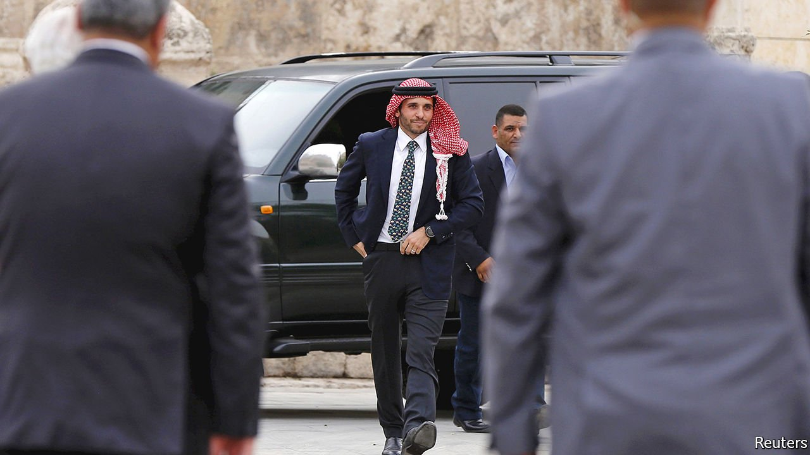
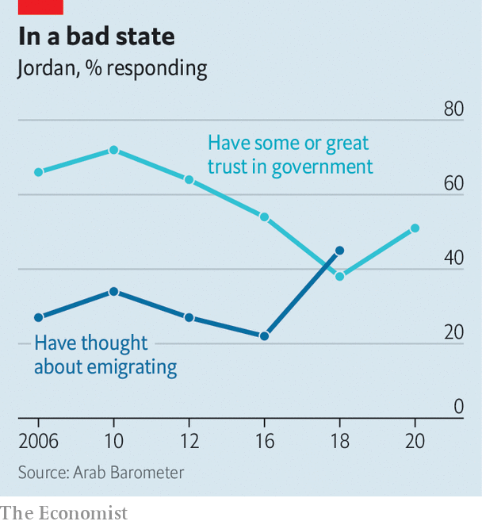

###### Uneasy lies the head

# A feud in Jordan’s royal family 

##### The arrest of a popular prince sends a chilling message to a frustrated public 

 

> Apr 8th 2021 

EVERY ROYAL family is unhappy in its own way. Jordan’s is no exception. There were sharp disagreements between King Hussein and Crown Prince Hassan, the brotherly duo who ruled the desert kingdom for decades. Weeks before his death in 1999, the ailing king flew back from an American hospital to remove his brother from the line of succession and make his son, Abdullah, heir apparent. But the Hashemites usually show a united front: Prince Hassan accepted his defenestration in silence.

Thus it has been extraordinary to watch the overt feud between King Abdullah and his half-brother, Prince Hamzah (pictured). It began on April 3rd, when the authorities detained perhaps 20 people on vague charges of plotting against the crown. The prince was confined to a palace outside Amman, the capital. He confirmed his detention in a late-night video message that assailed the government for alleged corruption, nepotism and authoritarianism. “It has reached the point where no one is able to speak or express an opinion on anything without being bullied, arrested, harassed and threatened,” he said.


No evidence has emerged to support the official claim of a foreign-backed conspiracy. No arrests within the army or security services have been reported, which seems telling: it is hard to organise a coup without guns. Jordan’s secret police are famed for their reach and ruthlessness. A sophisticated plot would be hard to hatch under their omnipresent gaze.

Instead the government has sought to calm the furore—perhaps a tacit admission that it erred with such a heavy-handed response. The king asked Prince Hassan, his uncle and the family’s elder statesman, to play the role of mediator. A judge then placed a gag order on the case. In a written statement on April 7th the king said the “sedition” had been dealt with.

But Prince Hamzah has toggled between being conciliatory and confrontational. After meeting with Prince Hassan he signed a deferential statement pledging loyalty to the king. Then his camp leaked a remarkable audio recording, said to be of a meeting between the prince and Yousef al-Huneiti, the army chief. (The tape cannot be authenticated, though both voices are recognisable.) General Huneiti’s tone was respectful, but he had come to deliver an unmistakable warning. The prince, he said, had crossed a line by attending meetings at which there was criticism of the government and crown prince. He asked Prince Hamzah not to tweet, or to meet anyone outside the royal family.


That the prince is disenchanted with Jordan’s leaders is hardly a revelation. In 2018 he rebuked the government for mismanaging the public sector and failing to fight corruption. He often meets tribal leaders, the so-called East Bank Jordanians who are both the monarchy’s historic power base and an impoverished, frustrated constituency. Admirers say the prince has a common touch lacking in the king, who grew up speaking English and can seem more comfortable in a British army club than in a scruffy Jordanian village.

The prince used those rhetorical skills in his chat with General Huneiti, parts of which sounded oratorical, meant for public consumption. He repeated his criticism of the government: “Is the mismanagement of the state my fault? Is the failure that’s happening my fault?” Voice rising, he told aides to bring the general’s car around and invoked the name of his late father, still a beloved figure in the kingdom. “Next time, don’t come to threaten me in my house, the house of Hussein,” he said.

Jordan is often described as an oasis of stability, but under the surface a deep discontent simmers. The economy was stagnant even before the covid-19 pandemic. Last year it contracted by 5%, while unemployment hit 25%, and 48% for Jordanians aged 20-24. At least one Jordanian in six lives on less than $3.15 a day. Exporters have been hit hard by decades of war in neighbouring Syria and Iraq. Successive waves of Iraqi and Syrian refugees have strained services and pushed up rents.

A survey in 2018 showed a sharp increase in the number of Jordanians who have thought about emigrating (see chart). But opportunities have dwindled: wealthy Gulf states, home to more than 500,000 Jordanian expats, are struggling with low oil prices and sluggish economies. Remittances to Jordan fell from $6.4bn in 2014 (17% of GDP) to an estimated $3.9bn last year (9% of GDP). Small and resource-poor, Jordan uses its strategic location and compliant foreign policy to extract aid from allies. That is drying up, too. In 2011, after protests inspired by the Arab spring, Gulf states gave Jordan $5bn in aid. After more demonstrations in 2018 they offered just $2.5bn, mostly as loan guarantees and central-bank deposits.

 


The kingdom has lost billions to tax evasion, corrupt customs officials and other kinds of graft. Well-connected crooks are rarely punished. In March seven people died in Salt, a poor town west of the capital, after an oxygen failure at a government hospital treating covid-19 patients. Many saw the deaths as emblematic of widespread official incompetence.

King Abdullah played his cards as usual. He sacked the health minister. In an angry speech, he asked “how long we can bear neglect and corruption” by excusing it as a part of Jordanian culture? At times he sounds more like the head of a good-governance group than a monarch. He poses as being above the fray; when things go wrong it is the fault of cabinet members or the prime minister, a job held by 13 men since he ascended the throne in 1999.

Yet few others are permitted to ask tough questions about governance. Parliament serves more as a vehicle for patronage than a check on the executive. Turnout for last year’s election was just 29%, partly because of covid-19, but also because of a complex electoral law that favours wealthy candidates (some openly paid for votes). Activists and journalists are often harassed. Police have used the pandemic as an excuse to ban demonstrations. Last year hundreds of teachers were jailed for protesting against a crackdown on their union.

Politicians are rarely pure of motive. Prince Hamzah is only 41 and was unceremoniously removed from the line of succession in 2004. His , and the effort to silence him seems to have backfired, only raising his profile. It is understandable why the king’s inner circle may find all this unnerving. The monarchy, as an institution, remains popular, but public spats within the royal family undermine it. So does dressing down the head of the army, a deeply loyal force. That the prince was playing politics, though, does not render his gripes invalid. The greatest threat to Jordan’s stability comes from within: if the king wants to silence his critics, he will need to respond to their criticisms.■

