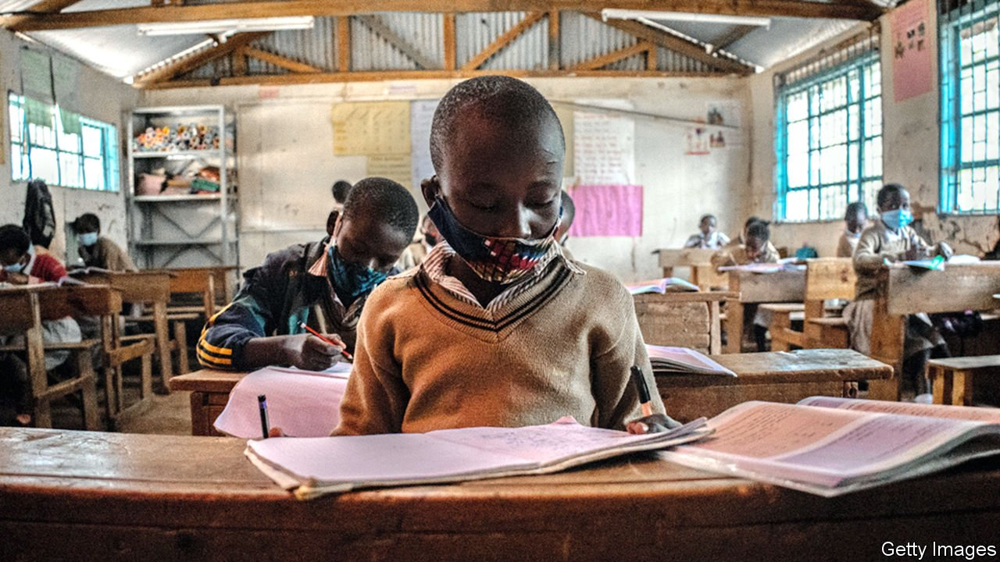

###### One step backwards, two forwards

# Covid-19 creates a window for school reform in Africa 

##### Many pupils already needed catch-up classes. The pandemic may jolt countries into providing them 

 

> Apr 8th 2021 

EVEN BEFORE covid-19 forced its classrooms to close for three months last year, Mavis Maphoto’s school in Botswana had decided that its pupils needed to catch up. At the start of 2020 it began setting aside an hour each day in which to shuffle some of its children out of their usual classes and into groups decided by how well they could do maths. For 60 minutes chairs and tables are swept aside; pupils play learning games on the floor. Ms Maphoto, a teacher, says her school has expanded its catch-up programme since its doors reopened in July—though she fears the classes are not quite as fun, now that the children must keep one metre apart.

Pupils in many poor countries have long been learning shockingly little. In Botswana only about half of ten-year olds can read and understand a simple story—in America the rate is 92%. In most sub-Saharan countries the figures are much worse (see chart). The reasons for this could cover a blackboard. But one is that many school systems cling to over-stuffed curriculums. Teachers lack the training or permission to veer from the course set by textbooks. Pupils who fail to grasp basic literacy and numeracy when they are tiny cannot make sense of anything that comes next.


These long-standing problems now risk compounding the harm that covid-induced school closures have caused. (According to UNESCO, schools in sub-Saharan Africa shut for an average of 23 weeks.) A recent study of children affected by an earthquake in Pakistan in 2005 found that they ended up falling behind by one and a half years, even though their classrooms shut for only three months. The authors think this is because, when schools reopened, teachers pressed on with the usual lessons as if nothing had been missed.

 


Catch-up classes of the sort running in Botswana offer an alternative approach. They borrow from a technique pioneered over two decades by Pratham, a big Indian NGO that has helped left-behind learners in South Asia. Its model, known as Teaching at the Right Level (TaRL), uses speedy oral tests to sort children in their last years of primary school into groups that match their learning levels, rather than their age. These groups commonly gather for one hour of each school day to practise either maths or reading. Alternatively children may attend intensive catch-up “camps”, which are repeated throughout the school year. One such programme implemented a few years ago in Uttar Pradesh, India’s most populous state, saw the share of children who could read a paragraph increase from 15% to 48% after 50 days of catch-up classes. That was twice as many readers as in a control group, who plodded on with their usual lessons.

For years Pratham’s programmes have been studied by economists from the Abdul Latif Jameel Poverty Action Lab at the Massachusetts Institute of Technology. In 2019 the two outfits set up a new organisation, called TaRL Africa, which aims to spread its model of remedial teaching across the continent. It is working with governments and advising local NGOs.

Ten African countries are running experiments: these include the Ivory Coast and Kenya, in addition to Botswana. Zambia is keenest. When the pandemic struck, it was running daily catch-up classes in one-fifth of its primary schools, benefiting a quarter of a million children in grades three to five. In 2019 the share of pupils who could read a simple story in one province increased from 22% to 41%. The government has grown even more enthusiastic since it allowed schools to reopen in October, says Nico Vromant of VVOB, a Belgian NGO that is helping. This year it is almost doubling the number of schools that operate a catch-up programme.

Making the model work in Africa is trickier than in India. Classes tend to be much larger. Bigger distances between schools make it more costly to ensure that all of them get frequent visits from mentors, who are needed to keep the programme on track. Noam Angrist, an American who co-founded Young 1ove, an NGO involved with the catch-up programme in Botswana, says that to get the programme to work in some schools it had to discourage corporal punishment. Pupils who are hit are afraid of making mistakes.

The pandemic could create new obstacles. In places that require strict social distancing, officials have had to cut the hours pupils spend in schools in order to allow them to attend in shifts. That only intensifies battles over how classroom time should be best used. But catch-up classes are cheaper and more effective than many other things officials like to spend money on, such as textbooks that only the cleverest pupils can read. Austerity may inspire more of them.

Governments have been loth to take stuff out of school curriculums, for fear of being accused of dumbing down. They have also fretted lest large-scale catch-up programmes be seen as an admission of failure. Yet the disruptions caused by the pandemic have created an opportunity, says Rukmini Banerji, one of Pratham’s bosses. “Now they can blame covid.” ■

