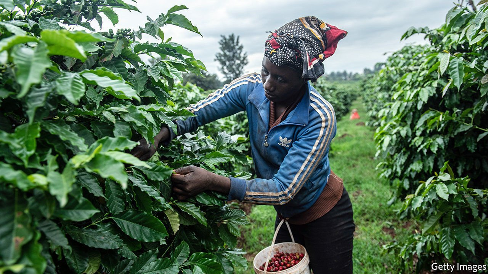
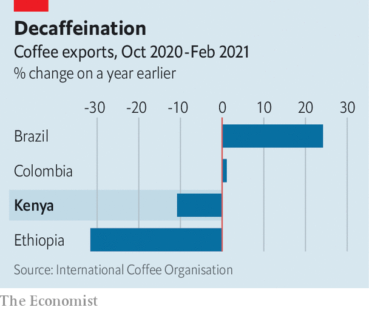

###### Wake up and smell it

# Kenyans are starting to drink their own coffee 

##### Covid-19 has shown the value of a local market for local beans 

 

> Apr 8th 2021 

IN A SINGLE room tucked away behind a petrol pump in central Nairobi, men toil over a whirling drum, a shiny metal rack and heaps of sacks marked “Produce of Kenya”. The coffee they roast sells for as much as $11 per 250 grams online. Out front at Spring Valley Coffee, the well-heeled brave the noise and fumes to sip flat whites topped with rippling hearts by a trendy young barista.

Some of the world’s best arabica beans are grown on the fertile land around Mount Kenya. But like the citizens of many former British colonies, Kenyans are partial to tea. Now an expanding middle class is getting a taste for coffee. Domestic consumption is expected to reach 3,600 tonnes this year, almost a tenth of total production. The pandemic has shown just how important a local market can be, as logjams at ports and a sharp drop in global demand crush exports. “Covid has been an eye-opener,” says Gloria Gummerus, who runs the Sakami estate in western Kenya.


It is a similar story for other coffee-producing countries. Apart from Brazil and Ethiopia (which has an elaborate coffee ritual), many are just beginning to consume their own beans. Over 30% of the world’s coffee is now drunk in producing countries, according to José Sette of the International Coffee Organisation, up from 22% 30 years ago.

 


Many Kenyans first get a taste for coffee via instant sachets made from cheap robusta beans. City folk then graduate to coffee shops, which serve better-quality arabica coffee in trendy surroundings. Java House, which opened its first shop in 1999, was among the earliest to offer a Starbucks-style experience. It has expanded to some 70 shops and others, like Spring Valley, have followed. Leaving aside a blip during recent lockdowns, sales are expected to climb. Coffee is an “aspirational” drink, says Rozy Rana at Dormans Coffee, a local roaster. “It’s the trendiness, the Western feel,” says Ms Rana.

To some, talk of Kenyan coffee conjures images of “Out of Africa” and its vast colonial-era estates. In reality, most of the country’s harvest comes from 600,000 smallholders. The film is more accurate about just how difficult it is to make money in coffee. A byzantine system of co-operatives, millers and marketing agents skims off profits. Farmers get about 6% of the retail price, reckons El Mamoun Amrouk at the UN’s Food and Agriculture Organisation (FAO).

As a result, production is dwindling. Only 120,000 hectares are devoted to coffee today, by FAO estimates, down from almost 180,000 hectares in the late 1990s. Farmers are switching to more lucrative crops, such as avocados or macadamia nuts. Developers pay good money for land near Nairobi, too. “When I visit coffee farms around Kenya all I see is old faces,” says Matthew Harrison of Trabocca, an importer.

Domestic demand could help. Roasting coffee and brewing cappuccinos creates more jobs than exporting beans does. Selling locally could also be more profitable for Kenya’s farmers, who complain that they are powerless price-takers in a vast global market. “When you have a domestic market you have more control,” claims Daniel Mbithi, the head of the Nairobi Coffee Exchange, which runs weekly auctions where much of the crop is sold.

There are plenty of ways to stoke local demand. The Fairtrade Foundation has tried paying young people to stand around cafés evangelising about Kenyan coffee. Dormans sponsors an annual barista competition. Meanwhile, buyers like Ritesh Doshi, who runs Spring Valley, take cafetières out to the farmlands. Getting growers to taste the hot stuff might be the best way to prove it is worth planting. ■

