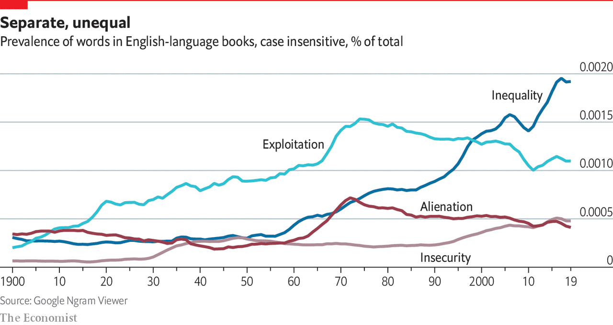

###### How to think about work

# Pessimism about the labour market is overdone 

##### The labour market is resilient, even after covid-19 

 

> Apr 8th 2021 

“THE SHIPPING NEWS”, a novel about family history in Newfoundland by Annie Proulx, includes a passage about work. Jack, a former fisherman, explains how the local economy changed after the province joined Canada in 1949. Fishing went into decline, and with it a life that was “hard” but where “a man did what he wanted”. Manufacturing rose in its place, offering jobs where men sheltered indoors, away from the elements, and did what they were told. Today, politicians on all sides say that jobs in manufacturing represent good, honest work and lament their demise. Jack thought they were utterly miserable. 

For as long as capitalism has existed people have worried about labour markets. Why is this so? Perhaps it is because they produce inequalities that even the most right-wing know are not really fair. Perhaps it is because they are always changing, and people are resistant to new ways. But it is also because labour markets produce uncomfortable trade-offs. The rise of the factory gave workers more pay but less autonomy. Trade unions boosted workers’ wages but reduced employment. As textual analysis of books shows, at different times authors have worried about different problems linked to work.


The modern labour market has similar trade-offs. Yet this special report has argued that before covid-19, it was working fairly well. Contrary to popular belief, work was both more plentiful and more rewarding. Overall wage growth was not as strong as many hoped; but low pay was falling and job satisfaction was rising. There was no sign of an ever-growing “precariat”. 

The pandemic has been catastrophic. Yet it may presage improvements in the world of work. The shift to remote work may make many people happier and more productive. It is unlikely to encourage job-killing robots. And it is forcing policymakers to acknowledge some difficult truths about whose interests today’s economy serves best. 

Reform or perish

Politicians have more to do. Some reforms have long been called for. Dismantling occupational-licensing barriers would mean more jobs and lower prices. More liberal immigration regimes would boost innovation.

But the pandemic highlights two other necessary changes. The first concerns welfare. It turns out that in recessions sending cold, hard cash to families, especially poor ones, can do much good. America massively boosted the value of unemployment-insurance payments. Poorer households’ incomes held up, and America’s economic bounceback was one of the world’s strongest because people had money to spend.

Outside recessions, there is still more to do. Boosting in-work payments does a lot to reduce poverty, as America’s latest stimulus package will show. But it is of less use to those who are out of work altogether. Simply lavishing the unemployed with public funds may discourage them from finding work; but the lesson of Denmark is that it is possible to combine targeted generosity with incentives to take jobs, making the labour market more efficient. Another reform is updating the technology of welfare systems so that people are reliably paid what they are entitled to and poverty traps disappear, something Britain’s universal credit system should eventually guarantee.

 


Boosting welfare in this way would give workers better options, making them less willing to put up with bad jobs. More could also be done to improve people’s bargaining power at work, the second big change. The pandemic showed that many workers have too little clout. Some paid with their lives.

A few favour a renaissance of trade unions, and even detect the stirrings of a movement in the tech sector. Irrespective of whether this is a good idea, a meaningful revival is unlikely when manufacturing and heavy industry are so much smaller than they were. Others say that the entire rich world should follow Denmark and Germany down the path of collective bargaining, where workers and bosses come together to reach deals on pay and conditions. But that would require wholesale corporate-governance reform. Other ideas are more practical. Talk to corporate bosses and, because of the pandemic, many now believe that they need to give frontline workers more of a voice. This can be as simple as giving them access to a corporate email account.

Governments also need to step up. Particularly in Anglo-Saxon countries, too many unscrupulous employers flout labour law. Many of the most egregious violations relate to gig-economy companies, which pretend that their workers are self-employed contractors when they are in fact more like employees. These firms have not found loopholes in existing employment law, as is often believed. Instead they act with impunity mainly because enforcement of existing labour law is weak and punishment is feeble. That calls for more inspections of suspicious firms and tougher fines for rule-breakers.

Such reforms may be hard to do. And history suggests they will come with their own trade-offs, creating different sorts of discontents. But the eventual outcome should be to move towards a more efficient and fairer world of work. ■

Full contents of this special report


* 

