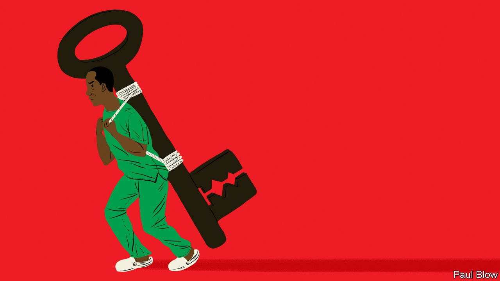

###### Essential workers

# The biggest losers from covid-19 

##### Covid-19 is a disease of the poor and the powerless 

 

> Apr 8th 2021 

DURING THE pandemic one part of the workforce did not get to wear pyjamas during the day or join in marathon sessions of “Tiger King”. The people known as “key”, “frontline” or “essential” workers had to be in public spaces and often in close proximity with their colleagues. Many died. 

Describing a worker as “key” is an arbitrary exercise (the label covers most journalists, for example). It usually includes occupations necessary to meet everyone’s basic needs—food, heating and transport, not to mention health care. Most such jobs cannot be done from home. Essential workers are more likely to be ethnic minorities. They are also relatively badly paid. The Institute for Fiscal Studies (IFS), a think-tank, reckons that the average key worker in Britain earns 8% less than other employees.


The pandemic has reminded key workers that without them society would grind to a halt. In its early phase homebound folk in Britain stood outside their front doors once a week and applauded the “heroes”. Yet as Camilla De Camargo and Lilith Whiley, two sociologists, argue in a paper, giving essential workers “an almost mythologised status and value” obscures the human suffering that many have endured. 

Going to work during a pandemic can be a terrifying experience. According to a study in England, frontline workers have had “significantly higher prevalence estimates of depression, anxiety, and PTSD”. Part of the difficulty facing many key workers is that they cannot easily voice their grievances. Head offices are closed, and many do not have access to internal communication channels, such as a corporate email account.

Many essential workers have little bargaining power, so that if they feel unsafe there is not much they can do about it. One courier in England reports that his firm did not supply personal-protective equipment, leaving many riders unprotected. Colleagues who complain about clients not respecting anti-covid protocols have been fired. Governments are slow to hold careless employers to account, notably in the meatpacking and warehousing industries.

Imbalances of power are bigger in some places than others. A study in Toronto found that the death rate from covid-19 in the neighbourhood with the most essential workers was more than twice as high as in the one with the fewest. A study in California found that people of working age saw a 22% increase in mortality from March to October 2020. But bakers saw mortality rise by 50%, and line cooks by 60%. One class of people stayed home in their pyjamas; others went into workplaces that probably killed them.

Full contents of this special report


* 


