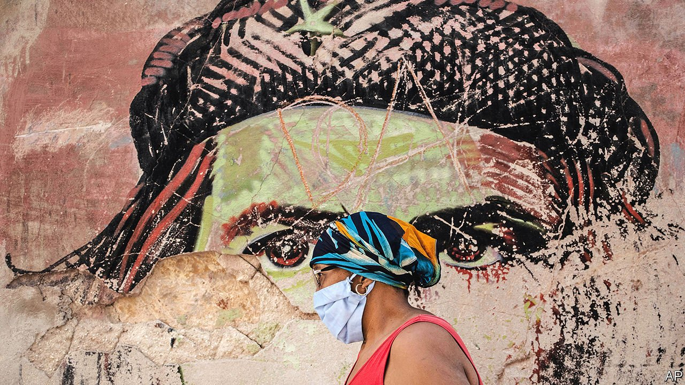

###### Revolutionary drugs

# Cuba may become the smallest country to make covid-19 vaccines 

##### Whether they will be approved elsewhere remains to be seen 

 

> Apr 10th 2021 

BY 7AM A long queue stretches around the medical centre near the Plaza de la Revolución in Havana. Some of those waiting have been there for hours; all are hoping to be volunteers to test Soberana-2 (Sovereign-2), Cuba’s most advanced covid-19 vaccine candidate, which is in phase-three clinical trials. At 8am sharp, the first 40 are admitted into two large rooms, given rapid lateral-flow tests and told what to expect if they are recruited as volunteers. Yosvany Rodríguez Muñoz, a 37-year-old doorman, is one of the lucky ones. Staff at the clinic measure his height, weight and blood pressure before giving him an appointment for the next day. After 28 days he will get a second dose.

Cuba is small, with just 11m people, and is short of basic goods such as rice and paracetamol. But its long history of medical research has stood it in relatively good stead during the pandemic. After the Communist revolution in 1959, half the island’s doctors fled abroad. In response Fidel Castro, the cigar-puffing dictator, pumped money into health care; he hoped pharma could be exportable, like sugar. Even during the economic collapse that followed the end of the Soviet Union and its subsidies in the early 1990s, in which GDP shrank by a third in three years, the Centre of Molecular Immunology (CIM) opened in Havana. “There was no money for food, but there was a brand-new cancer-research facility that was expected to be worth the sacrifice,” recalls Ricardo Torres, a Cuban economist. Cuba produces 5m doses of simple or combined vaccines for various diseases for domestic use alone each year.


Now the country is developing five potential covid-19 vaccines. Soberana-2 is developed by BioCubaFarma, a state-owned biotechnology company; CIM produces a key ingredient. More than 44,000 participants in the phase-three trials have been vaccinated so far, and 100,000 doses of the vaccine have been shipped to Iran for further trials. The Cuban government hopes that, if these are successful, it can produce 100m doses by the end of the year. Any vaccines not used domestically may be sold to allies, such as Venezuela. Officials have also pondered offering jabs to tourists to earn hard currency, too.

But just as the governments of several big countries have indulged in vaccine diplomacy, the Communist Party in Havana—which is expected to see Castro’s brother Raúl step down as first secretary on April 16th—has played up the propaganda value of its health-care system. The other vaccines in development have similarly grandiose names: Mambisa, a nasal spray, is named after the guerrillas who fought against Spanish colonial rule; Abdala, a vaccine that is also in phase three trials, is named after a play by Jose Martí, a revolutionary hero. State-run newspapers are full of headlines such as “Capitalism results in superfluous health care and socialism delivers it in just the right dose”.

Behind the bombast, however, a more complex picture emerges. Reported covid-19 cases are on the rise—although the absolute numbers are small compared with most countries. There are now about 1,000 cases a day, 20 times higher than at the end of 2020. Some of that uptick is due to an influx of Cuban-American visitors from the United States after airports reopened in November.

And even if one of these vaccines proves effective, the government is unlikely to make much money from it. Modern drug development is a high-risk, capital-intensive business; it requires far more capital than Cuba’s constrained economy can supply. “To date, not a single drug developed in Cuba has been approved for use in a highly-regulated market,” says David Allan, a former chief executive of YM Biosciences, a drug-development company that worked with the government between 1993 and 2013. Manufacturing costs are high because Cuba makes few components locally, instead relying on expensive imports. A lack of vials, for instance, might be an impediment to the speedy inoculation of its population against covid-19, in the same way that a lack of plastic bottles often makes drinks such as mineral water impossible to find.

The result is that despite the possibility of becoming the first country in Latin America to develop a covid-19 vaccine, Cuba has got off to a late start at jabbing its own citizens. Clinical trials will take several more months, though more people may be offered the vaccine before all the results are in. It is still unclear if manufacturing will be done locally or partially outsourced to Iran, China or Thailand.

Mr Muñoz says he could sense the hope of the others in the queue as he waited for a jab. Such optimism is in short supply. Despite the end, in January, of its economy-distorting dual-currency system, the island faces its deepest recession since the 1990s, because of sanctions and the lockdown-related drop in tourists. The potential vaccines are a “much-needed good-news story”, thinks Emily Morris, an economist at University College London. But ordinary Cubans, who also face the uncertainty of being governed by a non-Castro for the first time in six decades, cannot live off that good news alone.■

Dig deeper

All our stories relating to the pandemic and the vaccines can be found on our . You can also listen to , our new podcast on the race between injections and infections, and find trackers showing ,  and the virus’s spread across  and .

