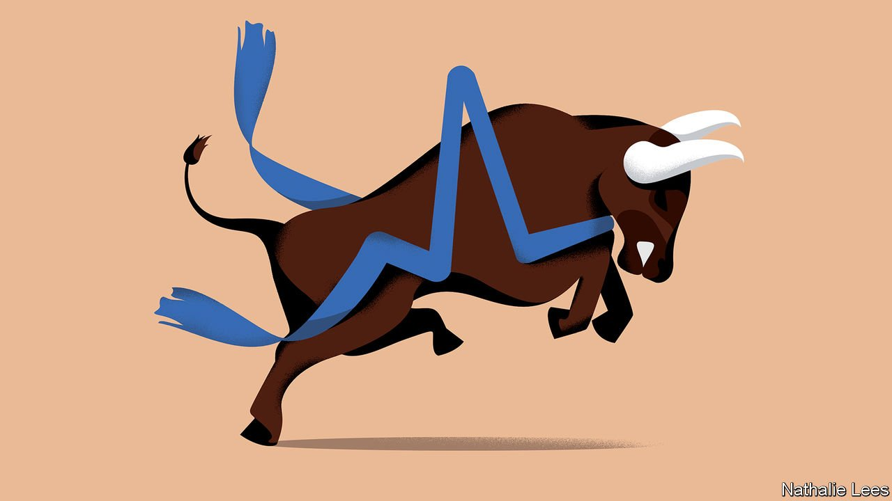
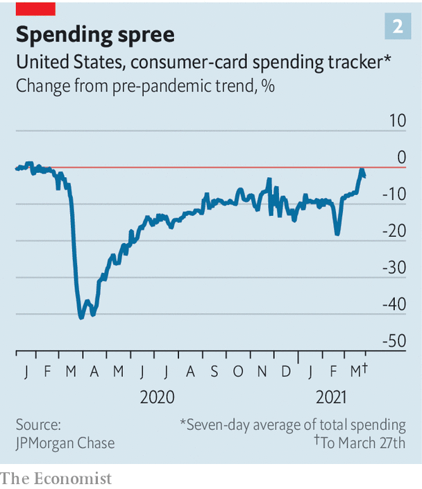

###### The world’s biggest economy

# America’s boom has begun. Can it last? 

##### High-frequency economic data suggest it’s full steam ahead 

 

> Apr 10th 2021 

THE LATEST monthly employment report, published on April 2nd, painted an impressive picture: over the previous month America created more than 900,000 jobs. That figure, the strongest since August, reflects the state of the economy in the first half of March, when the surveys took place. But a look at “high-frequency” economic data for more recent weeks, on everything from daily restaurant diners to Google-search behaviour, suggests that, since then, the recovery has if anything accelerated further. America’s post-lockdown boom has begun. 

A rapid bounce-back would be welcome, because the world’s largest economy remains a long way off its pre-pandemic peak, and the damage has been severe. Even after the latest jobs numbers, over 8m fewer people are in work than before the pandemic. The job losses are concentrated among low-income groups (though it is no longer the case that women are more affected than men). One-third of small businesses remain closed. Poverty is higher than it was before covid-19 struck, especially among black families. And the impact of school closures on children’s education could last for decades. 


High-frequency data, largely produced by the private sector, are useful in identifying economic turning-points before they get picked up in the government’s figures, which are slower to arrive. In March and April 2020, long before the publication of official numbers, these data showed that the economy was falling off a cliff. A year on, happily, they point to a rapidly strengthening economy.

Using mobility data from Google, The Economist has constructed an economic-activity index, which measures people’s visits to workplaces, stations, retail outlets and recreation sites. A month ago the index was 30% below its pre-pandemic baseline (see chart 1). In recent days the index has jumped to 20% below the baseline. 

 


Other high-frequency data show similar trends. The number of passengers travelling through American airports is rising fast. Economists have also closely watched statistics from OpenTable, a booking platform. In February the number of restaurant diners was 48% lower than normal. So far in April it is 18% lower. Hotel occupancy is increasing rapidly. High-frequency indicators of manufacturing and services activity are surging, too. 

People are venturing outside, and mixing, in greater numbers, in part because a successful vaccination campaign has allowed some easing of restrictions. And when people do leave the house, they have money to spend. On March 17th the Treasury deposited $250bn in stimulus cheques into people’s bank accounts, adding to the $1.5trn of extra personal savings (about 10% of annual consumer spending) that households had piled up by the end of 2020. A tracker by JPMorgan Chase, a bank, shows that payment-card spending is near its pre-pandemic level (see chart 2). In late March total spending was up by nearly 20% on the previous month, according to Cardify, a data-provider.

 


The upshot is that America is likely to register jumbo GDP-growth numbers in the second quarter of 2021. Research by Nicolas Woloszko of the OECD, a rich-country think-tank, gives a hint of what is to come. He uses another type of real-time data, Google-search trends, to construct weekly GDP measurements for the G20 economies. In the final week of March American GDP was about 4% below where it would have been in the absence of the pandemic. That is the strongest figure in over a year, and far better than most other rich countries.

Many forecasters are now expecting GDP growth of 6% or more in 2021. If that happens, then it will not come as a surprise if America notches up monthly jobs gains of 1m or more in future employment reports. The unemployment rate could be near its pre-pandemic rate fairly soon. 

Yet two factors could spoil the party. One relates to economic “scarring”. Some economists worry that the pandemic has damaged America’s productive capacity. If lots of businesses have gone bankrupt, then even with buoyant demand many Americans will not have jobs to go back to. 

So far there is no compelling evidence of a wave of insolvency. In 2020 total commercial bankruptcies were about 15% lower than the year before. Extensive fiscal support offered by the federal government has helped firms pay their bills, while many landlords have offered rent concessions. Bankruptcies have remained low so far in 2021, but no one really knows whether or not they will rise in the coming months, as fiscal support ends and landlords seek to make up for lost time.

The second factor relates to fears that infections could take off again, despite the momentum behind vaccination. There are particular concerns about coronavirus variants, such as one first found in Britain, which spread more easily (though the prevalence of the “British variant” has not stopped cases tumbling in Britain itself, where, as in America, vaccination has been proceeding apace). Cases of covid-19 in America are now rising again. Some places, such as Chicago and New Jersey, have paused reopening. 

That is slowing the recovery, but not yet stopping it. Widespread vaccination has weakened the link between infection and hospitalisation. In Michigan and Florida, two states with high levels of the British variant, the Google-Economist economic-activity index has lost steam in recent days, though it is still stronger than it was in the first quarter of the year. There will be setbacks along the way, but expect the good economic news to start piling up. ■

Dig deeper

All our stories relating to the pandemic and the vaccines can be found on our . You can also listen to , our new podcast on the race between injections and infections, and find trackers showing ,  and the virus’s spread across  and .

