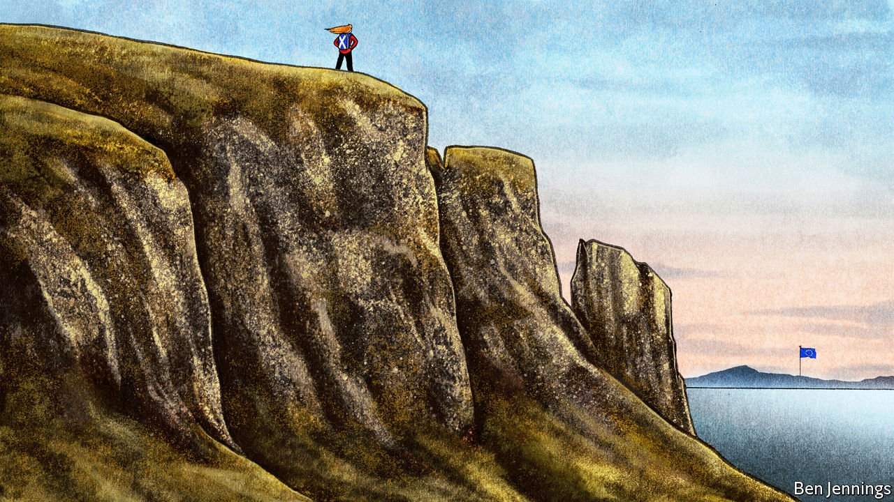
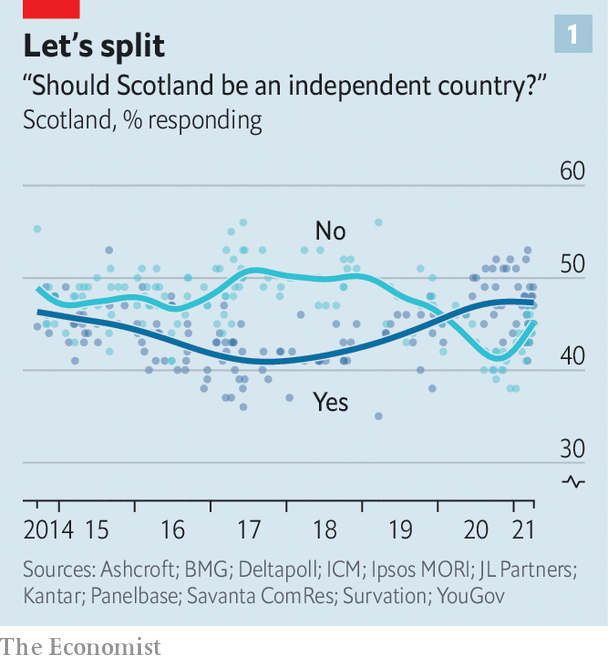
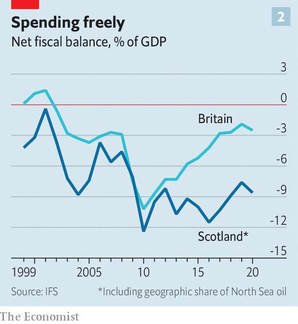
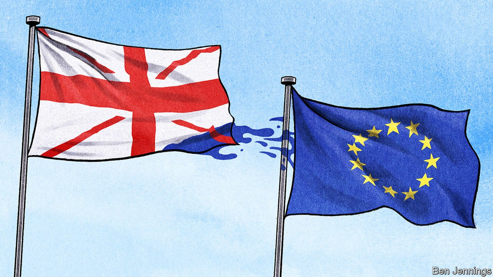

###### The long road back to Europe

# Brexit has reinvigorated Scottish nationalism 

##### It has also shown up some of the difficulties of secession 

 

> Apr 15th 2021 

THE END OF Britain’s 47-year experiment in Europe had a Scottish air to it. On January 29th last year the European Parliament ratified the Brexit divorce, after three years of negotiations which had exhausted Britons. On the square outside in Brussels a bagpiper played “Flower of Scotland”, a folk tune, and “Ode to Joy”, the European anthem. Aileen McLeod, a member of the parliament for the Scottish National Party (SNP), told other members that her country would soon be back: “In the meantime, I hope very much that you will leave a light on for Scotland.” After the vote was cast, many of the MEPs joined hands and sang “Auld Lang Syne”, a song of friendship by Robert Burns, Scotland’s national poet.

As prime minister, David Cameron oversaw two constitutional referendums with the potential to change the United Kingdom irrevocably. He expected to win both handily. In 2014 he had permitted Scots to vote on independence from the rest of Britain. They rejected it by 55% to 45%, and the following morning Mr Cameron declared the issue settled for a generation. In 2016, he was not so fortunate. In the referendum on membership of the European Union, Britons voted by 52% to 48% to leave.


Those two decisions are now inextricably entwined. Scots, more Europhile than the English, voted by 62% to 38% to remain in Europe. So Brexit has reopened the question of Scotland’s place in the United Kingdom, provoked demands for a new referendum, and reshaped the independence movement as an avowedly Europhile cause. For a growing number of Scots, independence has become the escape route from Brexit. Their movement—full of young, educated idealists, who are green, pro-migration and increasingly stirred by the politics of gender and race—looks like the opposite of the alliance of English traditionalists who supported Brexit.

 


The movement hopes soon to have its moment. Scotland will hold elections on May 6th for its devolved parliament in Edinburgh, which since 1999 has run education, health care and transport (foreign relations, defence and the economy are still run by Westminster). Nicola Sturgeon, the SNP leader, will seek another term as first minister. An SNP government, she says, will have a mandate to hold a second vote on independence. If it won, that would lead to separation talks with London, and open the door to Scotland’s accession to the EU. Around 65% of Scots still want to rejoin the bloc.Polls show a small lead for separation (see chart 1).

But victory in a second referendum would bring Ms Sturgeon a similar challenge to the one which Britain faced in 2016, of extracting a nation from a political and economic union without unleashing chaos. The SNP’s top brass believe they can avoid such trauma and learn from British errors. The Brexiteers had wildly different ideas about what Brexit meant, made no preparations for negotiations, and refused to anticipate problems such as the border with Ireland. Nationalists, by contrast, are clear about Scotland’s destination as a new EU state, and the Scottish government is studying the EU accession process. In private, senior nationalists are a little more candid these days about the obstacles: the need for a trade border with England, a new currency and a legally complex transition period for the chilly years between leaving one union and joining the other.

Yet many of the technical and legal challenges would look similar to those brought about by Brexit: settling bills, splitting assets, fixing the right to work and study, and access to fishing waters. The union has stood since 1707, so Scotland is far more deeply stitched into the United Kingdom than Britain was into Europe. The hidden systems of daily life—tax collection, immigration controls, electricity distribution—must be unwoven. Unlike Brexit, Scottish negotiations would need to grapple with the fate of nuclear weapons, sovereign debts, and oil and gas reserves. Only once Scotland was a state could accession talks with Europe begin. Unionists warn that, rather than an escape from the turmoil of Brexit, Scotland would be choosing its own “Brexit on steroids”.

But we can still rise now

Unlike British rule in Ireland, for most of its life the union has rested on Scots’ consent, which they have been, for the most part, happy to grant. Scotland had a stake in Britain’s government, producing prime ministers and cabinet members. Empire and free trade with England made it wealthy and the union did not interfere with Scotland’s church, legal system and universities. Demands for a parliament grew in the 20th century, but calls for independence only came from a noisy fringe.

The pillars of consent were weakened under Margaret Thatcher. She was more willing to impose London rule on Scots in areas such as higher education and local government. The collapse of coal, steel and manufacturing that followed privatisation hit Scotland hard, drove up unemployment, and gave the SNP its “anti-Scottish” villain. In the 1980s, the idea that Westminster lacked consent and legitimacy in Scotland gained ground in the Labour Party. Tony Blair hoped the devolved parliament would forestall independence. The SNP hoped it would be a stepping stone.

The Labour Party dominated the new parliament but became detached and complacent, and the SNP displaced it as the force of the Scottish left. In 2011 it won a majority in the Scottish Parliament. In 2015 it swept Labour’s Scottish MPs out of Westminster, too. As the devolved parliament has thrived, so the political news Scots digest has become increasingly different from England’s. Scots migrate south less, so cultural ties weaken. Yet, given the choice in 2014, they still opted to stay.

There the story might have ended, were it not for Brexit. Mr Johnson has chosen a hard exit, ditching the EU’s single market and customs union. He has spurned membership of Erasmus, an exchange programme popular with Scottish students, and an easy migration regime. That has cracked the pillars of consent. Scotland has looked suddenly powerless: the views of its voters, their parliament and their MPs in Westminster have counted for little. Brexit cuts deep into the courts and universities, and will make it poorer, as fishermen and bankers encounter trade barriers to Europe where before there were none.

In 2014, with Britain still in Europe, an architect in Glasgow could vote against independence, for she could have it all, seeing herself as Scottish, British or European, and working as freely in Munich as in Manchester. Now she is being asked to choose which identity she prioritises, and in which single market she wants to work.

Unionists see the SNP’s Europhilia as opportunistic. The party had opposed Britain’s entry into the EU in 1973, reckoning Europe remote and undemocratic. But it changed as dictatorships fell and Europe’s purpose evolved from stopping old countries going to war to helping new ones find freedom and prosperity. Ms Sturgeon welcomed Europe’s embrace of former communist states in 2004 as evidence of the “sheer normality of independence in Europe for small nations”.

The bloc does the hard work of independence for young, small states: it provides a ready-made currency, a trade policy and market of 450m consumers, and heaps of funding for motorways and wind farms. The EU’s breadth and reach, say nationalists, means independence is not a leap in the dark like Brexit, but a defined destination for which they can prepare. “Our answer to absolutely everything is whatever is working for Ireland, we’ll do,” says one SNP bigwig.

Scotland would blend in fine, as a middling EU member by size and disposition. It has typically European interests—financial services and green energy—and European problems, too—poor demographics and urban decay. Ms Sturgeon sees it as part of an arc of Nordic social democracies (new parents are sent a box of baby things, a policy borrowed from Finland) and has won the sympathy of European leaders.

But Europe may be leaving a light on for a long time. The first step is getting a referendum. Polls suggest Ms Sturgeon will keep her job after May 6th, either with an outright majority or in a pro-independence coalition. A toxic feud with Alex Salmond, her predecessor, has led to his launching a rival pro-independence party, Alba, but it does not seem to have badly dented SNP support. Her main problem will be getting a British prime minister to approve a new poll. Britain has no equivalent to Article 50, the EU’s unilateral exit clause. Under British law, the union is the exclusive concern of the Westminster Parliament, and the last referendum was held with Mr Cameron’s permission. Ms Sturgeon would like Mr Johnson to follow his lead, arguing that a vote must be deemed legally sound in London and overseas to result in statehood. If he does not, Ms Sturgeon will seek to force his hand by pushing ahead with a referendum law in the Scottish Parliament and daring him to approve it or to challenge it in the Supreme Court.

Mr Johnson says he will refuse, and that a referendum is reckless while Scotland recovers from covid-19. An unauthorised plebiscite would be a significant change in SNP strategy, which he could simply ignore or legislate to ban. Nearly half of English voters would be pleased or indifferent about Scottish independence, according to YouGov, a pollster, but it matters to the Conservative and Unionist Party, as the Tories are properly known. Scottish independence would cause both allies and adversaries to rapidly downgrade Britain’s global role, and inflict emotional trauma. “It would feel like chopping off your own arm,” says one Scottish Tory.

Whereas Mr Cameron offered greater devolution, Mr Johnson’s strategy is to reinforce London’s power, to fly the Union flag and splash the cash. EU funds for bridges and roads used to be handed to the Scottish government, but in future the British government will apportion the cash directly. Such a strategy risks strengthening support for independence. A new referendum, under a future government, may simply become a matter of time.

Unionists will ask Scots to focus on the economics of independence, which are liable to be tougher than Brexit’s. Around 60% of Scotland’s exports go to the rest of Britain, and leaving will cut GDP over the long run by between 6.5% and 8.7%—two to three times more than the cost of Brexit—according to a paper from the London School of Economics. EU membership will do little to mitigate that, it argues, as joining the single market would mean stricter controls at the English border.

The currency is a central weakness. In 2014, the British Treasury rejected the SNP’s plan to use sterling. The SNP now says it would use it unofficially, as Panama uses the dollar, before adopting a Scottish currency “as soon as practicable”. Since the EU states must consider their exchange rates with the euro “a matter of common concern”, Scotland would need to have a new currency or agree to a short transition before joining, notes Kirsty Hughes of the Scottish Centre on European Relations.

As a condition of membership, Scotland would promise to adopt the euro. The SNP argues this can be deferred indefinitely, as Sweden and Poland have done. Fewer than one in five Scots wants the euro, but the difficulties of creating a currency may make Frankfurt’s embrace more attractive. With a new Scottish currency, big exchange-rate risks would suddenly appear in cross-border contracts. Wages paid in it may shrink relative to mortgages agreed in sterling, a lesser risk with the more stable euro. Large banks would shift some of their activity overseas, fearing a Scottish central bank would struggle to act as a lender of last resort.

 


Scotland’s public finances would be squeezed, which would frustrate nationalists who want a more generous welfare state. Scotland raises less tax and spends more per person than Britain as a whole. The implied deficit (currently plugged by the central government) was 8.6% of GDP in 2019-20, compared with 2.6% for Britain as a whole (see chart 2). Tax revenues from oil and gas are volatile and fell from £10bn in 2008 to £650m last year. Scotland would be expected to meet the EU’s deficit criteria of 3% before or soon after joining. A paper commissioned by the SNP in 2018 proposed doing this within ten years by holding down public spending. While the British government can borrow at low interest rates, a new Scottish government would have to establish its own fiscal credibility, a task made harder by raising funds in a new currency.

The Remain camp relied on dry economics before the Brexit vote. Unionists face the same problem. Nationalists counter that trade patterns will shift and independence will give Edinburgh the levers to lift productivity. Goldman Sachs, a bank, has told clients that as well as big challenges, there are “potential economic upsides” to independence if Scotland can spur investment and improve skills. Polls suggest that, despite the gloomy predictions, Scots think Brexit more economically damaging than independence would be, and those most pessimistic about Brexit are the ones most enthusiastic about breaking away. After Brexit, Tories can hardly ask Scots to heed businesses’ concerns.

Unionists, with good cause, argue that the negotiations would be eerily familiar, too. Much of the content would resemble the 177 pages of legalese of the Brexit divorce treaty. That calculated Britain’s share of the EU’s financial liabilities, the rights of EU citizens in Britain, and tied up a long list of administrative loose ends, creating rules for personal data, nuclear fuel and legal disputes. Independence talks would cover a wider range, and be playing for higher stakes. The SNP wishes to eject Britain’s nuclear arsenal, which alarms American military planners. Britain’s £2.1trn national debt (98% of GDP) would need to be apportioned, as would its assets, including properties and oil and gas reserves.

The work would consume both governments. Brexit involved 25,000 civil servants (the Scottish government has just 5,000) and crowded out other issues for several years. The two parliaments would churn through a flurry of legislation to dissolve their relationship, create a new Scottish constitution and government, enact their divorce terms and remodel what was left of the rump British state.

And be the nation again

In the Brexit talks the EU had powerful leverage as the bigger party. As for Scotland, its deep integration with Britain would give Westminster the upper hand. The question is how far it would exploit it. “A brutal rupture would pretty much turn the lights out in Scotland,” says Philip Rycroft, a former British official who took part in informal preparations for a yes vote in 2014. He would urge ministers not to abuse that power, but an “antagonistic, zero-sum, Brexit negotiation mindset” could prevail, he warns.

 


Just as Europe feared a cascade of exit votes after Brexit, the fear of Wales and Northern Ireland also wanting to go their own way would drive a hard deal, says the Scottish Tory. “I see very few incentives to go kindly with them.”

Accession negotiations with Europe would be more cordial, but exacting. After five decades inside, Scotland should meet the EU’s core entry requirements—upholding democracy and the rule of law, and operating a robust market economy—relatively easily. It would need to bring its statute book back into line with Europe’s. A bigger task will be building new agencies to enforce rules in fields such as competition, data protection and customs.

Spain, which is fighting Catalan separatism, would be alarmed and wields a veto. Scotland would need nimble diplomacy, stressing that its exit was strictly in accord with Britain’s constitution.EU leaders would want to know that Scotland would not replace Britain as an awkward member, nor demand British-style opt-outs of major policies, says Fabian Zuleeg of the European Policy Centre. “But unless there were unreasonable demands, I can’t see that you wouldn’t get there in the end,” he says.

The whole process would strain Scotland’s parliament, just as Brexit split Westminster. Senior nationalists want to build a broad coalition for exit talks. They know it would be a gradual process. The Institute for Government, a think-tank, reckons leaving Britain and rejoining the EU would take most of a decade, but the nationalist rank and file want a fast and clean divorce.

Mr Cameron thought the threat of economic and administrative disruption could secure victory in referendums. But it is consent to a union that holds it together. Scottish independence, like Brexit, is a constitutional project, not an economic one. Fixing who governs you takes precedence over an easy life for supermarkets or civil servants. The British divorce from Europe has shown that a committed government, with the mandate of a referendum and an appetite for dislocation, can go a long way. The road back to Europe is long, but bagpipes may play again in Brussels. ■

