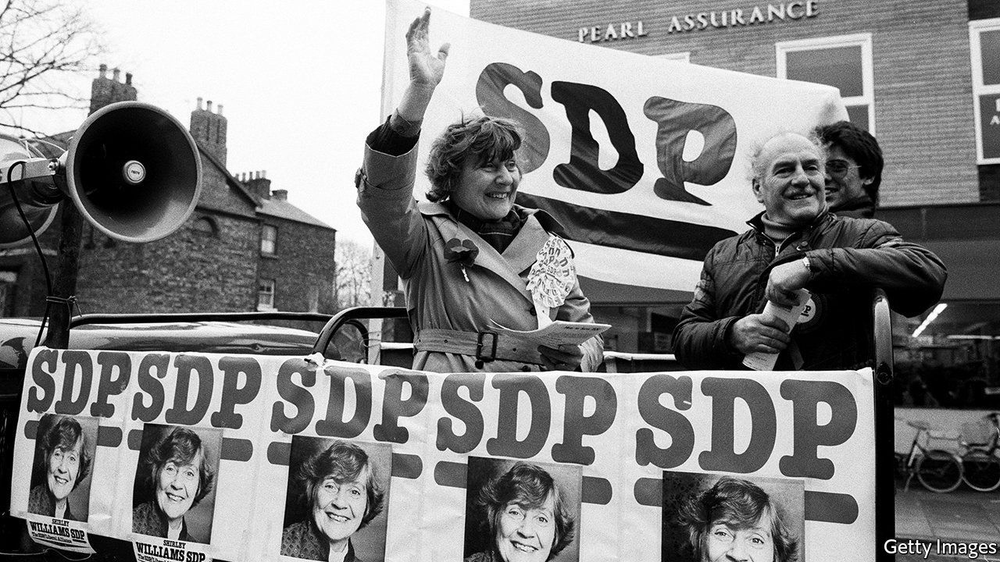

###### A lioness of liberalism

# Shirley Williams, one of the founders of the SDP, dies 

##### She changed politics and education 

 

> Apr 15th 2021 

SHIRLEY WILLIAMS spent her life at the heart of the liberal establishment. Her mother, Vera Brittain, was a prominent feminist and author of the first world war classic “Testament of Youth”; her father, Sir George Catlin, was an academic political theorist and Labour party activist (some would say suck-up); guests at the family home in Cheyne Walk, Chelsea, included T.S. Eliot, Jawaharlal Nehru and most of the leading Labour figures of the age. Ms Williams went on to marry two of the Anglo-Saxon world’s leading liberal intellectuals—Bernard Williams, a fellow of All Souls College, Oxford, and later provost of King’s College, Cambridge, and, after a long gap, Richard Neustadt, a Harvard professor and author of the classic “Presidential Power”.

Williams enjoyed a meteoric career in the Labour Party, starting when she found herself sitting next to the home secretary, Herbert Morrison, in an air-raid shelter, and impressed him so much that he took her to lunch in the House of Commons and made himself her mentor. She was first elected to Parliament in 1964—an annus mirabilis for all things progressive—and spent much of the next 15 years on the front bench. Her distinctive personal style—all messy hair and unkempt clothes—made her a familiar figure in British politics. And her crusade to abolish grammar schools as education secretary in 1976-79 made her one of the most divisive.


But her most important political act was to break with the party that she loved over its drift to the left. In 1981 she joined three other Labour MPs—Roy Jenkins, David Owen and her Oxford contemporary, Bill Rogers—to found the Social Democratic Party (SDP), and issue a guide to a new style of politics, the Limehouse Declaration. At first it looked as if the Gang of Four would achieve their stated aim of “breaking the mould” of British politics: in the Crosby by-election that year Williams converted a 19,272 Conservative majority into a 5,289 SDP majority.

But the mould quivered only to reform. A party that was supposed to be reason in action was consumed by personality clashes—particularly between the vanity projects that were David Owen and Roy Jenkins. In the 1983 election the SDP-Liberal Alliance only won 23 seats, with Williams among the casualties, and the party then spent much of its youthful energy forming a condominium with the liberals (Williams mysteriously described her party as “the heterosexual wing of the Liberals”).

From the moment she arrived in the House of Commons Williams was talked of as a future prime minister. And much of the commentary that followed her death reflected this high assessment of her powers (one writer in the Times even ventured that “her career was just as astonishing and almost as influential as Thatcher’s”). In truth, Williams lacked the combination of total dedication and the killer instinct that makes for a first-rank politician. She lost her chance of becoming SDP leader by a couple of fatal hesitations—first by failing to put herself forward for the Warrington by-election (Roy Jenkins stood instead) and then by failing to challenge Jenkins for the party leadership.

Her critics go too far when they argue that her major contribution to politics was to keep Margaret Thatcher in power by splitting the opposition. The opposition would have been too feeble to fell Thatcher even if the SDP had not embarked on its doomed mission. And the split made it clear that Labour would have to reform if it were ever to regain power, and thus laid the groundwork for Tony Blair’s New Labour project.

The critics are on more solid ground when they criticise her time as education secretary. Her great cause was abolishing grammar schools in the name of equality. She was particularly hostile to direct-grant schools—state-subsidised private schools. Yet she did nothing to remove the charitable status from public schools which, with the grammar schools abolished, entered a prolonged boom. It is an odd form of justice that Williams’s sartorial style—call it dishevelled poshness—has been brought to perfection by the Etonian who currently sits in Number 10. ■

