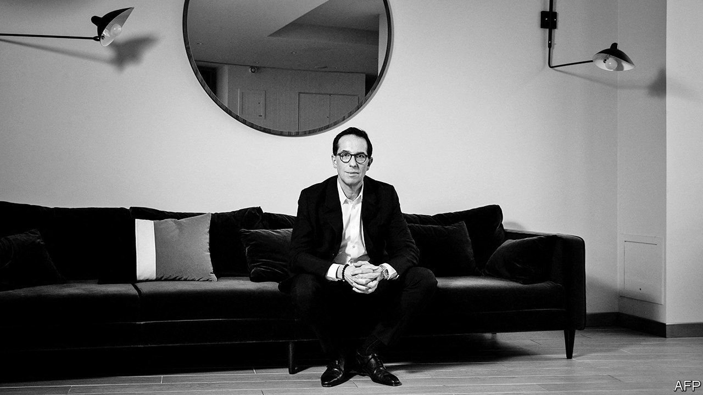

###### Skin deep

# A new boss at L’Oréal will have to prove he is worth it 

##### What will beauty habits look like after the pandemic? 

 

> Apr 17th 2021 

ACCORDING TO INDUSTRY lore, lipstick sales increase in recessions as women opt for affordable indulgences. This time it has been firms peddling masks and video-conferencing software that have prospered. But as face-to-face life slowly resumes in much of the world, purveyors of shampoo, skin creams, perfumes and the like are wondering how the pandemic will have changed beauty habits. At L’Oréal, the world’s biggest such firm, it will be up to a fresh face to navigate this new world.

Nicolas Hieronimus, who is set to take over as chief executive after a shareholder vote on April 20th, will be only the sixth boss since the French firm was founded in 1909. Stability in the upper ranks reflects the fact that L’Oréal has been a standout performer in an industry that has itself grown steadily. Investors, led by the Bettencourt family which inherited what is now a one-third stake worth $76bn, have emphasised continuity. After 15 years leading the group Jean-Paul Agon will focus on his role as chairman. Mr Hieronimus has been deputy chief executive for four years, and spent his working life at the group.


Mr Agon will feature in the company’s glossy history brochures as the man who brought L’Oréal to China. Having set up its operation there in 1997, he oversaw the country’s growth into the firm’s biggest market bar America. His closing act will have been to navigate covid-19, which shuttered stores and hair salons everywhere. Sales and profits dipped in 2020, though by a modest 5% or so. That Chinese shoppers kept buying helped, as did a surge in online orders, up by nearly two-thirds to 27% of total sales.

Attention is now turning to the post-pandemic future. Mr Agon has said a fiesta of fragrances and glossy lips is on the cards. Some sales channels, such as airport shops, will probably not recover fast. Like other providers of fast-moving consumer goods, L’Oréal hopes online habits formed in the pandemic will endure.

Mr Hieronimus faces no crisis, but challenges do loom. L’Oréal’s growth in Asia conceals ho-hum performance in other markets, notably America. Its biggest division, which sells everyday shampoos and makeup, was growing sluggishly even before the pandemic. That has left the group dependent on pricier offerings, often sold under the brands it has to license from luxury groups such as Prada.

Another threat comes from new rivals. The rise of e-commerce and social media means launching a beauty brand no longer requires complex distribution and mammoth advertising budgets. That has lowered the barriers to entry for wannabe competitors. L’Oréal, used to featuring celebrities in its advertising campaigns, now has to compete against such “influencers” launching their own beauty ranges.

Industry executives are still grappling with what working from home, or hiding lips behind a mask, will do to the business. In America, where many global beauty trends are forged, makeup was in decline even before lockdowns. Gone are the days of heavy foundation and showy eyeliner; teens increasingly say they are happy with no face paint at all. Luckily L’Oréal’s skincare range has a slew of chemical potions to help achieve just that natural look. ■

