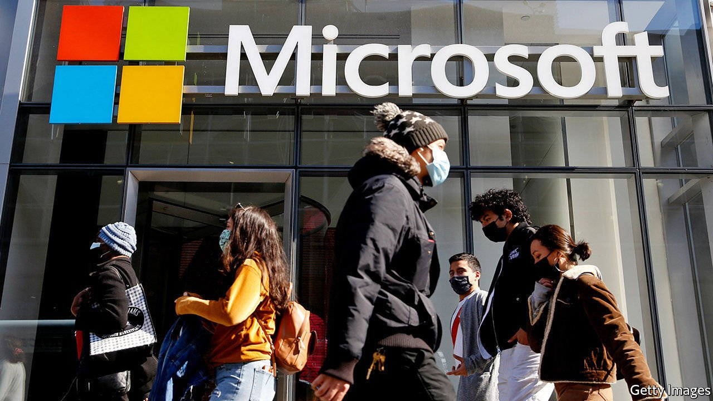

###### Don’t be fooled by randomness

# The method in Microsoft’s merger madness 

##### Making sense of the software giant’s acquisitive streak 

 

> Apr 15th 2021 

TAKE OUR cash, or at least our shares. That appears to be Microsoft’s mantra these days. After failing to acquire the American operations of TikTok, a short-video app, last year, the software giant was recently rumoured to be in takeover talks with Pinterest, a virtual pin-board, and Discord, an online-chat service. And on April 12th the firm announced that it would acquire Nuance, a speech-recognition specialist, for nearly $20bn in cash—its second-biggest acquisition ever.

Even before this latest flurry Microsoft had acquired a reputation for coveting tech firms that looked as alien to its core business of selling office software as TikTok’s dance videos are to Word and Excel. Five years ago, in its biggest purchase, it paid $26bn for LinkedIn, a business-oriented social network. In 2018 it picked up GitHub, a development platform for open-source programs, for $7.5bn.“Is Satya Nadella getting bored?” wondered the Information, a website covering the tech industry. Having successfully turned Microsoft around, observers murmured, its boss might be in the grip of merger madness. In fact, there might be a method to it.


For starters, Microsoft’s merger activities are unexceptional by big-tech standards, says Mark Moerdler of Bernstein, a broker. The industry is rife with takeover rumours; most are probably true. Large firms talk regularly to each other about potential deals. It is safe to say that Microsoft has term sheets for many potential targets on file. It still invests far more in expanding its existing businesses than on buying new ones. Excluding the Nuance deal, the company has spent only $33bn on big acquisitions in the past four years, compared with $64bn on research and development. It has oodles of cash in the bank ($132bn at the end of last year) and a valuable currency (its share price is up by more than 600% since Mr Nadella took over in 2014). Unlike rivals such as Alphabet and Facebook, both of which face antitrust cases and have steered clear of big deals lately, Microsoft is no longer on trustbusters’ radar.

 


By its relatively timid standard, though, Microsoft has indeed become more acquisitive in recent years (see chart). Having provided textbook examples of what not to do, most notably after buying Nokia, a phonemaker, and Skype, an internet phone service, it has learned how to integrate targets successfully. Under Mr Nadella it has taken on a shape that better lends itself to this process.

Simply put, it has become a giant computing cloud that can digest any data and offer any service. An acquisition can thus add to the business in more ways than one—and “feed the beast”, in the words of Brent Thill of Jefferies, an investment bank. Even TikTok would have brought new computing tasks for the cloud, provided reams of videos to train artificial-intelligence algorithms and allowed the firm to beef up its consumer business.

Purchases also help Microsoft to keep growing rapidly by allowing it to ride big industry trends. Discord, like GitHub before it, looked to be a bet on the shift toward creating content and related user communities, which Mr Nadella thinks will dominate life online. A bit like LinkedIn, Pinterest would give Microsoft access to data about people’s interests, which could enable new forms of e-commerce.

The Nuance deal encapsulates all these considerations. The firm is best known for its speech-recognition software and a health-care platform used in 77% of American hospitals. This technology, along with lots of valuable health data, will beef up Microsoft’s “health cloud”. Nuance’s portfolio of patents can be used elsewhere in Mr Nadella’s empire. Though $20bn looks pricey for a firm with a net profit of $29m last year on revenues of $1.5bn, Microsoft can afford it. Discord and Pinterest seem to be off the table for now. But expect Microsoft to surprise with more deals. And don’t be fooled by their apparent randomness. ■

