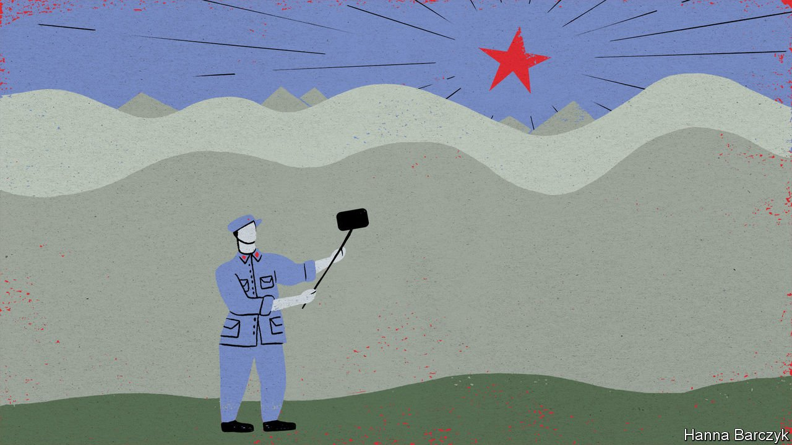

###### Chaguan

# Mao’s revolution becomes a lesson about conformity 

##### China’s Communist Party builds a propaganda festival around its 100th birthday 

 

> Apr 17th 2021 

ON A COLD and rainy recent night, on a mountain soaked in the blood of early Communist Party martyrs, Chaguan went for a walk to look for ghosts. None could be found. Instead Jinggang Mountain, in the southern province of Jiangxi, revealed itself as an oddly kitsch tourist complex, being readied for nationwide celebrations to mark the 100th anniversary of the party’s founding, in July. Toiling in the dark, work crews were installing floral displays and streetlights topped with red plastic flames.

Tens of thousands died on the mountain between 1927 and 1929, as Mao Zedong and pioneering Red Army units took refuge on its bamboo-clad slopes, hiding from the ruling Nationalist regime and prowling warlords. Some died in combat, others in political purges. Others were killed by cold and disease in a region so poor that locals ate wild vegetables and trapped squirrels for meat.


Today Jinggang Mountain is preserved as a “cradle of the revolution”. The local mayor, Jiao Xuejun, calls it “a spiritual place” that “purifies minds and clarifies people’s beliefs”. For all that, visitors hear little about its complex history. Rather, generic slogans reflect the party’s modern-day claim to rule, based on decades of economic development. A typical display, formed from illuminated red characters hanging from trees, reads: “The People Have Faith, the Country Has Strength, the Nation Has Hope”.

Tour groups, some in replica Red Army uniforms, throng a museum filled with revolutionary relics before heading to souvenir shops selling Mao statues. Nearby, a China Executive Leadership Academy, overseen by the party’s Central Committee, trains high-flying officials from around the country. The academy calls itself a furnace where cadres are fired with renewed fervour, via residential courses in party history, discipline and theory: above all, “Xi Jinping Thought on Socialism with Chinese Characteristics for a New Era”. Mr Xi visited in 2016. His tribute to the “Jinggang Mountain Spirit” is inscribed on an academy wall.

The mountain witnessed important ideological battles. Mao argued with party chiefs in far-off Shanghai about how to recruit peasants as revolutionary warriors, after urban uprisings failed. Some sharp rows concerned the merits of political terror, and whether to seize land from all landlords, or just the richest. Mao favoured a selective use of violence. He held public-execution rallies at which local gentry were disembowelled with spears, and hung a scaffold with couplets in his own calligraphy, reading: “Watch Us Kill the Bad Landlords Today. Aren’t You Afraid?” Mao eagerly recruited mountain bandits as troops and grumbled about the “petty-bourgeois consciousness” of villagers, who rarely volunteered to join the Red Army, wanting instead to farm in peace. When an enemy army drew near in January 1929, Mao abandoned Jinggang Mountain, leaving only a token force to defend thousands of villagers, wounded troops and Red Army wives and children. Massacres followed. An official history published in 1987, during a period of relative candour about Mao’s mistakes, cites a party inspector’s judgment that the Red Army’s 15-month stay left Jinggang Mountain “totally bankrupt”.

Such debates are now played down. Chaguan visited the mountain on a government tour, organised to introduce foreign and Chinese journalists to local leaders preparing to fete the party’s centenary, as well as to officials studying at the academy. Pressed to explain the Jinggang Mountain spirit, those students carefully refer to Mr Xi’s definition of it, which stresses persistence, seeking truth from facts, tackling difficulties and relying on the masses. Smoothly, academy students trace a common “Red culture” connecting early martyrs with material prosperity today. One student, a party chief at a university in central China, recounts how he ferried his son on a bicycle in the 1990s, whereas his soon-to-be-born grandchild will ride in a car. Definitions of happiness evolve, but “the people have always had dreams of a better life,” he beams. Another, a provincial vice-president of the All-China Women’s Federation, insists that for 100 years “the party’s goal hasn’t changed, it is wholeheartedly to serve the people.”

The right sort of fervour

Academy students take a field trip to a mountain pass, Huangyangjie, made famous after the Red Army held off a bigger enemy force there. Standing to attention in rows, the middle-aged officials recite in unison a Mao poem about this victory. A lecturer assures them—in contradiction of the historical record—that long-ago locals showed “complete loyalty to the party”, praising a villager whose eight children all joined the Red Army. “Relying on the masses is not a pretty slogan, it’s a reality forged in fire,” the lecturer says, drawing a link with the mobilisation of ordinary Chinese to fight covid-19. “The form of the war may change, but the path of relying on the masses is still the right one,” he concludes.

Officials offer simple morality tales about the selflessness of party members, from the Red Army commander who carried grain up the mountain to feed his soldiers, to the students who left “great universities” in Beijing to fight in Jiangxi 90-odd years ago. When visitors learn how highly educated patriots in their 20s sacrificed their lives, they realise that they can overcome their own difficulties, enthuses Mr Jiao, the mayor. An academy boss compares revolutionary martyrs to modern-day party secretaries who volunteered to work in harsh, remote villages to alleviate rural poverty, some of whom perished on the job.

The blandness of these approved stories is no accident. It is hard for today’s rulers, obsessed as they are with order and conformity, to celebrate a revolution, even one a century old. A revealing commentary in the People’s Daily this month called for party members to practice “self-revolution” and “self-purification” via strict discipline. In the Xi era, a revolutionary spirit is one that submits to party authority. History is a way to measure how far China has come. Ghosts from the real, messy past are not welcome.■

