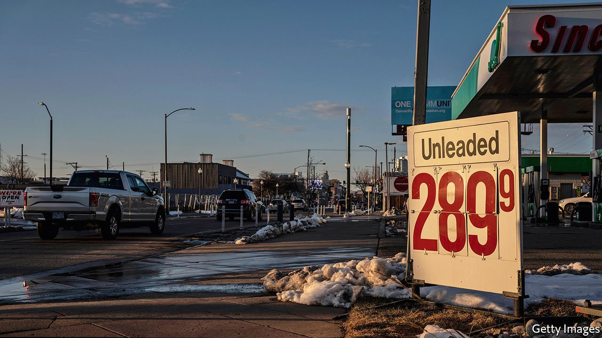

###### Base jumping

# America’s inflation spike begins 

##### A data quirk and a reheating economy push up the consumer-price index 

 

> Apr 13th 2021 

IN THE SPRING of 2020 American consumer prices fell for three consecutive months as the pandemic struck. Rents collapsed, hotel rooms went empty and oil prices turned negative. All sudden spurts of deflation or inflation make the news twice: first when they happen and then a year later, when they distort comparisons that look back 12 months. Sure enough on April 13th statisticians announced that consumer prices in March were fully 2.6% higher than a year earlier, up from 1.7% in February. The increase in headline inflation was the biggest since November 2009, when similar “base effects” were in play after the global financial crisis.

It would be wrong, however, to dismiss the rise in inflation as a mere mathematical quirk. America’s economy is emerging from the downturn at great speed as jobs return and vaccinated consumers start spending. In March alone prices rose by 0.6% compared with the previous month, the fastest pace since 2012. Much of that was driven by a big increase in petrol prices but even the “core” consumer-price index (CPI), which strips out food and energy prices, was up by 0.3% (an annualised pace of 4.1%). Services prices in particular have started to rebound: hotel rooms were 4.4% dearer than a month earlier and rent, a big component of the index, has firmed in recent months. Capital Economics, a consultancy, predicts that the combination ofbase effects and a boomy reopening will drive the headline annual rate of inflation close to 4% by May.

 


The Federal Reserve targets annual inflation of 2%, but on a different measure—the price index for personal consumption expenditures—which tends to run about a third of a percentage point cooler than CPI. Still, if prices rise at a monthly pace consistent with the Fed’s target, as they roughly have in recent months, base effects mean that the target will soon be exceeded in annual terms (see chart). Any heat in the economy will lead to further overshooting.


The path of inflation matters more than usual because of the amount of economic uncertainty in the air. The relaxation of social-distancing restrictions, President Joe Biden’s enormous $1.9trn economic stimulus and the unusual doveishness of the Fed, which is employing a new monetary-policy framework, together comprise an inflation experiment. It has turned some doves into hawks, with economists such as Larry Summers, a former treasury secretary, and Olivier Blanchard, a former chief economist of the IMF, warning of the risk of overheating. And, as the administration follows up its stimulus with an infrastructure bill, how the experiment pans out will help determine how much more deficit spending the economy can take.

The Fed and the White House both expect any pickup in inflation this year to be temporary. Financial markets are less sure. They are pricing in both a growing risk of a prolonged period of inflation above the Fed’s target and the possibility of higher interest rates in 2022—whereas at the Fed’s most recent meeting in March the median monetary-policymaker did not forecast lift-off until after 2023. The central-banking view stems chiefly from the state of the labour market, which is about 8.4m jobs short of the level of employment in February 2020 and even further behind where it would have been had the pre-pandemic trend continued. That amount of economic slack should keep inflation subdued.

Yet investors could be forgiven for asking questions of the economists’ models. These have consistently underestimated the pace of America’s jobs rebound. In the second quarter of 2020 the median respondent to the Philadelphia Federal Reserve Bank’s survey of professional forecasters thought unemployment two quarters later would average 11%; in fact it turned out to be only 6.8%. That was the biggest overestimate in the history of the survey and more than three times the next highest such error. In February this year forecasters expected unemployment in the second quarter to average 6.1%, only for it to fall below that rate in March. If the labour market continues to outperform expectations the economy will eat up slack and push up inflation sooner.

At that point the Fed will face a choice. Its new policy framework seeks to overshoot its 2% target temporarily after recessions, in order to make up lost ground. But it has been vague about what this “average-inflation targeting” means in practice. Some recent speeches by officials have suggested that the central bank needs to compensate for lost inflation since last spring. Others have implied that August is the starting point for catch-up policy, as that is when the framework changed. But there has been no inflation shortfall since August (see bottom panel on chart). If the springtime bump in inflation does not melt away, the central bank will be forced to decide precisely what it wants.■

