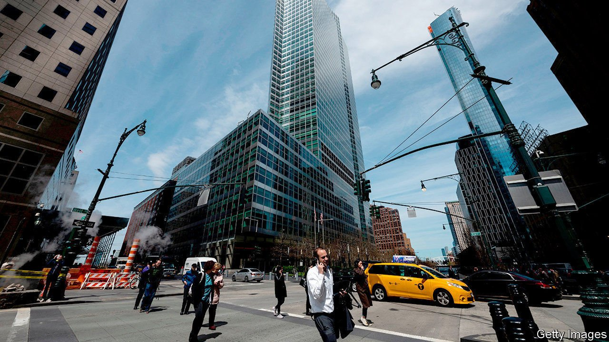

###### Hand over fist

# Profits at America’s banks are sky-high 

##### It helps that the economy is on the up, and markets are soaring 

 

> Apr 17th 2021 

THE GOOD old days seem to be returning to America. Now that nearly 200m vaccine doses have been administered, people are gathering in bars, restaurants and shops. The days are warmer and longer. And banks are making returns on equity of 20% once more.

It has been a while since Wall Street has been able to present the kind of stellar results that America's banks announced to their investors on April 14th. JPMorgan Chase posted record revenues in the first quarter; those at Goldman Sachs were twice the level in the first quarter of 2020. Profits at Bank of America doubled on the year; those at Citigroup tripled. Returns on tangible common equity, a measure of profits relative to capital, leapt to 20% at Citigroup, 29% at JPMorgan and 33% at Goldman. Not since before the global financial crisis, more than a decade ago, have the banks’ shareholders been so flush (see chart).

 


Two factors are behind the boom. The first is the frenzied activity in capital markets in the first quarter. The burst of activity in stock and bond markets, partly spurred by the surge in retail trading, sent JPMorgan’s investment-banking profits to a record high. Firms rushed to go public and issue capital into frothy stockmarkets: equity-underwriting revenues were up by 40% at Goldman, compared with the fourth quarter. The craze for special-purpose acquisition companies (SPACs) lifted investment-bank revenues at Citigroup by more than 50% compared with the preceding quarter. Dealmaking flooded back after a drought during the worst of the pandemic. Goldman’s advisory fees were 40% higher than in the same period last year. And more will come: David Solomon, the bank’s boss, told investors that the backlog of transactions it is scheduled to carry out is at an all-time high.


The second factor behind banks’ robust results is a rosier outlook for America’s economy. Continued government stimulus has led lenders to revise up their economic forecasts. That in turn means that reserves that had been set aside in case loans soured are no longer needed. JPMorgan wrote off $1.1bn for bad debts in the first quarter; but it also now expects $4.2bn of loans it once thought it would have to write off to be repaid, allowing the sum to be counted as income. This boosted profits by 30%. Wells Fargo, which also reported decent results on April 14th but does not benefit as much from busy capital markets, added $1bn to its pre-tax income thanks to lower expected losses. Bank of America added $1.9bn to its earnings for the same reason.

Booming results probably help explain why some banks’ share prices have recovered their losses since March 2020, and have even made gains. But neither driver of stellar earnings looks likely to last. Though they have remained very strong for several consecutive quarters, market revenues will probably eventually fall back to more normal levels. Running down reserves set aside for bad loans cannot boost banks’ income indefinitely.

You only need to listen to bank bosses to understand how different—and difficult—it is to run a bank in modern times. Even as he told investors that the underlying results were “fabulous”, Jamie Dimon, the boss of JPMorgan, lamented how much time his bank had dedicated to discussing the alphabet soup of regulations now levied on big lenders’ balance-sheets, from CECL (current expected credit losses), to the SLR (supplemental leverage ratio) and the G-SIFI surcharge (an extra capital charge for global systemically important financial institutions).

And even as the pandemic has spurred record profits at many banks, it has also put them in a tricky spot. As the Federal Reserve bought up assets to support the economy, its balance-sheet has ballooned. Each asset bought by the Fed creates a new cash deposit that makes its way to accounts at the banks. Stimulus cheques and robust capital markets, meanwhile, mean that demand for loans from households and companies is low. The result is a pile-up of deposits, especially at big banks—and that in turn is causing post-crisis regulation to bind more tightly. More deposits and liquid assets make for bigger banks in absolute terms, which, for instance, increases the G-SIFI charge and makes leverage ratios look worse. That seems perverse, given that banks are actually safer. “We have $2.2trn of deposits, $1trn of loans and $1.5trn of cash and marketable securities, much of which cannot be deployed to intermediate or lend,” said Mr Dimon. “How conservative do you want to get?”

Regulators have toyed with the idea of relaxing some rules. The SLR requires big banks to fund themselves with equity worth at least 5% of total assets. In March 2020, a realisation that the Fed’s emergency actions had the unwanted effect of making the SLR bind more tightly led regulators to exclude cash reserves and Treasuries from the ratio’s calculation. But extending this pragmatic and sensible exemption proved politically fraught, and it expired at the end of March this year. The good times may be back, but they are not as good as they used to be. ■

