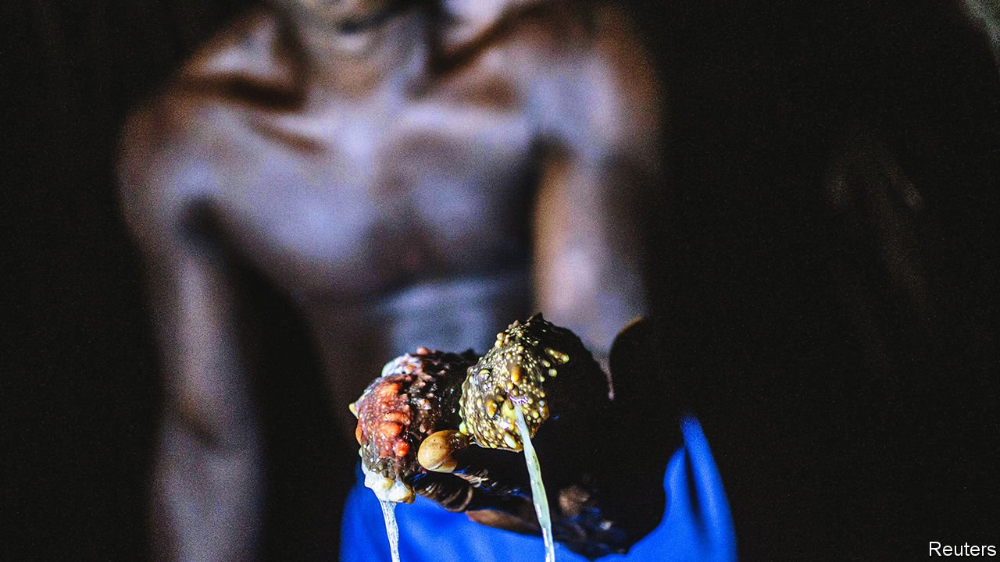

###### Slug-like and precious

# How covid-19 walloped sea-cucumber catchers 

##### Exporting big chewy delicacies to China has grown much harder 

 

> Apr 17th 2021 

IN A COCONUT grove behind a secluded beach in Liberia is a tin cabin cobbled together by a dozen Sierra Leonean divers. They have been plying the coastline in search of “black gold”. Not oil, but the sea cucumber, a large slug-like creature that infests the ocean floor. Local fishermen have traditionally ignored them, since locals deem them unappetising. Yet if dried and exported to China, they can fetch $500 a kilo. Chinese chefs and diners adore them. They are also an ingredient in traditional Chinese medicine, and touted without evidence as a way of boosting virility.

The divers, whose tattoos and swagger make them stick out among Liberians, have not always been itinerant. As recently as 2013 their own waters off Freetown, Sierra Leone’s capital, were teeming with sea cucumbers. Young men willing to don a breathing hose could make good money. In the dead of night they would gather their prey. But Sierra Leone’s stocks have shrunk and most of the Chinese traders have left. Some divers have tried their luck elsewhere.


Covid-19 has upended the business. Lockdowns have left cucumber-catchers stranded in remote Liberian villages. And the closure of airports has all but halted sea-cucumber exports. Many catchers sold their canoes, smartphones and designer shoes, says Abdoulaye Mansaray, who leads one group of them. And when they ran out of money for food, they turned to their stock of unsold dried sea cucumbers. This was a culinary challenge for Musa, the cook. He soaked them for three days before frying them with onions. His creation was shared with curious locals. The divers claim that those who ate the echinoderms were startled by the aphrodisiac effect—and fisherfolk never exaggerate.

This year the catchers have been prospecting farther down the Liberian coast in ropey rented canoes. Their diving season was cut short by the authorities, who seized their motors over a licensing dispute: a sign, perhaps, that Liberian stocks of sea cucumbers will be better managed than Sierra Leone’s. But the sea cucumbers gathered here are too small to fetch a good price. So the divers will be moving on, coiling their hoses, loading their leaky boats and setting off in search of seabeds better endowed with large, chewy slug-like creatures.

Dig deeper

All our stories relating to the pandemic and the vaccines can be found on our . You can also listen to , our new podcast on the race between injections and infections, and find trackers showing ,  and the virus’s spread across  and .

