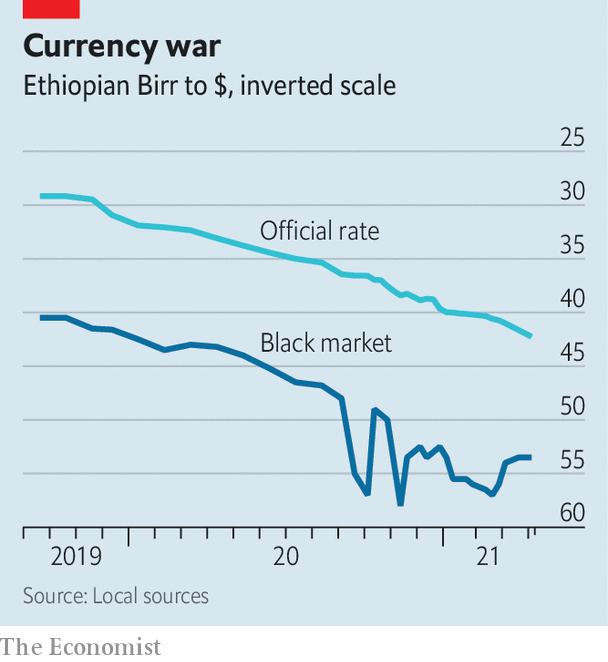

###### Blowing in the wind

# The war in Tigray is taking a frightful human toll 

##### It is also rattling Ethiopia’s economy 

 

> Apr 15th 2021 

“LIKE FLOUR scattered in the wind” is how Abiy Ahmed, Ethiopia’s prime minister, describes the Tigrayan People’s Liberation Front (TPLF), the ethnically based party that called the shots in Ethiopia for almost three decades. By this he means it is crushed, never to revive. There is no denying that its power has waned. In 2018 the TPLF lost control of the federal government, making way for the ascent of Abiy. Then last November his forces kicked the TPLF out of its seat in the regional government of Tigray, a northern state, killing or capturing some of its leaders and sending the rest into hiding.

But Abiy’s description is apt in another way too. His forces are now battling invisible guerrillas whom they are unable completely to subdue. Last year, soon after federal troops entered Mekelle, the Tigrayan capital, Abiy declared victory. Now he admits that defeating “an enemy which is in hiding” will be “very difficult”.


As the war drags on, the human toll mounts. In recent weeks tens of thousands of Tigrayans have fled what American officials have described as ethnic cleansing in western Tigray. Possibly thousands of civilians have been murdered by armed forces on all sides. Women and doctors in Tigray report mass rape by both Ethiopian and Eritrean soldiers. “The conflict is ongoing and human-rights violations are happening every day,” says Finland’s foreign minister, Pekka Haavisto, who is the EU’s special envoy to Ethiopia.

The war’s economic costs are ruinous, too. Life had been improving. Between 2000 and 2016 the share of Ethiopians who could not afford to buy a basket of food containing the minimum number of calories they need fell from 44% to 24%. Such huge gains, made in Africa’s second-most populous country, are now under threat.

Start with the direct costs of reconstruction. Eyob Tolina, Ethiopia’s finance minister, estimates that the price of repairing damaged infrastructure will be around $1bn (about 1% of GDP). Schools, universities and hospitals have been looted or destroyed, as have farms and factories.

 


Longer-term costs are harder to quantify, but are piling up. Before the war Tigray produced a third of Ethiopia’s sesame exports, worth almost $350m a year, a tenth of total exports. Since then, tens of thousands of farmers have fled, abandoning the harvest. Although business in Mekelle is slowly picking up, banks and markets in much of the region are still closed.

Officials shrug off the economic impact. In January the trade ministry said that the closure of factories and roads in Tigray was losing the country $20m a month in exports. Abiy has since trumpeted a 21% rise in exports, largely thanks to a huge surge in earnings from gold. The government insists that the economy will grow by 8.5% in 2021. The IMF, however, reckons growth will be closer to 2%.

The government’s confidence is based on an assumption that the war’s impact will be limited to Tigray, which accounts for less than 10% of the national economy. “Tigray...is a geographically small part of the country,” says a senior government adviser. “Certainly not a big macro issue.” Public debt has fallen by more than a tenth since reaching a peak of almost 60% of GDP three years ago, even after a small rise because of covid-19.

But how long can the economy bear a prolonged conflict? Inflation, which was running at 18% before the war, is now above 20%. Foreign exchange is cripplingly scarce. On the black market the Ethiopian birr has fallen by 9% against the dollar in recent months. Businesses trying to get foreign currency through official channels often wait at least a year to get their allocation from state-owned banks.

The government has asked the IMF and the World Bank to bail it out. In February it said it would apply for debt relief under a programme aimed at helping poor countries affected by covid-19. Rating agencies duly downgraded Ethiopia’s debt. The government also hopes to get a windfall from auctioning two new mobile-phone licences and later selling a 45% share of Ethio Telecom, the mobile-phone monopoly.

But relief, whether from lenders or investors, may be slow. Faced with reports of atrocities as well as uncertainty concerning elections, which are planned for June, foreign investors are nervous. “Everything is on hold,” reports one of them. Officials fret that extra support from donors may not be forthcoming. In January the European Union suspended €88m ($107m) of budget support until aid agencies are given full access to Tigray.

Ethiopia also has little room for manoeuvre. Under the terms of an existing IMF programme it cannot easily borrow more. Nor can it just print money. The treasury has been able to finance its deficit by selling treasury bills, mostly to state-owned pension funds (previously it simply forced banks to hold public debt at below-market rates). But the government will face a balance-of-payments crisis unless it can get hard currency to finance imports and service its foreign-denominated debts.

Allies such as China, Russia and, especially, countries in the Gulf may help to plug the gap. Meanwhile the conflict is spreading. People in Tigray are already starving. Mass famine looms. Elsewhere in the country ethnic violence is worsening. In recent weeks hundreds of people have died in clashes between Oromos and Amharas, the country’s two biggest groups, as well as between ethnic Somalis and Afars in the east. Eyob, the finance minister, sounds optimistic, arguing that in recent months the economy has shown “resilience” in the face of the crisis. On the ground, though, the situation looks increasingly dire. ■

