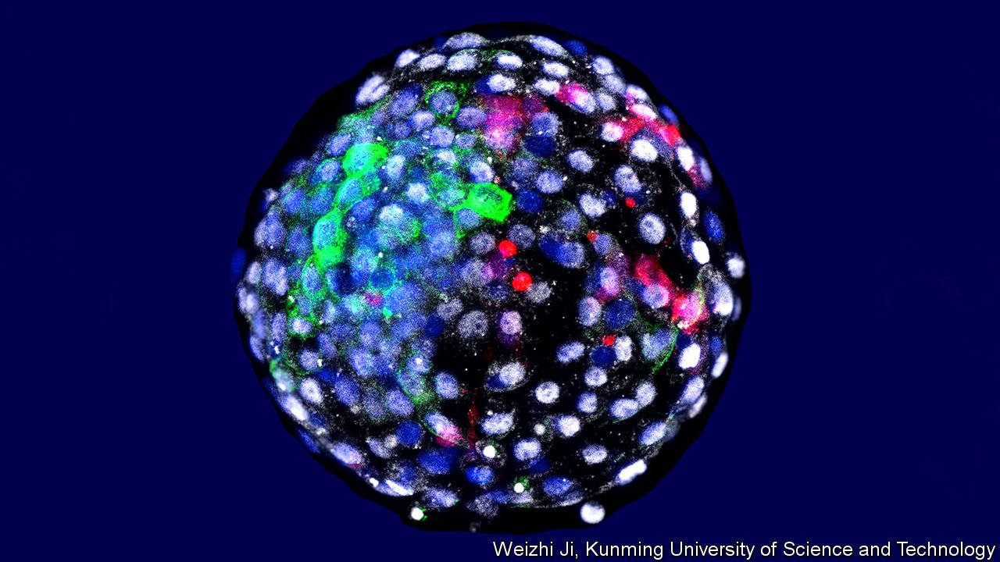

###### Fantastic beasts

# Researchers have created embryos that are part-human and part-monkey 

##### They could one day provide organs for transplant 

 

> Apr 15th 2021 

THE ANCIENT GREEKS were good at inventing fantastical animals. The chimera, for instance, was “a thing of immortal make, not human, lion-fronted and snake behind, a goat in the middle”. It was eventually slain by Bellerophon, with help from his flying horse.

Not all chimeras are mythological. To biologists, the term describes organisms whose bodies consist of cells from two distinct lineages. In twin pregnancies, for example, one twin can occasionally absorb the other. The resulting individual is built from cells with separate genomes. A 2019 forensic-science conference discussed the case of a man who had received a bone-marrow transplant. Since bone marrow produces blood cells, subsequent DNA tests on the man’s blood matched his donor’s genome, not his own. (More unexpectedly, the donor’s DNA also turned out to be present in swabs taken from the man’s cheeks, and in his semen.)


For several decades scientists have been experimenting with cross-species chimeras, organisms which, as in the Greek myths, are composites of different animals. They have created mouse-rats, sheep-goats and chicken-quails. Now, in a paper published in Cell, Tao Tan, a biologist at Kunming University of Science and Technology, and a team of American, Chinese and Spanish researchers, report efforts to extend the principle to humans. They have managed to create embryos that are part-monkey and part-human.

The work builds on earlier endeavours by many of the same researchers. In 2017 Juan Carlos Izpisúa Belmonte, a biologist at the Salk Institute in San Diego, announced the creation of chimeric human-pig embryos. But quite how successful those efforts were is uncertain. Only about one cell in 100,000 in the embryos were human, and it was unclear whether they contributed to the organism’s growth. This time things are different. The human cells seem happy to co-operate, at least some of the time, with the monkey ones.

The researchers began with 132 embryos of the crab-eating macaque. Six days after fertilisation these were injected with human extended pluripotent stem cells, which can develop into any other cell type found in the body. Tagging the human cells with fluorescent markers allowed the researchers to track where in the developing embryo they, and their descendants, went.

In the early stages of development, mammal embryos develop into four distinct cell types. Epiblasts go on to form the organism itself; hypoblasts develop into the yolk sac; trophectoderms become the placenta and extra-embryonic mesenchyme cells make a membrane that surrounds the embryo. The chimera’s human cells made their way into all four types of tissue, though they were outnumbered in every case. No more than 7% of the epiblast was made up of human cells, and just 5% of the hypoblast (in other areas the numbers were lower still).

Joint venture

The cells’ location seemed to influence which proteins they produced. Human cells in the chimera’s epiblast behaved more like those found in human embryos than those found in monkey embryos. But that was not true of human hypoblast or extra-embryonic mesenchyme cells, both of which behaved more like monkey cells.

The monkey cells, in turn, were affected by the presence of the human ones. The researchers found 126 different sorts of cell-to-cell interactions among monkey cells in the chimeric embryos, compared with just 19 in non-chimeric ones, as well as differences in the activity levels of many genes.

The cells were grown in a lab, which imposed limitations. The number of surviving embryos began falling by day 15. By day 20 none was left. But that was enough time for a process called gastrulation to take place. Gastrulation is a vital development stage in which embryonic cells become primed to form different organs and tissues. The human cells took longer to reach this point than the monkey ones did. But they managed nevertheless, providing more evidence that the human cells were not merely passive passengers, but were “mucking in” to help with the process of embryonic development.

The researchers hope this biotechnological wizardry will help with two goals. One is to shed light on the complicated process of embryological development, which might eventually lead to treatments for some congenital diseases. Chimeras may offer a way around some of the ethical difficulties involved in experimenting on human embryos.

The other is the hope that chimeric animals might one day provide a source of organs to be transplanted into sick humans. In 2017 Japanese researchers demonstrated the principle by transplanting parts of a pancreas that had grown inside a mouse-rat chimera into a diabetic mouse, curing it. Whether that can work in people is, for now, unclear. And research into human chimeras is ethically fraught. America, for instance, forbids federal funding of such work. Most of the work reported in this latest paper happened in China.

But if chimeric human organs do become a reality, macaques are unlikely to be the animal of choice, says Dr Izpisúa Belmonte. The most likely donor would probably be pigs (this is why his 2017 experiment focused on the animals). Their organs are roughly the size of their human equivalents, and, fairly or unfairly, they seem to provoke fewer moral qualms. (Pigs already provide thousands of people with replacement heart valves, for instance.)

The advantage of working with monkeys, at least for now, is that they are much closer, in evolutionary terms, to humans. That may have helped smooth out any compatibility issues between the two sets of cells. The hope is that lessons from experiments with humanity’s close cousins might allow the researchers to revisit their work with its more distant, porcine relatives—and get better results. ■

