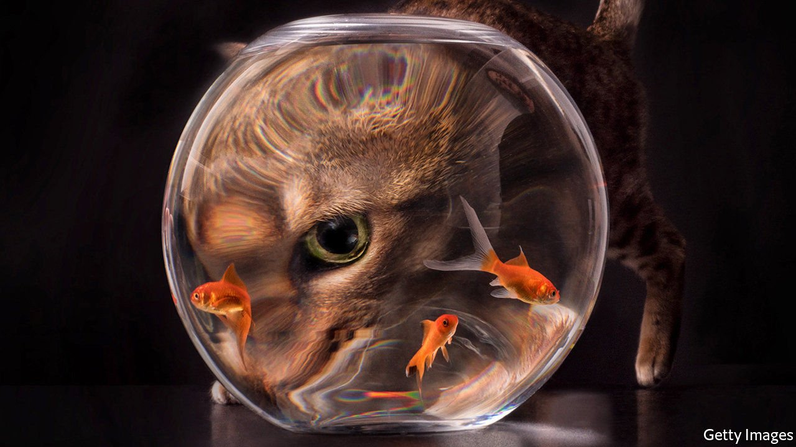

###### Photography

# Taking selfies with a liquid lens 

##### A smartphone with a fluid lens 

 

> Apr 14th 2021 

SERIOUS PHOTOGRAPHERS are usually laden with serious amounts of serious kit, especially multiple lenses. The paparazzi use zoom lenses to get a telescopic view of their subjects. Mid-range lenses are well-suited to street-scenes and portraits. Wide-angle lenses are good for capturing sweeping cityscapes. A macro lens is ideal for close-ups. But what if it were possible to build a single lens that could cover all such eventualities? Xiaomi, a Chinese electronics and consumer-goods company, is taking a shot in that direction.

On April 16th, Xiaomi’s new Mi Mix Fold smartphone will go on sale, priced from 9,999 yuan ($1,526). Like most new smartphones it is packed with whizzy features, including a flexible screen that can be folded open and shut. But what makes this new phone special is that it is the first to come equipped with a liquid lens.


A conventional camera lens consists of several specially shaped and polished glass or Perspex elements inside a tube. These act to deflect incoming light. By moving them closer or farther away, it is possible to focus an image onto the camera’s sensor and, if it is a zoom lens, to adjust the magnification. In modern cameras the lenses are moved by electric motors.

There is little or no such paraphernalia involved with liquid lenses. They work a bit like the human eye, in which muscles squash or stretch an elasticated lens, altering its curvature so that a person can focus on objects at different distances. Most liquid lenses consist of an aqueous fluid, sometimes with an associated layer of oil, sitting on a water-repelling surface. This surface causes the fluid to form into a spherical blob, like a bead of water sitting on a lily pad. Applying an electric charge to the edge of the blob attracts molecules in the liquid to the perimeter. This flattens the lens, thus changing its focal length. Conversely, reducing the charge sends the molecules back to the middle, causing the lens to fatten up again.

Liquid lenses of this type already have a number of uses, mostly in industry and medicine. Because they can focus rapidly on objects at different distances and tend not to wear out, they are sometimes employed as image sensors on automated production lines, and to read bar codes. They can also be made tiny, which means they are ideally suited for use with the laparoscopic cameras that are inserted into people’s bodies during keyhole surgery.

Xiaomi, however, has taken a different direction in its new phone. It uses a thin, solid film to contain the lens fluid and a small, high-speed electric motor to stretch or relax this film in order to change the lens’s curvature. The company says its lens can work as a 3x optical zoom (a figure that rises to 30x with “digital enhancement”) and as a macro lens, focusing down to 3cm for taking close-up shots.

The company has not explained why it has taken this route with its liquid lens. Perhaps it is more familiar with the technology involved. Nor is it risking putting all its eggs in one basket, as the new phone is also equipped with a standard lens and an ultra wide-angle one. As it will be sold only in China it is, perhaps, partly experimental. Xiaomi did not respond to a request for more information.

As other smartphone-makers have been investigating the technology, it seems only a matter of time before liquid lenses replace some or all of the multiple lenses now appearing on phones. And with phones rivalling even some high-end cameras in picture quality, the makers of conventional cameras might follow with liquid lenses of their own. Snappers, then, can look forward to their gadget bags getting a good deal lighter.■

