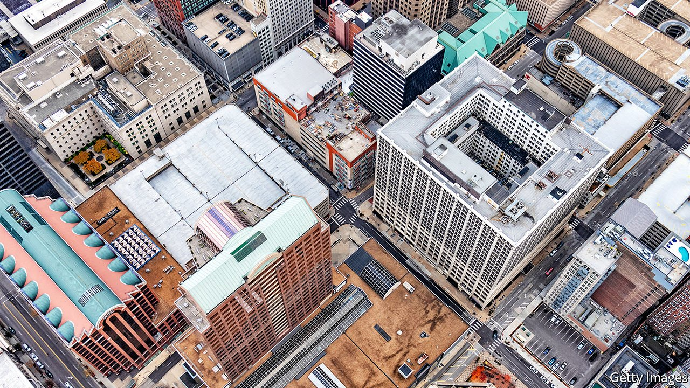

###### Eyes in the sky

# St Louis mulls the promise and perils of aerial surveillance 

##### And finds that citizens are increasingly sceptical of expansive police powers 

 

> Apr 17th 2021 


IT WAS JUST one of more than 2,000 murders in 2009 in Ciudad Juárez, a Mexican city across the Rio Grande from El Paso, Texas: someone shot in an alley, no witnesses. Seen from above, though, a fuller story emerged. Four cars converged on the area—two for protection, one each to carry the shooter to and from the scene—and, after the murder, several people gave fruitless chase. The people were indistinct dots, and the cars just rolling lozenges, but drone footage showed where the shooter came from and, more important for police, where he went after the crime.

The notion of putting cameras on orbiting drones to catch malefactors was born on the battlefields of Iraq, where American armed forces wanted to nab people leaving bombs on roadsides. Ross McNutt, a former air-force engineer, founded Persistent Surveillance Systems (PSS) to offer the same service to American cities (and others, such as Juárez) struggling with high murder rates. PSS drones flew over parts of Baltimore, most recently in May-October 2020. St Louis, among America’s most violent cities, also considered but is poised to reject PSS’s services, which raise difficult questions about how much surveillance Americans are willing to tolerate in exchange for the promise of safer streets.


Putting eyes in the sky gives overworked officers extra visibility, literally, into their own city, and makes them less reliant on help from witnesses, who for a variety of reasons are often reluctant to come forward. That is especially important in a city such as St Louis, which last year recorded a record 262 murders. Police solved just over one in three of them. By comparison, London, with around 30 times as many people, reported 126 killings last year; nationally, American police forces solve more than three in five killings. Mr McNutt contends that PSS also has a deterrent effect: if people know they might be under surveillance, they will be less likely to commit crimes.


Yet many Americans are uneasy about being put under surveillance, despite having been suspected of committing no crimes. Baltimore first used PSS drones for eight months in 2016, but kept the programme secret until a report from Bloomberg Businessweek revealed its existence. The backlash was severe. The experiment ended, but in its aftermath Mr McNutt conducted extensive public outreach—involving as many as 80 community meetings, according to Benjamin Snyder, a professor of sociology at Williams College who was embedded with PSS.

In May 2020, Baltimore sent the drones aloft again for six months, this time after informing the public. One month afterwards, a survey taken by the University of Baltimore, in which most respondents came from high-crime neighbourhoods, found majority support for the programme. A study from the RAND Corporation, a think-tank, concluded that PSS-derived evidence may have helped police solve multiple serious crimes in the city last year (see chart). And Mr McNutt notes that violent crime declined in Baltimore last year compared with 2019, for which he naturally credits his company.


But the ACLU of Maryland, which champions civil liberties, along with an activist group from Baltimore, has sued Baltimore’s police department, alleging its aerial-surveillance programme impinged on citizens’ constitutional rights. The police department prevailed, both in the initial case and on appeal, but the case has since been reargued.

In St Louis, says Mr Snyder, “privacy activists…were ready and waiting, and put together a really strong campaign.” Despite initial approval by the city council and, says Mr McNutt, strong community support, the council’s rules committee unanimously recommended against contracting with PSS. Unless the council overrides the recommendation by April 19th, when the legislative session ends, PSS drones will probably not fly over the Gateway Arch. ■


