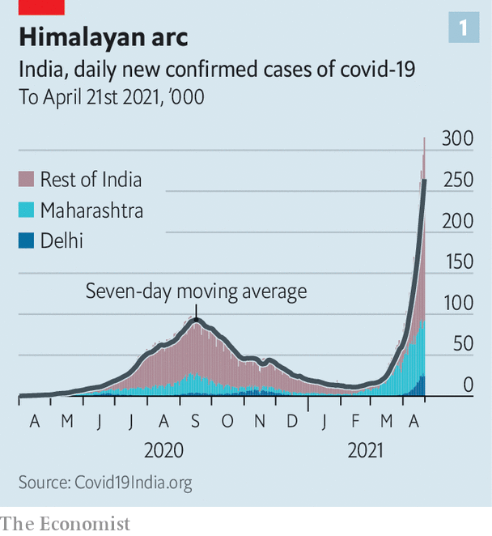
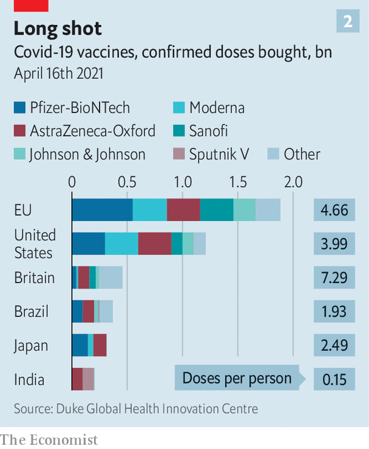

###### First as tragedy

# India is struggling with a catastrophic second wave 

##### A return of the virus was inevitable. The government’s failures were not 

 

> Apr 24th 2021 

AMERE THREE months ago India was starting to feel good about itself. The wave of covid-19 that crested in the autumn seemed to be ebbing away. True, the virus had stolen lives and battered livelihoods, but now schools were reopening, friends were getting together and a looming season of state elections promised a return to normal politics. Best of all for many in a cricket-mad country, India’s team had just roared back from a rocky start to snatch victory over a fierce rival, Australia.

Addressing university students in late January, Narendra Modi, the prime minister, drew parallels between cricketing glory and his government’s war on covid, noting that both situations presented challenges that required a positive mindset. “With made-in-India solutions, we controlled the spread of the virus and improved our health infrastructure,” he boasted. “Our vaccine research and production capacity have given a shield not just to India but to many other countries in the world.” In February Mr Modi’s Bharatiya Janata Party (BJP) passed a resolution hailing him as a visionary who had “defeated” covid-19.


A month is a long time, in pandemics as in politics. Until March, India was recording barely 13,000 new covid-19 cases a day, fewer than Germany or France and a drop in the ocean for a nation of 1.4bn. The caseload then began to tick gently upwards, until suddenly, late in March, it was rocketing. On April 21st India clocked 315,000 new positive covid-19 tests, above even the biggest daily rise recorded in America, the only other country to record such highs. In contrast to America, however, the pandemic’s trajectory in India is near-vertical (see chart 1). Its vaccination effort, albeit impressive in scale and organisation, is simply too late to change the course of the virus any time soon. “They said flatten the curve and we did,” laments a wry recent tweet. “We just put it on the wrong axis.”

 


More disturbing still, India’s soaring official covid-19 count represents the tip of an iceberg. Because of low testing rates outside big cities, say epidemiologists, the actual caseload could be anything from ten to 30 times higher. A national serological survey conducted in December found 21% of Indians were carrying covid-19 antibodies, compared with an official tally which suggested that only about 1% of India’s people had been infected by that time. More recently, local journalists who have cross-checked hospital and funeral records against government numbers have found similar, gaping discrepancies across the country. One report revealed that in the second week of April, when authorities in Vadodara, a city in the state of Gujarat, announced seven covid-19 deaths, the count in two hospitals alone was more than 300. This suggests that India could be facing not 2,000 deaths a day, as the current official count shows, but something much higher.

The surging caseload has scattered many dominoes, including trust in Mr Modi’s government. However much attention the health infrastructure received during 16 months of pandemic, it was not enough to make up for decades of underinvestment. In big cities in recent weeks, let alone provincial towns, hospitals have fallen fatally short of staff, beds, blood, drugs, oxygen and even oxygen canisters. The vaunted “Made in India” vaccination campaign has flopped disastrously. It turns out that the government counted wrongly, placed orders late, underfunded local suppliers and needlessly rejected foreign vaccines, meaning that by mid-April just 1.3% of Indians had received a full double dose, and instead of supplying the world with vaccines, India has banned exports.

Worse still was the government’s seeming indifference to the mounting tragedy. Even as the scale of India’s second wave grew obvious, Mr Modi and his top ministers not only failed to block, but actually encouraged vast gatherings of unmasked people, both at their own giant election rallies and at the Kumbh Mela, a month-long Hindu festival that brings millions of pilgrims to a single small town on the Ganges.

The focus of most Indians just now, however, is less on the failings of Mr Modi’s government than on their own anguish. “Last year, possibly you knew someone who knew someone who got covid,” says an IT executive in Mumbai. “This time it is everyone within spitting distance that either has it, or just got over it, or has a close relative who has died from it.”

Survey evidence from India’s commercial capital supports the comment. Whereas the first wave hit hardest in Mumbai’s slums, this time the virus is also ripping through high-rise housing estates, shopping centres and corporate offices. Geographically, the virus is spreading more widely, too. Poor rural regions such as eastern Uttar Pradesh and Bihar, which escaped lightly last year, have now been hit hard. Their high population density and pitiful lack of health care make it hard to quantify the impact. Yet even by the official count the number of active cases in Bihar tripled in just one week, from 20,000 on April 13th to nearly 60,000 on the 19th.

If the presence of the illness is pervasive, so, largely thanks to social media, is the terrifying reality of mass death. Disturbing scenes have grown familiar: ambulances in mile-long queues to deliver covid patients, engines running to keep oxygen pumps working; body bags heaped in mortuaries; dozens of funeral pyres blazing at once; a middle-aged man lying in front of a health officer’s car, pleading for a spot for his dying father in a hospital; a 65-year-old journalist tweeting his own dying hours as he waits in vain for oxygen. On April 21st television viewers witnessed a multiple tragedy, as an oxygen leak at a hospital in Nashik, a city 140km north of Mumbai, shut down ventilators for an hour. Twenty-four covid patients died.

Predictably, the tragedy has sparked panic buying. The black-market cost of Remdesivir, a drug reputed to help with serious covid-19 cases, has reportedly soared from around $12 per shot to as much as $600. The rush to secure personal oxygen tanks has left hospitals struggling to stay supplied. Surging demand for PCR tests has created backlogs, with labs that issued results within hours now taking days.

Mr Modi’s slowness to respond to this avalanche of grief has perplexed even supporters. His party appears to have been so blinkered by its desire to win control of West Bengal that it was only after all its rivals began cancelling events due to covid-19 that the BJP toned down its own campaign in the . And Mr Modi personally promoted the Kumbh Mela pilgrimage. Only after the head of the second-largest of India’s 13 main akhadas, or circles of Hindu religious devotees, died of covid-19 following his ritual dip in the Ganges did Mr Modi suggest that perhaps a symbolic pilgrimage might be more appropriate this year. There is no doubt that the Kumbh Mela was already a giant super-spreader. Authorities in Gujarat, Mr Modi’s home state, tested passengers on a single train returning from the pilgrimage. Thirty-four came back positive. In Uttarakhand itself, the official number of active cases has risen seven-fold since the start of April.

Belatedly, Mr Modi has moved in other ways to slow the epidemic. Faced with a shortage of vaccines (see chart 2), his government has now come up with lots of money for Indian producers and liberalised the market, allowing both states and private entities to buy and distribute stocks. Swallowing national pride, it has also agreed to fast-track approvals for half a dozen foreign vaccines. Government directives have tried to steer as much oxygen as possible to medical use, diverting some from equipment used by the fighter jets of the air force. Correcting course following his premature and overzealous imposition of a national lockdown last year, which crippled India’s economy, Mr Modi now largely lets individual states set their own covid-19 rules.

 


This is all well and good, but does not explain why, given more than a year of warning, Mr Modi’s government failed to make adequate preparation for a second wave. After the world’s biggest vaccine maker, the privately owned Serum Institute of India (SII), took a risk and signed a deal in June to manufacture the AstraZeneca vaccine at its plants in Pune, numerous foreign governments came knocking for hundreds of millions of doses.

India’s government, by contrast, signed its very first contract with SII only in January this year, for a puny 11m doses. More galling still, Mr Modi’s government funded another Indian producer, Bharat Biotech, though its product had not completed all trials at the time, and it had less experience scaling up production. Obsessed with atmanirbharta, Mr Modi’s newish slogan of national self-reliance, India’s government meanwhile rejected applications by Pfizer-BioNtech, among others, to license local versions of their vaccines, stipulating that they would first need to conduct local trials. All this dither and miserliness mean India can now only drip-feed its people with some 3m doses a day. At this rate they will not all get shots before the end of 2022.

India’s government has also been slow to fund another crucial part of the anti-virus struggle, gene-sequencing. As varied and adaptive strains of the virus have emerged around the world, it has become even more vital to understand how they are spreading. Yet only since January has India’s government started to divert enough resources to help institutions with the capacity to do the needed research.

There is no telling how much worse India’s current covid-19 wave will get, or how long it will last. Medical historians note that in the last great global pandemic of this scale, the Spanish flu a century ago, India suffered a mild first and then a mass-murderous second wave. About a third of the estimated 50m people who died worldwide in that epidemic were Indian. Alas, notes Chinmay Tumbe, the author of a book on the subject, India produced timelier statistics then than it does now. ■

