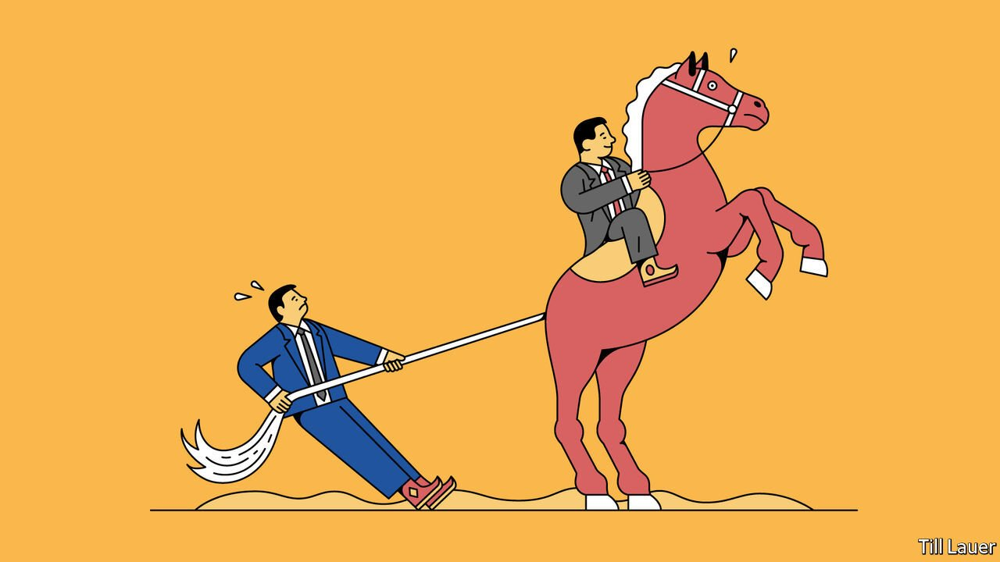

###### Banyan

# Mongolia’s president tries to ban its ruling party 

##### The dramatic move comes just two months before his term expires 

 

> Apr 24th 2021 

WITH THE yak-tail banners, or tug, of state authority behind him, Khaltmaagiin Battulga read out his presidential decree outlawing the Mongolian People’s Party (MPP). Banning political parties is the stuff of tin-pot dictatorships. Yet Mongolia, which broke from the Soviet Union’s orbit in a peaceful revolution in 1990, had until now been notably democratic. And the MPP is not just any party, but Mongolia’s oldest, the social-democratic successor to the Marxist-Leninist machine that ruled under Soviet tutelage. Last month it celebrated its centenary. Mr Battulga’s move on April 18th is especially gobsmacking because the MPP is the ruling party. It runs the government and has a supermajority in the State Great Khural, the parliament. Mr Battulga is from the rival Democratic Party (DP), which looks increasingly distant from the democratic revolution that gave birth to it. Is Mongolian democracy now under threat?

Personal pique on the part of Mr Battulga, a former wrestling champion, is not hard to divine. In 2019 the State Khural under the MPP passed constitutional amendments to check the powers of the president and strengthen parliamentary rule. Future presidents were limited to a single term. Whether current or former presidents could run again was unclear. But on April 16th the constitutional court ruled that they could not—a blow to Mr Battulga’s intention to seek re-election in early June.


As justification for his dramatic decision, the president in his decree accused the MPP of manipulating the constitutional court and of making its own the state apparatus and all its levers. To that he added the accusation that the MPP was militarising the state and using the armed forces to entrench power.

No doubt, the court’s ruling has suddenly made politics more brittle—few Mongolians trust the judiciary’s independence. And the MPP has changed voting rules to strengthen its parliamentary grip. Yet little suggests the MPP will refuse to give up power. Past post-election transitions have been largely smooth. If the DP performed abysmally in parliamentary elections last year, it is because people were fed up with its incompetence.

As for the militarisation of the state, Mr Battulga’s claims are overblown, says Julian Dierkes of the University of British Columbia. Admittedly the MPP chairman (and prime minister until January), Ukhnaagiin Khurelsukh, whom the president singled out by name, is a former army man with a predilection for medal-pinning and uniformed pageantry. But Mr Battulga’s accusation that an NGO founded by Mr Khurelsukh to improve the lot of retired military personnel is a front for the militarisation of the state looks wild. The army keeps out of politics.

What happens next is hazy. Mr Battulga’s decree may be ignored by the MPP, or kicked to the courts. He may expect Mongolians to come out on the streets against the MPP. After all, Mr Khurelsukh stepped down as prime minister in the face of spontaneous protests against the heavy-handed policing of the pandemic. But if Mr Battulga’s plan is for street confrontations, it is an irresponsible one. In 2008 riots sparked by allegations of vote-rigging left five Mongolians dead and the MPP headquarters a charred hulk. Sumati Luvsandendev of the Sant Maral Foundation, a polling outfit, predicts that few will come out in support of the president’s decree. Ordinary Mongolians see it as Mr Battulga’s battle and not theirs; so do the president’s fellow DP members. He has long got under the skin of its old dinosaurs, while at the same time disappointing the modernisers who once backed him. His four years in office have been largely bereft of purpose other than the cultivation of his own power, which now looks on the wane.

His decree, if it is defied, may provide evidence of that. The MPP, while accusing the president of overstepping his powers, appears in no hurry to stoke confrontation. Conveniently for Mr Khurelsukh, stepping down as prime minister allowed him to ready a bid for president. He is nearly certain to get the MPP’s nomination. Now that Mr Battulga’s impetuous move has thrown the DP into even greater disarray, Mr Khurelsukh is also likely to prevail over whomever it puts forward.

As for Mr Battulga, his decree has engendered talk of his impeachment. Impeachment or no, after leaving office he risks prosecution for abuse of power and even corruption. He is likely to be best remembered for this week’s test—with luck, not to destruction—of Mongolia’s democratic guard rails.

