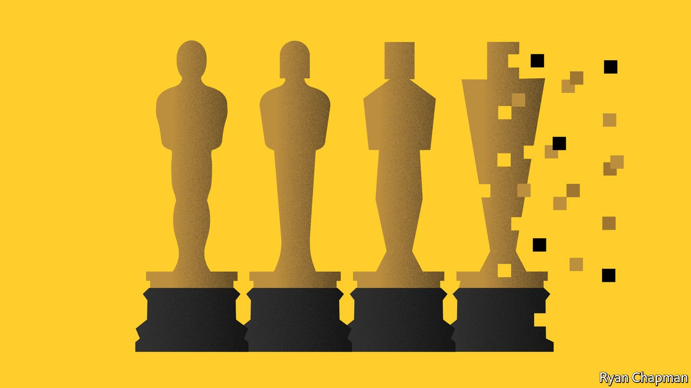
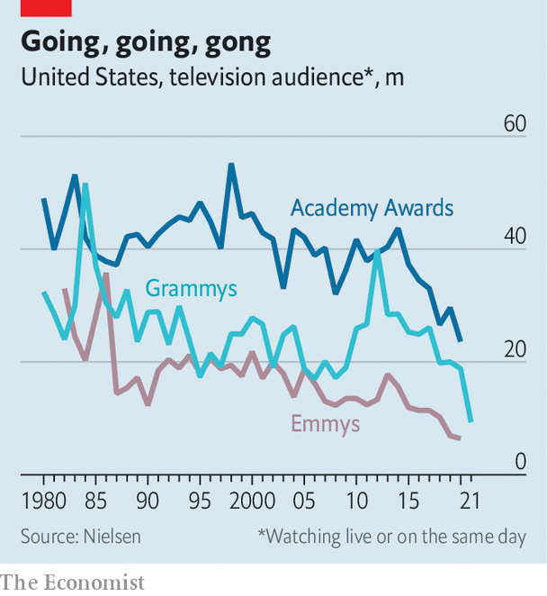
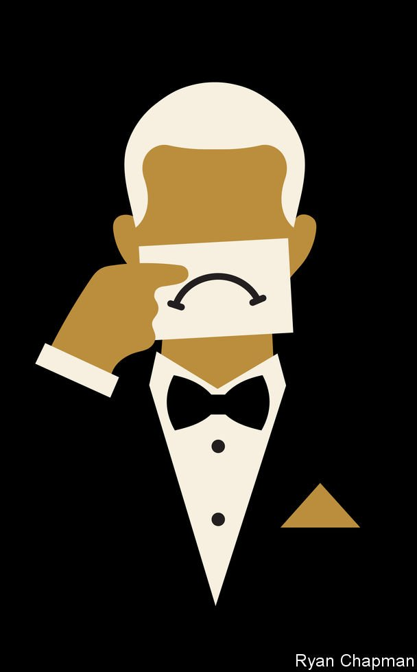

###### The rise of the robot critic

# And the winner is…who cares? 

##### The common popular culture on which awards shows depend is being eroded 

 

> Apr 24th 2021 

THE ORGANISERS of the Academy Awards are going to some lengths to lure stars to this year’s ceremony, which will take place on April 25th. To bypass travel restrictions, nominees and their guests have been designated “essential workers”. All attendees will be tested for covid at least three times. Zooming in is banned, so simultaneous mini-events are to be held in London and Paris for those who can’t make it to Los Angeles.

The bigger challenge may be persuading viewers to tune in from home. If other awards shows are a portent, the Oscars are in for a difficult night. Last month the Grammy music awards got just 9.3m viewers in America, less than half the number who watched last year. In September the Emmys, television’s equivalent, notched 6.4m, another record low.


The pandemic has not helped: most of last year’s big films were postponed because cinemas were shut, dimming the Oscars’ allure. But the decline of interest in arts awards has been long in the making (see chart). It signifies growing boredom with ritzy galas, in an age when lots of stars broadcast directly to Instagram themselves. It betokens frustration in some quarters with a lack of diversity in judging panels and nominees—and, in others, with the perceived left-wing bias of the industry. More than that, though, it is evidence of a deeper shift in the entertainment world, in which the common popular culture that awards shows celebrate is itself being eroded.

Top of the bots

Years of sliding ratings have sparked calls to jazz up the Oscars, a three-hour backslapping fest stuffed with commercial breaks. Ideas include more offbeat categories and more involvement for fans. But this kind of makeover hasn’t much helped other awards shows. This year’s Grammys, which included spectacles such as Lil Baby re-enacting a police shooting and rapping on top of a squad car, was hailed by the Los Angeles Times as the best in memory; its ratings were still the worst. Its defenders point out that young music fans hardly watch any TV these days. But the online buzz is quietening too. Google searches in America for the Grammys this March were one-third lower than five years ago; queries for the Oscars and other gong shows have seen a similar drop.

 


Ranking the best artists of the day made more sense in an era when most people imbibed broadly the same content. When it was launched in 1981, “MTV made the world into a monoculture, where everybody was focused on the same acts,” says Bob Lefsetz, a veteran music-industry analyst. Those days are long gone. Today Spotify offers more than 70m songs, a figure which grows by 60,000 a day. Viewers who once chose from a handful of TV channels and a couple of local cinema screens now have access to hundreds of cable and streaming services. User-generated content, on YouTube and the like, has added near-infinite options.

Audiences navigate this ocean of culture with the help of personalised recommendations, making them even less likely to see and hear the same things. Playlists cooked up by the algorithms of Spotify, Apple Music and others have become the main means of discovering songs. Half of Netflix subscribers in America say they rely on their TV for viewing suggestions, up from 37% two years ago, according to Ampere Analysis, a research firm. Only 3% of British book-buyers say that prizes steer their choices, according to Nielsen, another research company, which finds that readers are three times more likely to make their decision after browsing an online bookshop like Amazon, where recommendations are made algorithmically.

The upshot is that the entertainment monoculture once epitomised by the Oscars has splintered into microcultures. “We’re in an asynchronous world, where what can be a summer hit show or song to us, nobody else might have heard of or watched,” says Mark Mulligan of MIDiA Research, a consultancy. As for arts prizes, “with every year that goes by, there’s a larger share of the audience for whom they mean much less.” How relevant are the Grammys to a listener who has been led down an algorithmic rabbit-hole into an obsession with sea shanties? Why would someone tune in to the Emmys if their favourite screen idol is an ineligible TikTok star like Charli d’Amelio? (Look her up—or ask a teenager.)

The diminishing role of industry tastemakers is reflected in the sort of art now being produced. To make it onto computer-generated playlists, songs must avoid getting skipped, so tracks increasingly open with a catchy “pre-chorus”. New releases may have up to a dozen writers making sure that every section sparkles—a “genetically modified hit”, quips Mr Mulligan, who doubts that “awkward listens” like Radiohead would do as well today. “Bohemian Rhapsody” by Queen, which takes more than a minute to get going, would not be released, he suspects. Songs have become shorter, since artists are paid per stream. Labels are even making sure that the titles are Alexa-friendly.

Islands in the stream

Amid this algorithmic takeover, the role of awards has evolved. Their influence on audiences has not evaporated altogether. In the two weeks after it won this year’s Grammy for best album, for instance, streams in America of Taylor Swift’s “Folklore” leapt by 6.7m, or 21%, according to MRC Data. But the economics of streaming mean such fillips are worth less to the artists than they once were. Ms Swift will have pocketed a little under $20,000 in royalties from her post-Grammy uplift in streams, plus about $35,000 from extra album sales, calculates Will Page, author of “Tarzan Economics” (and formerly of Spotify). That compares with royalties of around $1.1m that he thinks Adele, the winner in 2012, made from her Grammy-induced jump in record sales. “The upfront transaction of a cinema ticket or CD was made for awards bumps. The same can’t be said for monetising consumption downstream on Netflix and Spotify,” says Mr Page.

As for film and TV awards: ironically it is the streaming services, which have helped erode the entertainment monoculture, that now value prizes most highly. Clinching Oscars gives them legitimacy as “proper” film studios in the eyes of customers—and performers, who tend to dislike going straight to video. Instant availability means that audiences can watch Oscar-winning films at home as soon as the victors are announced. Netflix, which has more nominations than anyone else this year, created a page in its app to lead subscribers to its nominated films, which have duly enjoyed a boost in views. The streaming market among young people is saturated, so streamers are courting the over-35s, who still set store by awards, says Richard Broughton of Ampere Analysis. With older viewers in mind, streamers are commissioning more of the grown-up productions that judges esteem, such as Netflix’s “The Trial of the Chicago 7” and Amazon’s “Sound of Metal”, two nuanced dramas.

 


As offerings proliferate and interests diverge, one way for awards and critics to remain relevant can be seen in the book world. The ease of books’ distribution and the relative cheapness of their production mean publishing has never been as monocultural as Hollywood. Book awards have long focused on slices of the market, such as high-quality literary fiction, where they retain significant clout.

The 13 novels longlisted for the Booker prize in 2019 sold an average of 160 copies in Britain in the week before the list was announced, and 470 the week after, according to Nielsen. The winner gets an average bump of about 10,000 sales in the week after the ceremony in the autumn, says Philip Stone of Nielsen, with a tail that lasts until Christmas (and a valuable boost overseas). Making it into one of the “book clubs” run by celebrities such as Oprah Winfrey means a still-bigger bonanza. For a few literary megastars, such as Margaret Atwood, all this makes relatively little difference. For others, it is transformative.

The Oscars judges seem to be taking a leaf out of the book world, homing in increasingly on niche cinema. Between 1980 and 2003 most “Best Picture” winners were among the ten highest-grossing films in America in the year of their release, according to a ranking by the New York Times. In the 16 years since, none has been. That is partly because the box-office top ten has been dominated by superheroes and remakes, which may do well commercially but tend not to get the nod for gongs. Even so, judges seem to be embracing lesser-known movies. Only three of the past ten winners even made the top 50 at the box office. The two most recent, “Green Book” and “Parasite”, barely made the top 100.

The result is that the Oscars are having a greater commercial impact on the films that win (as the Booker always has), albeit from a relatively low base. “Parasite”, a Korean-language black comedy, doubled the number of American screens on which it was shown in the month after being named Best Picture, according to Gower Street Analytics, a research company. “Nomadland”, an uncommercial drama which is the bookmakers’ favourite to win this year, would likewise reap a big dividend.

Cultural prizes are supposed to highlight the best work in their genres; but, says Mr Lefsetz, for successful performers these days, “the awards show is always in the rear-view mirror.” The more that judges and other tastemakers unearth artists who have been passed over by algorithms, the more relevance they will retain amid the rise of the robot critics. ■

