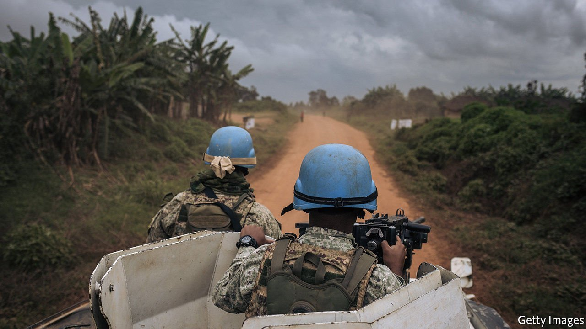

###### Local heroes

# The trouble with peacekeepers 

##### Too often, a new book argues, they are cut off from those they are meant to protect 

 

> Apr 24th 2021 

The Frontlines of Peace. By Séverine Autesserre. Oxford University Press; 240 pages; $27.95 and £18.99

IN THE PAST five years wars have cost more than $10trn annually, calculates Séverine Autesserre. That is 13% of the world’s GDP or $4 a day for each of its inhabitants; 2bn people live in conflict zones. Her book is about finding better ways to stop them.


Take the east of the Democratic Republic of Congo. One of the world’s most expensive peacekeeping missions has been there for more than 20 years, yet armed groups are multiplying. Massacres—often perpetrated embarrassingly close to UN bases—are routine. Locals nickname peacekeepers “body collectors” for habitually turning up when it is too late; many want them to leave. Earlier this month protesters blocked roads with burning tyres and brought the cities of Goma and Beni to standstills. Ms Autesserre, a frequent visitor to the region, candidly observes some of the mission’s most absurd mistakes and considers how better to prevent bloodshed in Congo and elsewhere.

Part of the trouble is that foreign peacekeepers and aid workers often exist in homogeneous bubbles, which she calls “Peaceland”. From Haiti to Somalia, Congo to Afghanistan, Peacelanders live in compounds in posh neighbourhoods, roll around in four-by-fours, get drunk with other foreigners and often distrust locals. Ms Autesserre’s criticisms are scathing and often justified, but she empathises with the Peacelander too—“an outsider living and working far from family, in constant fear, and confronting a lack of basic facilities while performing a job that is emotionally draining”. Security measures imposed by charities or missions can prevent Peacelanders leaving their bases, or put certain neighbourhoods off limits. The author approves of a proposal for “calculated disobedience” on their part.

The distance between outsiders and locals leads to preposterous missteps. Ms Autesserre describes a scheme in Congo in which rebels were offered $100 for their weapons. But a Kalashnikov goes for $40 on the black market, so fighters turned in rusty guns, bought two new ones and still had money for beer. Staff from the mission gave mobile phones to a handful of people in dangerous villages so they could call if the situation deteriorated. But the villages had neither phone signal nor electricity. Peacekeepers often descend on war zones without speaking the local languages, relying instead on a few harried translators.

Ms Autesserre’s solution is bottom-up peacebuilding. Peacelanders should spend more time working with communities, understanding their grievances and earning their trust, rather than hobnobbing with government officials and UN bigwigs. More responsibility should be given to locals. Neglecting them leads to failure (as in Kenya, where people joke that NGO stands for “Nothing Going On”) or emasculation (Haitians have nicknamed their country “The Republic of the NGOs”). By contrast, in two surprising oases of peace, Somaliland and the island of Idjwi in Lake Kivu in eastern Congo, the “collective eyes and ears of people” have helped keep violence at bay.

Building peace in war-ravaged countries such as Congo is extremely complicated (as Ms Autesserre acknowledges). After all, the mission there is obliged by the government to work with the army—which is itself responsible for some of the worst abuses. Closer collaboration with communities is only a start. But it would be an improvement on the current malaise, as this timely critique of Peaceland’s denizens and sponsors shows. ■

