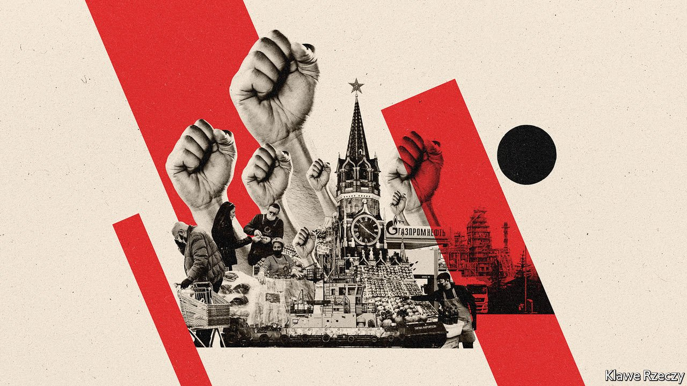
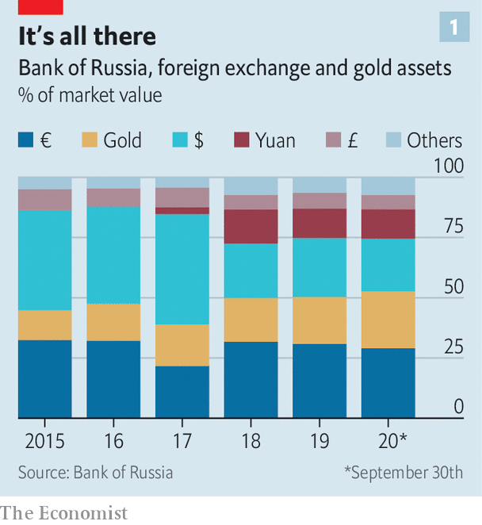
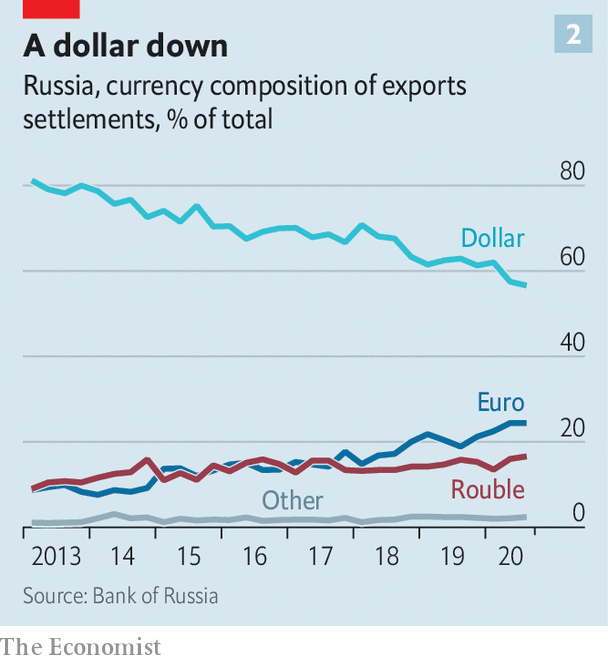

###### Under siege

# The Kremlin has isolated Russia’s economy 

##### It has protected the country from shocks but is choking any growth 

 

> Apr 24th 2021 

ON A RECENT weekday in Perm, an industrial city of 1m people on the edge of western Siberia, patrons packed Toropomodoro, a popular pizza restaurant. “We were back to pre-pandemic levels of customers by June, and they’ve remained at that level since,” says Maxim Minin, the owner. Russia’s economy shrank by just 3% last year, leaving it in better shape than many. That is in part because the government did not reimpose a national lockdown after a second wave of covid-19 in the autumn. (Russia’s excess-mortality rate—313 per 100,000 people, far beyond that of America—suggests the human toll was enormous.) But it is also because the Russian economy has long experience of isolation.

Since 2014, when Russia annexed Crimea and invaded eastern Ukraine, the Kremlin has commanded the economy like a fortress under siege, building up reserves, decoupling from the world economy, and preparing for the potential impact of Western sanctions or fluctuations in oil prices. This fortress is effective at protecting against outside shocks. But inside its walls it breeds stagnation and malaise, which fuel Alexei Navalny’s opposition movement and the protests against Vladimir Putin, Russia’s president. “It’s about stability, not development—or more specifically about control,” says Natalia Zubarevich, an economist and geographer. “They won’t let the economy die, but in this system development isn’t possible.”


The foundations of the fortress are high reserves and low debt. For Mr Putin, the Russian government’s default in 1998 was a formative trauma. When he became president a little over a year later, he set out to build up the country’s reserves. When the global financial crisis sent oil prices plummeting in mid-2008, Russia had $570bn on hand, equivalent to almost a third of GDP. This proved handy. The government burned $220bn refinancing banks and defending the rouble. But after the crisis it kept spending on the armed forces, public-sector salaries and pensions. Firms went on a borrowing spree of their own. When the West slapped Russia with sanctions and the oil price crashed in 2014, the economy spiralled out of control.

Russia has since rebuilt and restructured its reserves. At the end of 2020, it had $183bn in its rainy-day National Welfare Fund (NWF), the most since 2009. Russia’s overall international reserves stood at $596bn, equivalent to nearly two years of imports. To hedge against sanctions, the central bank has also shifted its holdings away from American banks and out of American dollars: the share of its international reserves held on American territory fell from 30% in 2013 to just 7% now. It has more of its overall reserves in gold (24%) than in dollars (22%) (see chart 1).

 


Both the corporate sector and the state have paid down their debt. Squeezed by sanctions, Russian firms shed liabilities: since 2014, non-financial firms have reduced the amount of debt owed to foreign creditors by 25%. Banks cut theirs by 65%. The government ran budget surpluses in 2018 and 2019. Even after some deficit spending during the pandemic, its debt is equivalent to around 20% of GDP; only one-fifth is held by foreigners. Fresh  barring financial institutions from buying new Russian bonds were calibrated to limit their impact; but even a wider ban on the secondary market may merely lead to more debt being held domestically. Russian banks buy most of the new bonds: during the most recent bond issuance earlier this month, state-owned VTB Bank scooped up some 70% of the offerings.

Russia has also cut its dependence on dollar invoicing. The share of its exports handled in dollars has fallen from 80% in 2013 to less than 60% last year (see chart 2). Less than half of Russia’s trade with China is settled in dollars. In trade with the EU, the euro has almost overtaken the dollar.

 


The Kremlin would like to see cyber-decoupling, too. A law passed in 2019 is intended to give the government the ability to cut the Russian internet off from the rest of the world. It follows earlier data-localisation laws designed to force foreign companies to store Russian users’ data in Russia. Home-grown Russian technology firms already compete with Western giants in many sectors. Yandex runs head-to-head with Google in the Russian search market; it beat Uber to dominate ride-hailing. Two Russian companies, Wildberries and Ozon, sit atop the nascent e-commerce market, where Amazon does not operate.

Yet Russia has neither the breadth of home-grown technologies nor the technical capabilities at the state level to erect a Chinese-style firewall. Although the Kremlin frets about the reach of foreign social networks, such as YouTube, where Mr Navalny broadcasts, their wide audiences and a lack of local alternatives make banning them unpalatable. An attempt to block the messaging app Telegram in 2018 ended with Pavel Durov, the firm’s Russian exile founder, outfoxing the Russian regulators and racking up millions of new users.

An attemptthis yearto slow down Twitter using new filtering tools was swiftly followed by the Kremlin’s own site crashing. Despite directives to ditch outside IT, in 2019 the government’s audit chamber found that 96% of state institutions still use unapproved foreign software. Eschewing Western technology has often meant using more Chinese stuff, a prospect less abhorrent for the Kremlin than relying on America, but still uncomfortable.

Russia’s economy remains highly dependent on hydrocarbons. Despite years of promises, no meaningful diversification has taken place. Hydrocarbons still account for more than 60% of exports, and some 40% of government revenues. Though China has been buying more Russian oil and gas in recent years, the EU remains Russia’s biggest customer and Russia the EU’s biggest supplier, accounting for 30% of the bloc’s crude-oil imports and 40% of its natural gas. That would make any embargo on Russian energy exports too disruptive for the West to stomach.

No future in the fortress

As resilient as Russia’s fiscal fortress may be, preserving it means tight limits on spending. Russia’s covid-19-related stimulus measures amounted to just 4% of GDP, according to the World Bank. The pandemic, in Mr Putin’s eyes, is not the proverbial rainy day the NWF was intended for: the fund actually grew in 2020. The limited stimulus was instead financed by borrowing. Most of the stimulus came through tax breaks and loan guarantees, rather than direct support to small- and medium-sized firms or households. As Tatiana Maksimenko, director of a children’s centre in Perm, says, “For the government, I don’t have much value. My business is small and my taxes into the budget aren’t huge.”

Real incomes fell by 3.5% in 2020, leaving the average Russian’s income 10% lower than in 2013. One survey showed that after a six-week lockdown at the start of the pandemic, nearly half of households had no savings or only enough to cover a month of expenses. Food prices have risen by 7.7% since February 2020. The cost of basic products such as sunflower oil and sugar has grown by 27% and 48% respectively. Some of the hottest businesses in Russia these days are discount retailers, such as Svetofor, a Siberian chain that forgoes shelves and displays its cut-price products in cardboard boxes on the floor.

The future looks no brighter. Russia will struggle as the world moves away from fossil fuels. Little has been done to prepare for a greener future. Renewable energy currently accounts for less than 1% of Russia’s power generation. Investments in clean energy between 2014 and 2019 amounted to just $5bn, one-sixth of Brazil’s over the same period and one-tenth of India’s, according to BloombergNEF, a data provider. Some economists are alarmed. “The rents that we enjoyed for the last 20 years will never come back,” a former finance minister, Alexei Kudrin, wrote last year. “That’s a huge challenge for all of economic policy.”

The petrodollars stopped generating growth long ago. In 2000-08, amid an oil boom, Russia grew by 6.6% a year; in 2012-19, GDP growth averaged just 1%. That pace leaves Russia trailing not only other countries at a similar level of development, but even rich countries, which tend to grow more slowly. It amounts to just half the rate the Soviet Union saw from 1977 to 1985, the latter part of the era known as “Stagnation”.

In the late 1980s, Mikhail Gorbachev tried to resuscitate a moribund economy, launching reforms that helped lead to the Soviet regime’s collapse. Mr Putin is determined not to repeat that. Boosting growth would require embarking on reforms that would challenge his grip on Russia’s politics. Yet without structural changes, the IMF reckons that Russia’s growth in the coming years will remain below 2%.

If the Kremlin hoped that stagnation would mean social stability, growing discontent is proving otherwise. According to the Levada Centre, an independent polling group, the number of people who expect economic protests in Russia has risen from 26% a year ago to 43%. For Artyom, a 30-year-old stock trader who protested in Perm in the wake of Mr Navalny’s arrest in January, demonstrating was not just about the “lawlessness” of the Kremlin’s treatment of a critic. His frustration had been building for other reasons: “the inability to provide future prospects and improve people’s quality of life”. A slice of pizza at Toropomodoro is a poor substitute for a vision of the future in Russia. ■

Dig deeper

 (Apr 2021)

 (Apr 2021)

 (Apr 2021)

