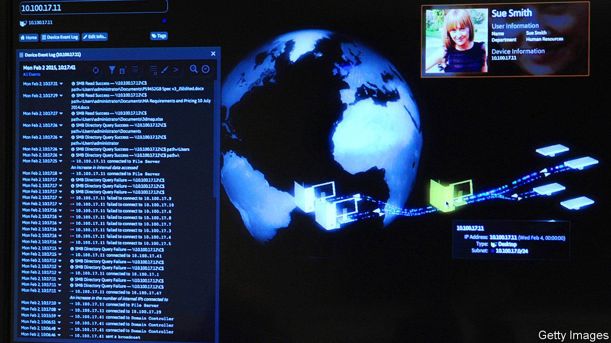

###### Tech IPOs

# Darktrace’s float will test London’s market 

##### Can it repair London’s dented tech-listing hopes? 

 

> Apr 24th 2021 

DELIVEROO’S FLOTATION in March did nothing to enhance London’s prospects of becoming a tech-listing magnet. Shares in the meal-delivery startup are trading at two-fifths below their offer price. Now London’s hopes hang on Darktrace, a cyber-security firm which this week confirmed its plan to list on the London Stock Exchange in early May.

Darktrace is expected to seek a valuation of around £3bn—modest, compared with Deliveroo’s of £7.6bn. Software is a better business than food delivery, too, and Darktrace has powerful connections. Founded in 2013 by cyber specialists from GCHQ, Britain’s signals-intelligence service, maths whizzes and sundry artificial intelligence (AI) experts, its advisers include Jonathan Evans, MI5’s former chief.


From the beginning Darktrace took a different approach on cyber defence for companies. The long-accepted methodology has been to build a perimeter “wall” against attacks based on what has been learned from past attacks. But against sophisticated cybercrime today that kind of “point solution” defence is about as effective as hilltop Tuscan villages deploying stone walls against artillery, says Mike Lynch, who founded Autonomy, another software company. After selling it to America’s Hewlett-Packard in 2011 for $10.3bn, he created Invoke Capital, a venture-capital fund, whose first investment was in Darktrace. Some Invoke Capital executives moved to Darktrace, including its chief executive, Poppy Gustafsson.

Darktrace’s machine-learning software assumes attacks have already penetrated, then finds and responds to the malware, ransomware and other nasties. It took time for security chiefs to accept it unearthing their systems’ failures. In the early days, on occasion, Darktrace would set its software running inside a company, find malicious code and the company would show them the door, says Mr Lynch.

No longer. Darktrace has 4,700 customers spread between Britain, the rest of Europe, America and Canada and the rest of the world. With the industry expanding fast, the firm expects its revenues to grow by around 36% in the year to June. It reckons it should be able to sell to most of the world’s medium to large companies, meaning a potential market of $40bn.

Even with Darktrace’s next-generation technology, there is a nagging doubt about bang for buck. Spending on cyber security increases every year but the attacks keep succeeding. Darktrace and other firms are whizzes at talking up their products. But customers may eventually ditch their software if there is more hype than efficacy.

Darktrace spent a whopping 82% of revenue on sales and marketing last year, and 6% on research and development. Its cybersecurity capability is very good but not transformational, according to a veteran of the field. Thus, Darktrace’s language about its revolutionary “cyber AI” is “questionable,” he adds. Investors will watch to see if the firm’s clients, who typically sign up for a few years, stay put. At present the vast majority of them do, according to the firm’s figures.

Institutions will also consider risks associated with Darktrace’s ties to Mr Lynch, whose sale of Autonomy later kicked off Britain’s biggest-ever fraud case. He is currently fighting extradition to America. HP is claiming $5.1bn, a sum that derives its size from the sheer scale of the American firm’s overpayment for Autonomy. HP alleges that Mr Lynch inflated revenues through improper accounting. Mr Lynch says the charges are baseless and that HP mismanaged Autonomy. If he is obliged in future to sell down his sizeable shareholding in Darktrace, that could depress the share price. But techies and investors may also be thanking him for backing not just one but two British tech unicorns. ■

