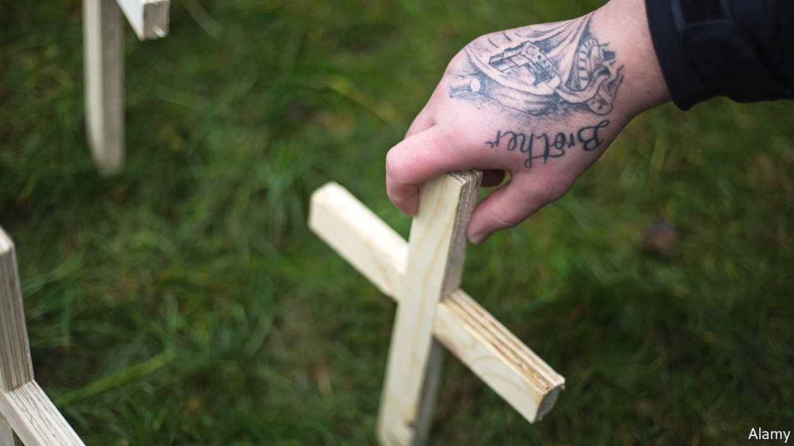
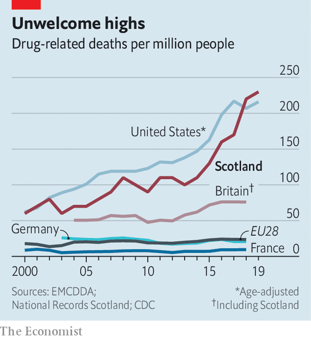

###### Spiking

# Scotland’s drug-death crisis is in need of a fix 

##### The issue is rising up the political agenda, not always with welcome consequences 

 

> Apr 24th 2021 

THE MOMENT of clarity arrived on October 11th 2018. “This feeling just came over me that I couldn’t do what I was doing any more, that this was it,” says Ryan Todd, a 38-year-old from Motherwell. Addiction ran in the family. One of his brothers was murdered; another committed suicide. In the preceding years he spent time in prison, self-harmed and tried to kill himself. But, sitting in the hospital after one such attempt, he wanted out.

Too many others never had an epiphany. In 2019, 1,264 people died drug-related deaths, more than twice as many as five years earlier. Per person, the death rate in Scotland is three times that in the rest of Britain, ten times the average in Europe and probably higher than in America, a country ravaged by an opioid epidemic (different counting methods mean it is hard to be certain).


In December Nicola Sturgeon, Scotland’s first minister, sacked her public-health minister after statistics showed the situation worsening. In a debate before forthcoming elections to the Scottish Parliament, Ms Sturgeon admitted her government had taken its “eye off the ball”. The Scottish National Party’s manifesto promises a “national mission” to reduce deaths. The issue now sits near the top of the political agenda.

Mr Todd is doing his best to ensure others get the help he did. He has a job in a warehouse, lives with his partner and one of his children, and runs a cocaine-anonymous group. These efforts are made harder by a flood of pure cocaine and cheap benzodiazepines, purchasable in bulk for 50p (70¢) a pill. “Street benzos” are so popular that in 2019 they displaced heroin and morphine as the drugs most often found in the blood of the deceased.

 


Andrew McAuley of Glasgow Caledonian University thinks that the appetite for these drugs was stimulated by a decision in the early 2010s to tighten prescription of legal benzodiazepines, ironically because of fears of rising drug deaths. “So like any market, we have demand, and then if a supply route is cut off someone else, usually a criminal element, will fill [it],” he says. The drugs are of varying quality, making it hard for users to pace themselves. Deaths involving etizolam, a potent variety of benzodiazepines, have risen sharply in the past five years.

Mr Todd’s cohort—those aged 35 to 54—are the people worst affected. Many began using at the time of the first “Trainspotting” film and kept at it. But with deaths rising among all age groups, some wonder if what is happening is akin to America’s “deaths of despair”. Scots are more likely to die young, drink heavily and commit suicide than people in the rest of Britain. Andrew Horne, who has worked in drug services in England, Ireland and Scotland, says that whereas people in the other countries use drugs to get high, “people in Scotland use drugs to be as close to unconscious as possible.” In places like Dundee, Glasgow and Lanarkshire, communities have been devastated.

Only recently has the government begun to pump money into the problem. In 2015 responsibility for alcohol-and-drug partnerships, which commission services, switched from the justice to health department; a move which may have seen funding fall (accounting is tricky since cash comes from multiple budgets). Spending has since risen, but capacity remains an issue. “We don’t have enough people in treatment, and our record of retaining people in treatment is poor, too,” admits Angela Constance, Scotland’s drugs minister.

The SNP’s manifesto promises an extra £50m a year for interventions to bring deaths down. This will help to implement measures recommended by a task-force established in 2019. New standards will guarantee same-day access to treatment (at the moment it can take weeks). Naloxone kits, which reverse overdoses, are being handed out more widely, aided by a decision by Scotland’s Lord Advocate that, during the covid-19 pandemic, any government service could hand them out.

Other changes introduced during the pandemic will also stick. In Dundee Danny Kelly, a manager at a needle exchange, has used the decline in footfall to do more outreach work. The focus is on those who have survived overdoses: checking methadone prescriptions, warning about mixing drugs and ensuring they are not using dangerous equipment. But it is also about making sure they have the basics. “They might say, yeah, I’ve not eaten in a week, I’m just really needing food,” Mr Kelly explains. Funding will enable the work to continue after the pandemic.

Cynics saw the task-force as a way for the SNP to distance itself from the problem. That distance no longer exists. Having created the post of drugs minister after sacking her public-health minister, furnished it with a civil-service office and increased spending, Ms Sturgeon is now more accountable. While the funding has been welcomed, other decisions have been less popular. Some policymakers worry that a decision to put more money into residential rehabilitation was made to see off Tory criticism. Research suggests that such facilities are associated with more deaths, because of the increased risk of overdose when people exit.

Having been in power for 14 years, the SNP looks to be responsible, but it argues that Westminster blocks some of its plans. It opened a heroin-assisted treatment centre in Glasgow, but only after negotiations with the Home Office. It wants to open drug-consumption rooms (or “overdose-prevention facilities” as Ms Constance prefers), but is prevented from doing so by laws made in London. It promises a citizen’s assembly to consider decriminalisation. But it would need more powers to implement such radical policies, and it will not get them soon. In the meantime, things go on getting worse. ■

