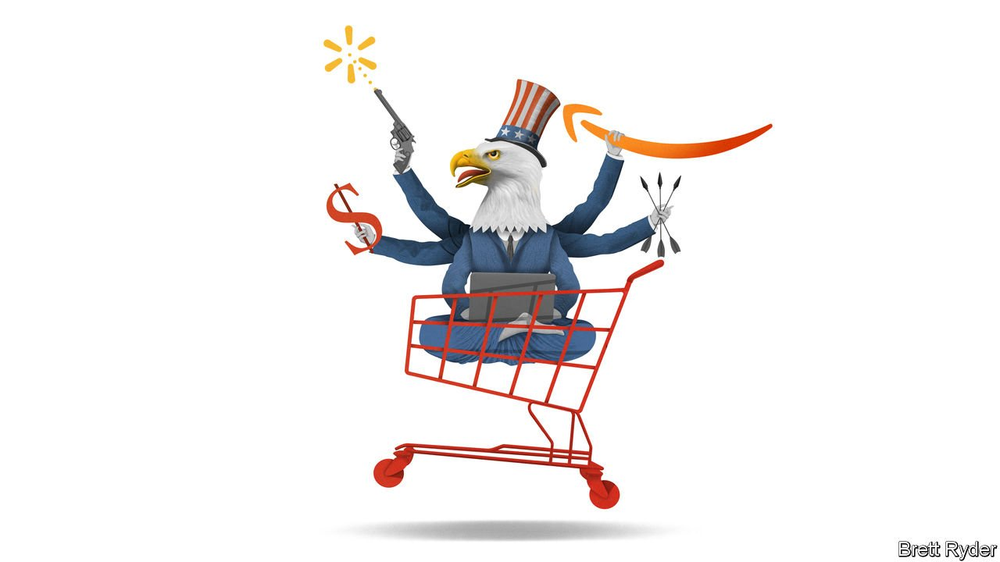

###### Schumpeter

# Amazon and Walmart confront Indian politics 

##### The country is becoming as surly to foreign investors as China 

 

> Apr 24th 2021 

IN THEORY, THE battle for e-commerce in India should be a purely commercial one, in which two of the world’s biggest retailers, Walmart and Amazon, compete with each other and Reliance Industries, a conglomerate that also owns India’s biggest retailer. In reality, there is a fourth force: the prime minister, Narendra Modi, and untold numbers of small merchants that support his Bharatiya Janata Party (BJP). As nationalists, they naturally side with Reliance, which is led by Mukesh Ambani, India’s richest man. That makes the battle visceral, mixing business, politics, xenophobia and billionaires.

Before Reliance Retail, Mr Ambani’s commercial arm, launched its own e-commerce platform last year, Amazon and Walmart-owned Flipkart were the undisputed lords of online selling in India. They invested heavily in technology, logistics and payments to build market shares of about 35% each in what is still, partly as a result of curbs on their activities by the Modi government, a relatively underexploited e-commerce market. Now, coinciding with a renewed surge in covid-19 cases in India, the risks they face are rising. Lockdowns may favour Reliance Retail, especially given the prominence of its online grocery store, JioMart. And yet more government efforts to hobble the foreign-owned e-merchants may be on the way. As a result, Amazon and Flipkart are themselves having to play politics to defend their interests. It is an unsavoury situation. Just when foreign firms are looking for big and attractive alternatives to China to invest and grow, India’s government, like that of China, is becoming surlier.


Foreign-owned e-commerce firms already faced tough restrictions before Mr Modi took office in 2014. After Walmart’s $16bn purchase of Flipkart in 2018, the rules were tightened further, with unexpected severity. Two restrictions predominate. First, foreign firms are prevented from holding inventory or selling their own goods, which both Amazon and Walmart do in other markets. They can offer their platforms only as “marketplaces” for other buyers and sellers. Second, the degree to which they can own big sellers on their platforms is limited, to prevent those sellers acting covertly on their behalf. Reliance Retail endures no such restrictions, even though it raised $6bn last year from foreign investors. As an Indian company, it enjoys what bullish analysts at Jefferies, an investment bank, call a “regulatory advantage”.

The restrictions imposed three years ago left a few loopholes for Amazon and Flipkart to exploit. Yet both firms remain under threat on several fronts. New rules on foreign investments are under consideration, which may tighten up those loopholes and force the two market leaders to reduce or eliminate ownership stakes in their anchor sellers. And both have been under investigation by the antitrust watchdog, the Competition Commission of India. They insist the probe has no merit.

Amazon is engaged in a legal battle to stop Mr Ambani’s $3.4bn takeover of Future Group, India’s second-biggest retailer. Amazon alleged that the sale breached the terms of its investment in a unit of Future that barred its sale without Amazon’s consent. India’s Supreme Court is expected to rule on the matter shortly. A victory for Mr Ambani would boost his ability to offer “omnichannel” commerce in India; the acquisition would add about 1,700 Future stores to Reliance’s 3,500 existing ones and also benefit JioMart. As foreign-owned retailers, Amazon and Flipkart are largely prohibited from mixing physical and digital channels.

For years both firms kept low profiles in India. No longer. This month Flipkart forged a partnership with part of the Adani Group, a conglomerate led by Gautam Adani, an industrialist whose fortune has soared recently thanks to investments in physical and digital infrastructure. The pact is for the construction of a giant warehouse and data centre, but many discern political motivations, too. Mr Adani’s firm has deep roots in Gujarat, the state in which Mr Modi built his power base. Flipkart may feel it needs a domestic champion, especially as it mulls a flotation this year that Bernstein, a broker, says could value it at $40bn-50bn.

Amazon is also seeking to win over the BJP’s vociferous supporters. It is using its brand power to recruit its own army of small retailers. Jeff Bezos, its founder and the world’s richest man, was ridiculed in January last year for being snubbed by Mr Modi on a high-profile visit to India. But he still pledged $1bn of investment to help digitise small businesses. This month Andrew Jassy, Amazon’s CEO-in-waiting, doubled down on the offer, pledging another $250m to launch a small-business venture fund in India. Such investments are all framed in the context of Mr Modi’s slogan of a “self-reliant India”. They also win hearts and minds.

So much for self-Reliance

Few are likely to shed many tears for either Amazon’s or Walmart’s Indian travails. They take no prisoners in their businesses outside the country. And within it both have built such strong moats that the position of neither is in jeopardy. As Arpan Sheth of Bain, a consultancy, says, “Walmart and Amazon are here to stay.”

The lament is chiefly for India itself. Reliance needs no more protection than it currently enjoys. According to Jefferies, its retail revenues are already greater than those of the next ten Indian retailers combined. E-grocery, in which JioMart excels, is expected to grow ten-fold within five years, in part by digitising kirana, as Indian neighbourhood shops are known. Its telecoms network, Jio, has over 400m subscribers and extends into India’s poorest areas. Its payment platform, linked up with WhatsApp, a messaging service owned by Facebook, also has huge potential.

Some see Reliance as the Indian equivalent of Alibaba, China’s e-commerce titan. The big difference is that the Chinese government has sought to kneecap Alibaba and its co-founder, Jack Ma. In India, it is Reliance’s rivals that are getting the rough treatment. That bodes ill for competition—and hence for India itself. ■

