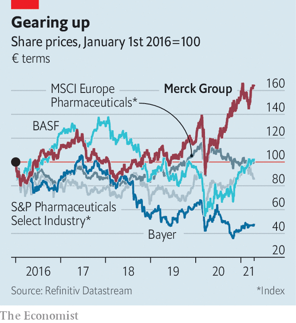

###### Lab life

# Can Merck’s new boss maintain the drugmaker’s winning streak? 

##### Belén Garijo takes over as chief executive in May 

 

> Apr 24th 2021 

FEW COMPANIES have a history as long and interesting as Merck. Founded in 1668 by Friedrich Jacob Merck as a pharmacy in Darmstadt, the world’s oldest apothecary has survived several European wars, two world wars and the Nazi regime. In 1917 America’s government confiscated its American subsidiary under the Trading with the Enemy Act. It has operated as a rival business, based in New Jersey but, confusingly, also named Merck, ever since.

Belén Garijo, the no-nonsense 60-year-old Spaniard who will take over as Merck’s chief executive on May 1st, says she is keenly aware of her company’s heritage and its unique ownership structure. Fully 70% of the company is still in the hands of the 13th generation of Mercks (the rest is owned by public investors). And it was at the family’s instigation that Stefan Oschmann, the outgoing CEO, and Ms Garijo, his deputy, transformed Merck through a series of bold acquisitions from a drugmaker living off legacy medicines into a conglomerate that makes gear and chemicals for biotechnology labs as well as pharmaceuticals. “Diversification is strength,” insists Ms Garijo, who herself embodies diversity, becoming only the second woman ever to head a firm in the DAX 30 index of Germany’s bluest chips.


Investors applauded the strategic shift under Mr Oschmann (see chart). Merck’s market value increased from €36bn ($41bn) in 2016 when he took the helm to €63bn, more than Bayer, another big German drugmaker, which has almost twice as many employees as Merck, and nearly as much as BASF, a chemicals giant. Last year the group’s revenues rose by 9% to €17.5bn; net profit shot up by 51% to €2bn.

 


The most immediate task for Ms Garijo is to manage a shake-up of the executive suite. The company is installing new heads of drugmaking, research and development, and the American pharmaceuticals business. It is also looking for a new head of the lab division; Udit Batra, who used to run it, left after Ms Garijo pipped him to the top job last year.

The new boss must also ensure that the commercial potential of the course charted by her predecessor is realised, says Matthew Weston of Credit Suisse, a bank. Some big bets appear to have disappointed. Bintrafusp alfa, a drug to fight lung cancer that is in the late stages of development, did not show any benefit over a rival drug in trials. Only two other drugs are close to potential clinical use, a lung-cancer treatment and one to fight multiple sclerosis. In 2020 sales of the medicines business edged down by 1%.

In the pandemic year this was handily offset by the strong performance of Merck’s lab division, which has become the firm’s biggest arm. Its sales increased by nearly 10% to €7.5bn in 2020. In February Merck announced that it will significantly accelerate the supply of the fatty bubbles needed to make the Pfizer-BioNTech vaccine against covid-19. Few companies in the world are able to produce these custom lipids in large quantities for vaccine production. The company has also said it will invest in production capacity for disposable plastic materials for bioreactors, another essential ingredient for makers of covid-19 vaccines.

The lab business should continue to thrive once the pandemic abates, thinks Mr Weston. That will let Ms Garijo focus on medicines, which as former head of the pharma division she is well placed to do. Mr Oschmann will be a tough act to follow—but not an impossible one. ■

