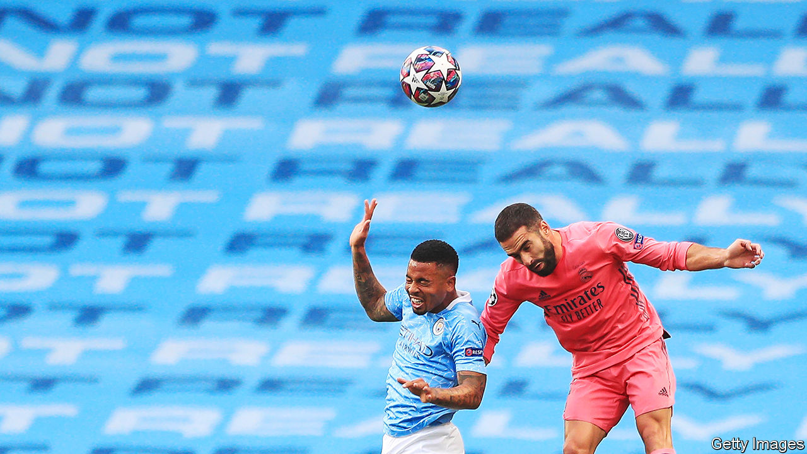
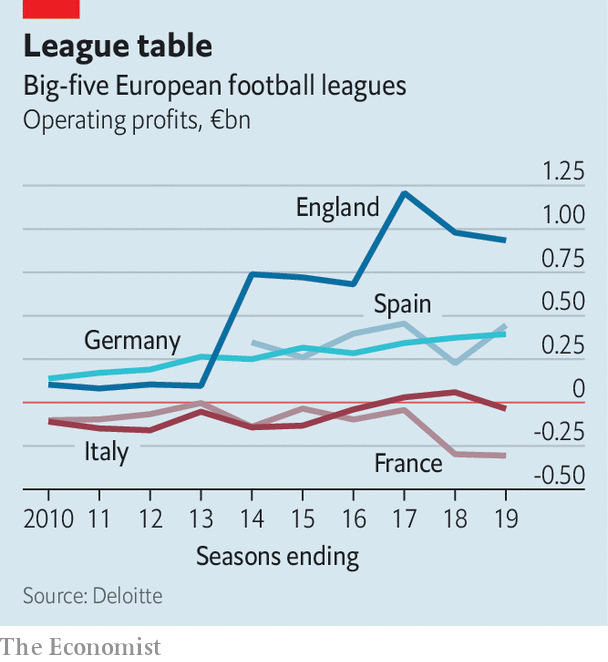

###### They think it’s all over

# Europe’s Super League scores a spectacular own goal 

##### The football clubs’ failed venture has weakened their future bargaining position 

 

> Apr 22nd 2021 

THEY PROMISED to “deliver excitement and drama never before seen in football”, and for a few short days they succeeded—just not in the way they had hoped. On April 18th a dozen of Europe’s top football clubs announced plans to disrupt the game with a breakaway “Super League”. Investors cheered. But fans revolted, broadcasters turned up their noses and governments vowed to block the plan. Within 48 hours half of its founding members dropped out. It was soon declared dead.

What began as a daring bid to seize control of elite football now looks like a damaging own goal. The Super League promised its members financial security and sporting prestige. Instead the “dirty dozen” rebels have been forced to grovel to supporters and in some cases jettison their bosses. Their bargaining power over rival teams and league organisers has been weakened. They may face tighter regulation by governments responding to furious fans.


The plan was for 20 clubs to compete in a Europe-wide league, kicking off in August. Fifteen “founding” clubs would be guaranteed a spot every year, with the remaining five places awarded competitively. The 12 clubs that broke cover comprised England’s “Big Six” (Arsenal, Chelsea, Liverpool, Manchester City, Manchester United and Tottenham), plus three from Spain (Barcelona, Atlético Madrid and Real Madrid) and three from Italy (AC Milan, Inter Milan and Juventus, whose part-owner, Exor, also owns a stake in The Economist’s parent company). JPMorgan Chase was to stump up €3.3bn ($4bn) of financing to get the league off the ground. An equivalent women’s competition was planned.

The venture’s stated aim was to give the world’s best clubs more chances to play each other than Europe’s main existing club competition, the Champions League. Barcelona and Bayern Munich have faced each other fewer than a dozen times in their history. Big clashes would bring in more viewers and more money: the Super League’s organisers had hoped that broadcasting rights might generate €4bn a year, nearly double the €2.4bn brought in by the Champions League in the 2018-19 season.

 


Automatic qualification looked even more appealing. Unlike American teams, European sides play in open leagues, where poor performers get demoted to a lower tier, with stingier broadcasting and sponsorship deals. Club owners thus gamble on making it to the top, investing generously at the expense of profits. In closed contests like America’s National Football League (no relation to what Americans insist on calling soccer), clubs face no risk of relegation and so co-operate more. “Draft” systems allocate talent more equally and wages are often capped—something that the Super League hinted it might do, via an agreed “spending framework”. Clubs in closed leagues must worry only about economic competition from rival leagues, which require more upfront investment to start than an individual club.

The combination of less risk and less competition for talent produces higher profits for owners. Forty-three of the world’s 50 most valuable sports teams are American, according to a ranking last year by Forbes magazine. By contrast, European sport is a dicey business: between 1992 and 2014 there were 45 insolvencies in the top three tiers of English football, 40 in France and 30 in Germany. “Football is essentially insolvent,” notes Stefan Szymanski, a sports economist at the University of Michigan. Without their deep-pocketed owners, most clubs would not be going concerns. The American owners of teams such as Manchester United and Liverpool look at the European system and wonder, “Why this insecurity?” says François Godard of Enders Analysis, a research firm. That explains why investors liked the Super League. United’s share price rose by as much as 10% the day after it was announced and that of Juventus by 19%.

Fans saw it differently. “Created by the poor, stolen by the rich”, read one of the banners displayed outside Manchester United’s ground. A poll by YouGov found that 79% of British football fans opposed the Super League, 68% of them “strongly”; opposition was fiercer still among fans of clubs outside the “Big Six”. Sensing the mood, broadcasters including Sky and Amazon hurried to distance themselves from the league. Boris Johnson, Britain’s prime minister, vowed to “do everything I can to give this ludicrous plan a straight red”. All six British teams pulled out on April 20th, followed by Atlético Madrid and the two Milanese teams. At that point the league’s organisers pronounced it dead.

Some of the clubs involved are thought to have seen the idea as, at worst, a bargaining chip to negotiate better terms with their existing league. The top clubs have long argued that, as the main attraction, they deserve a bigger slice of revenues and a bigger say in how leagues are run. Breaking away has always been used as a threat—and has often worked. In 1998, the last time the idea of an elite European competition was raised, Europe’s football association responded by enlarging the Champions League, as the big teams had requested.

The Super League’s implosion shows the threat was empty, says a director of another top-flight Premier League club. The debacle presents “an opportunity for the wider community to drive a harder bargain”, he says. A new round of Premier League broadcasting rights is to be auctioned soon. The Big Six are in a weaker position than before to negotiate their cut.

Another threat comes in the form of regulation. Britain’s sports minister, Oliver Dowden, promised to “put everything on the table” to stop the new league, from competition law to governance reform. On April 19th the government launched a wide-ranging review into how football is run. British fans have noted that no German club joined the rebels, which they attribute to Germany’s community-ownership model (though ownership by fans did not dissuade Barcelona and Real Madrid from joining). The French, Spanish and Italian leagues, which are in poorer financial health than England’s, will be watching the outcome closely. “Owners should remember that they are only temporary custodians of their clubs; they forget fans at their peril,” Mr Dowden declared. Spectators who enjoy a sporting upset could be in for an exciting season. ■

A version of this article was published online on April 21st, 2021.

