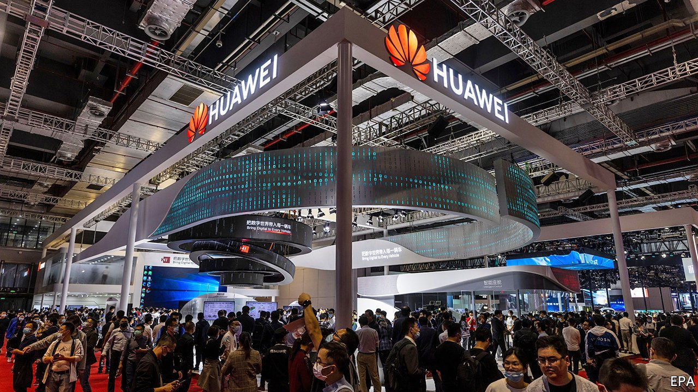

###### The non-motor show

# Huawei and other non-carmakers invade Auto Shanghai 

##### The live trade show is back—with a new guest list 

 

> Apr 22nd 2021 

PETROLHEADS DESCENDED on China’s largest exhibition complex on April 21st for the opening of Auto Shanghai, the first big global car show since the start of the pandemic. Dozens of typical exhibitors, from Cadillac to Kia, flaunted their latest models to China’s burgeoning consumer class. Yet the most popular booths, as judged by foot traffic, belonged to a clutch of Chinese companies with little carmaking experience: Huawei, a telecoms giant; DJI, the world’s biggest drone-maker; and Evergrande, a property developer.

The newcomers aim to capitalise on . Last year 1.3m of them were sold in the country, accounting for two-fifths of the global total, estimates Canalys, a research firm. As part of its anti-pollution drive, China’s government wants every other new car sold to be an EV by 2035.


Tech firms like Huawei and DJI are betting that future EVs will compete not so much on the “eye appeal” of their hardware as on the sophistication of their software. Fully autonomous vehicles, able to understand their surroundings, are the ultimate (if distant) goal. Conveniently, both Huawei and DJI have developed advanced laser-based detection systems which, they reason, could easily be applied to passenger cars. China’s most popular search engine, Baidu, another star turn, unveiled its own radar self-driving technology.

Some of the firms are joining forces with conventional carmakers to get to market quickly—important in an industry where first-mover advantage matters, as Tesla has shown. Huawei is teaming up with Beijing-based BAIC Group to roll out its new luxury EV. Baidu recently entered into a “strategic partnership” with Geely, which owns Volvo among other brands, to mass-produce “intelligent” EVs (which are short of full autonomy).

Other newcomers prefer to do things in-house. Evergrande is building its own EV factories. It aims, ambitiously, to compete with Mercedes-Benz, BMW, Audi and Tesla, says Dai Lei, an executive at the company. Xiaomi, a purveyor of smartphones that has given the Shanghai jamboree a miss, pledged last month to invest $10bn over ten years in its new EV business. Xiaomi gamely insists it has “distinct and unique advantages in manufacturing cars”, despite having no history of making them (and its planned investment being a fraction of what carmakers familiar with producing at scale, like Volkswagen, are ploughing into EVs).

Proponents of do-it-yourself argue they can recoup initial outlays on new factories down the line by not having to share revenues with partners. They add that the incentives of established carmakers are not aligned with those of the newcomers; Geely’s own EV marque, called Zeekr, is on display at Auto Shanghai not far from Baidu’s booth. For all the talk about “win-win co-operation”, rivalry is likely to intensify.

As the two approaches evolve, one thing looks certain: lots of wannabe EV-makers will struggle. Even if Auto Shanghai returns in future years, unlike many Western car shows killed off by the pandemic, plenty of the current edition’s budding exhibitors will not. ■

A version of this article was published online on April 21st, 2021.

