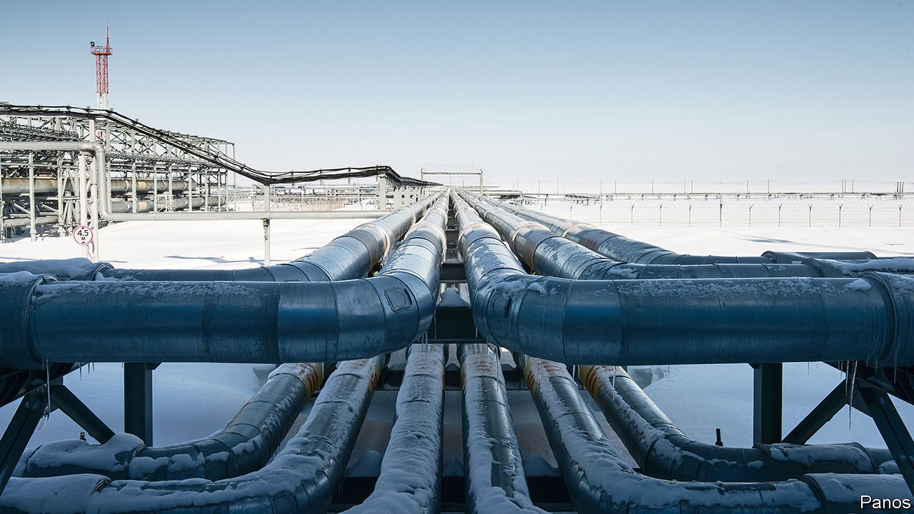
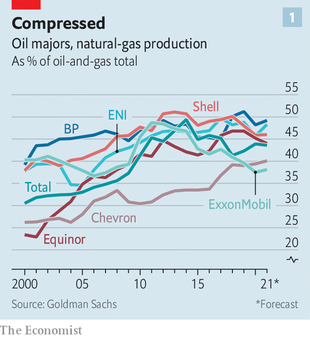
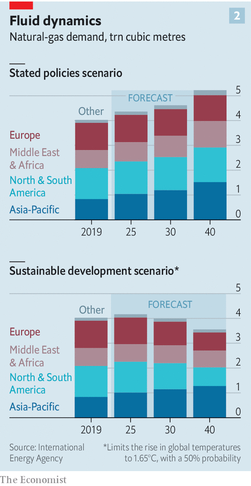

###### The energy transition

# Oil supermajors’ mega-bet on natural gas 

##### Is the least grubby hydrocarbon a bridge fuel to a greener future, or a trap? 

 

> Apr 22nd 2021 

ENERGY COMPANIES have no seat at the climate high table convened by President Joe Biden on April 22nd and 23rd, to which he has invited 40 other world leaders to discuss how to speed up the shift from dirty energy. From the sidelines, coal firms will scowl at efforts to curb demand in Asia and oil drillers will wince at support for electric cars. Watching particularly closely will be those companies which have bet big on natural gas.  gathers momentum, no fuel’s future is hazier than that of the least grubby hydrocarbon.

Proponents see gas as the “bridge fuel” to a greener world. They include the five largest international oil firms: ExxonMobil, Chevron, Royal Dutch Shell, Total and BP.  saw gas rise from 39% of their combined hydrocarbon output in 2007 to 44% in 2019 (see chart 1). That year producers approved a record level of liquefied natural gas (LNG) capacity. Those projects will come online in a few years. Shell, which in 2016 paid $53bn for BG, a British gas group, now says its oil production peaked in 2019, but that it will expand its gas business with annual investments of about $4bn. Total expects its crude output to sink over the next decade, but for gas to rise from 40% to 50% of sales. In February Qatar Petroleum, a state-owned giant, said it would begin the largest LNG project in history.


Yet debate is intensifying over whether gas will be a bridge or a dead end. Mr Biden and his counterparts elsewhere appear to be serious about achieving net-zero emissions by 2050. That would require accelerating the phase-out of all fossil fuels, gas included, unless paired with technology to capture and store emissions. Inexpensive wind and solar power already threaten gas-fired electricity, particularly in America and Europe. Even as demand looks uncertain, cheap gas from state-owned firms such as Qatar’s will add to global supply. Some companies’ bets will go bad.

 


On the demand side, gas remains a sensible gamble in some ways. A gas-fired power plant belches about half the emissions of a coal-fired one per unit of energy. The fuel benefits from diverse sources of demand, too. In addition to producing electricity, gas is used to make fertiliser and generate heat for buildings and industry. Unlike exhaust from a car, emissions from a factory can theoretically be captured and stored below ground. Gas can also be used to generate hydrogen, which may in turn serve as a form of long-term energy storage.

However, companies’ investments have not always gone as planned. A rush for gas between 2008 and 2014 was part of a broader stampede by energy giants, as higher energy prices spurred investments with little regard for costs, explains Michele Della Vigna of Goldman Sachs, an investment bank. In 2019 Chevron said it would write down as much as $11bn, largely owing to underperforming shale-gas assets in Appalachia. Gas comprised the bulk of the $15bn-22bn of impairments announced by Shell last June. In November ExxonMobil said it would write down the value of its gas portfolio by $17bn-20bn, its biggest impairment ever. Its $41bn purchase in 2010 of XTO Energy, a shale-gas company, may be the worst-timed investment made by an oil major in the past 20 years.

Two big questions now hang over future demand, each difficult to answer with any certainty. The first is how fast governments limit carbon emissions. The extraction, liquefaction and transport of gas produce their own emissions, on top of those from its eventual combustion. Gas production also releases methane, a greenhouse gas that is about 80 times more potent than carbon dioxide over a 20-year period. Adding methane leaks from fracking or pipelines, the Natural Resources Defence Council, an environmental group, calculates that American LNG exports in the next decade may produce greenhouse gases equivalent to the annual emissions of about 45m new cars—not counting burning the stuff for energy.

Responding to climate concerns, the Netherlands and some Californian cities have banned gas in new buildings. Britain will do so from 2025. “To put it mildly,” Werner Hoyer, president of the European Investment Bank, declared in January, “gas is over.” John Kerry, Mr Biden’s climate envoy, warned in January that natural-gas assets risked becoming stranded. The International Energy Agency, an intergovernmental group, reckons that demand growth will slow to about 1.2% a year until 2040, from an average of 2.2% in 2010-19. If governments move more aggressively to restrain temperatures, demand could be lower in 2040 than it was in 2019 (see chart 2). BP offers a more bearish scenario: if the world were to reach net-zero emissions by 2050, gas demand would peak within the next few years and nearly halve by mid-century. “For the business to survive,” argues Massimo Di Odoardo of Wood Mackenzie, an energy consultancy, “it’s not just about marketing gas. It’s about marketing gas and managing emissions.”

 


The second question with respect to demand is how quickly rival technologies advance. Already, about two-thirds of the world’s population lives in places where power from new wind and solar farms is cheaper than from new gas plants, according to BloombergNEF, a data provider. Electric heat pumps threaten gas in buildings. In future, gas with carbon capture and storage (CCS) may prove pricier than hydrogen generated by renewable electricity. Mr Biden’s proposed $2trn infrastructure bill includes support for CCS, but also for things that may challenge gas’s role in industry, power and heating. The European Union aspires to make its members leaders in hydrogen, hoping it could one day replace gas in many applications while using existing pipelines and other infrastructure.

Then there is the matter of supply. Maarten Wetselaar, Shell’s gas chief, says the industry used to expect the market to be undersupplied and the price set by the marginal buyer. Instead, the world has plenty of gas courtesy of American shale, he notes. On top of that, private firms must compete with state ones in Qatar and Russia, which can extract gas cheaply and have a political imperative to monetise reserves while they can. Qatar’s new project will raise its LNG capacity by 40% by 2026. And a growing spot market and shaky demand have made LNG buyers less interested in traditional long-term contracts. At least a quarter of LNG supply is now uncontracted, estimates Mr Di Odoardo. As approved projects come online, the share of uncontracted LNG may exceed 50% by 2030.

All this is prompting some in the industry to rethink their embrace of gas. Last July Dominion Energy, an American utility, cancelled plans for a controversial pipeline and sold its entire pipeline business to Berkshire Hathaway, a huge conglomerate, for $9.7bn. In November Engie, a French energy company, scrapped plans to sign an LNG contract with NextDecade, an American firm, over concerns about shale emissions. Other firms are trying to adapt to a gas business that looks set to grow both more competitive and more complex.

Big players are now applying a higher cost of capital to their hydrocarbon investments, with a greater focus on profitability, notes Mr Della Vigna. Scale is turning to their advantage, too.

Shell’s share of gas production actually fell in recent years, as it sold off less profitable gas assets in America and Nigeria. Mr Wetselaar maintains that Shell is well positioned to deal with the market’s new realities. Unlike smaller players, which depend on long-term supply contracts to attract financing for new projects, Shell can use its balance-sheet. Trading capabilities make it easier to sell LNG to diverse buyers. For those who want zero-emissions energy, Shell has already sold ten “carbon neutral” LNG cargoes, paired with offsets. Total plans to double its LNG sales over the coming decade, while touting its plans to reduce methane emissions. ExxonMobil reckons that its  will both limit emissions and support its traditional business.

Such plans are unlikely to sway those who want investment in all fossil fuels to plunge. Companies’ plans can be disrupted by any number of forces—in March an attack in Mozambique prompted Total to suspend a giant LNG project there. The changing market means only the safest, most profitable projects backed by the strongest firms are likely to move forward.

NextDecade, having failed to secure Engie as a client, has delayed a final investment decision on a proposed facility in Texas and scrapped another. It had sought to build an LNG import terminal in Ireland but in January Irish officials let a preliminary agreement with NextDecade expire. Gas may not quite be over. But the industry could soon be defined not by the projects that advance but those that don’t. ■

For more coverage of climate change, register for The Climate Issue, our fortnightly , or visit our 


