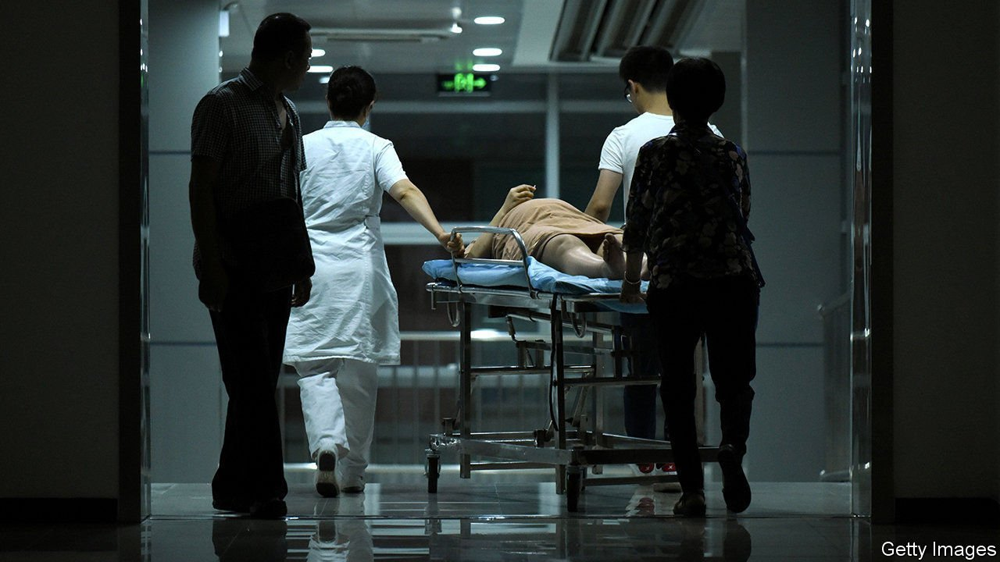

###### Do no harm

# Violence against doctors in China is commonplace 

##### Paying medics poorly means they often overprescribe, causing patient anger 

 

> Apr 24th 2021 

PATIENTS IN CHINA keep attacking their doctors. On January 27th Hu Shuyun, a physician in the southern province of Jiangxi, died after being assaulted on a ward. A few days earlier three medical workers at a hospital in Hangzhou, an eastern city, were injured when a patient set off a homemade bomb. Every month brings more shocking stories. Chinese even has a word for it: yinao, meaning “medical disturbance”. Between 2004 and 2016, the number of such disputes that ended up in court rose from 8,854 to 21,480. But only a fraction of cases get that far. In 2016 the National Health and Family Planning Commission acknowledged that it had mediated more than 60,000 disputes.

The problem of yinao has become so acute that, on March 1st, Shanghai became the first city to start a blacklist of people deemed to have engaged in banned behaviour in medical facilities. As well as facing criminal penalties, they can be barred from holding public-sector jobs and denied access to outpatient services under the social-credit system, in which bad behaviour can mean loss of rights and privileges.


These measures build on a national law that came into effect last June. It is the first to specify that citizens have a right to “basic health-care services” provided by the state. It also bans them from attacking medical staff. In July Beijing’s city government adopted its own guidelines for hospital security, recommending checks at entrances and surveillance cameras inside. On April 15th Beijing’s health commission said that 86 hospitals had installed facial-recognition systems.

China’s doctors have long worried about violence. In 2015 600,000 physicians signed a petition calling for an end to such assaults. A survey in 2019 found that 85% of doctors had encountered violence at work. Officials have hailed medical staff as heroes during the covid-19 pandemic, but at the height of the outbreak last year there were several reports of patients with the disease assaulting doctors.

Much of the anger originates in the 1980s, when reform began on the free, state-funded health-care system. Hospitals, starved of government funds, began charging patients for treatment, and often resorted to overprescribing. Many ordinary people were unable to pay. This has created a “generalised sense of distrust” towards the medical profession, says Cheris Chan of the University of Hong Kong.

Even though the government initiated further reforms in 2009, under which nearly everyone is now covered by some form of basic health insurance, the quality of care in rural areas is still poor. So people go straight to large city hospitals, many of which sell tickets for consultations that touts buy up and resell for profit.

Fully 36% of spending on health care in China comes from patients, compared with 14% in the OECD, a club mostly of rich countries. The insurance system gives hospitals an incentive to treat out-of-province patients, since they must pay upfront. And China still has only two doctors per 1,000 people, compared with 3.5 on average across the OECD. Most are poorly paid.

Medical scandals further undermine confidence. A well-known case in 2018 involved hundreds of thousands of children receiving faulty vaccines after the manufacturer fabricated inspection records. In February this year 70 people were arrested for making fake covid-19 vaccines.

Tougher regulations to protect doctors from angry patients do not seem to be working. Since the new laws were introduced in Beijing more than 180,000 prohibited items such as knives have been seized at hospital entrances. With covid-19 under control, people are going back to hospitals. This could cause violence to rise again. Until the government deals with underpaid doctors and overstretched hospitals, it is likely to continue.■

