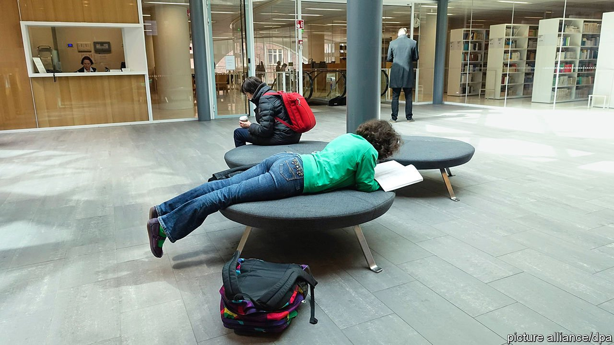

###### Mind the gap year

# Too many well-educated Finns are missing out on university 

##### But there’s a plan 

 

> Apr 24th 2021 

YOUNG PEOPLE in Finland enjoy one of the world’s best school systems. By the age of 15 they perform well above average in international tests of science, reading and maths. That makes it all the more galling that once they leave school, their progress often comes to a halt. In America 90% of those who begin bachelor’s degrees do so in the same year they finish school. In Finland only 20% do.

Highly selective admissions are one explanation. Universities have traditionally made applicants pass long-winded entrance exams, in addition to tests they take at school. Excelling at both in the same year is difficult: school-leavers commonly perform worse than applicants who are a few years older and have had more time to prepare. The exams also discourage candidates from applying to more than one or two institutions. Because they have few back-up options, talented candidates who miss out on spots at the most prestigious universities often end up with no place at all.


The result is that lots of Finland’s smartest cookies end up taking at least one and sometimes several unplanned gap years. Many find that a pain. It is also bad for the economy. Finland’s population is among the fastest-ageing in Europe, says Tuomas Pekkarinen of the VATT Institute for Economic Research, a government agency; it cannot afford to let ambitious youngsters tread water. While they wait at tables or stack shelves, one in five jobs in Finland is filled by someone with lower-than-ideal skills.

The government is trying to shake things up. Changes that came into full force last year require universities to accept at least half of applicants solely on the basis of their scores in school. Many candidates still sit entrance tests, but the idea is that universities should no longer require them to do much swotting in advance. Mr Pekkarinen says that disruption caused by the pandemic has made it difficult to measure the results, but that early signs suggest the reforms are helping to bring down the age at which most students start their studies.

Making admissions more efficient will help the government wring more benefit from the cash it is stumping up to expand the number of spots on offer. The share of young Finns with a degree has not budged much for a decade. At 42% it is below the rich-country average. The government wants to hit 50% by 2030. Last year it funded about 4,000 more places to help youngsters put out by the pandemic. Perhaps one day Finland’s school-leavers will come to miss all the time they used to get off.

