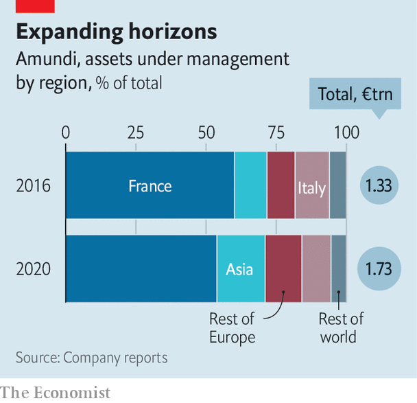

###### Alpha plus

# Has Europe’s BlackRock outgrown its pond? 

##### Amundi is betting on China and technology to shore up income 

 

> Apr 24th 2021 

THE PRACTICE of elevating a company’s chief executive to chairman has come to be frowned upon, if only because a new boss often struggles to break free if her predecessor is looking over her shoulder. Not so at Amundi, Europe’s biggest money manager. In May Yves Perrier, its CEO since 2010, will move upstairs and Valérie Baudson, his current deputy, takes the helm as chief executive. Shareholders have reacted to the news rather well: Amundi’s share price has risen by 11% since it was announced in February.

That shows how much they value continuity at the firm. Under Mr Perrier Amundi’s assets under management and net income more than doubled, to €1.7trn ($2.1trn) and €962bn by the end of 2020. Its market capitalisation has swollen from €7.5bn in 2015, when it went public, to around €15bn. The firm is still a cut below America’s titans: BlackRock, for instance, manages about $9trn in assets. Yet Amundi is nearly twice as big as its closest continental rival, and the only European firm in the global top ten. The question for Ms Baudson is whether the firm has much more room to grow.


Three factors have underpinned Amundi’s rise since it came into being in 2010, a result of the merger of the asset-management arms of Crédit Agricole and Société Générale, two French banks. One is the €650bn in assets it took over from its parents, which gave it the scale to spread out costs and pocket recurrent income. Cleverly, it signed quasi-exclusive distribution contracts with the banks, ensuring its role as the main manufacturer of investment products for their institutional clients, and that revenue would remain stable.

Amundi then used its excess cash to acquire rivals, including the asset-management arms of UniCredit, an Italian bank, in 2016, and of Banco Sabadell, a Spanish lender, in 2020. Whereas the portfolios it inherited gave it a foothold in retail investment, where margins are higher, these deals allowed it to expand its distribution network further. Amundi made integrating those units smoother by developing its own data- and portfolio-management platform, rather than relying on suppliers—its third smart choice and one that BlackRock has made too. That has curbed operating costs: at 51% of income, they are among the lowest in Europe.

Ms Baudson can expect a benign few months. Unable to spend much during lockdowns, households have stashed record amounts at banks, some of which should flow to money managers. Yet beyond the short-term bump, being “the biggest, most efficient manufacturing machine” may not suffice, says Haley Tam of Credit Suisse, a bank. Unlike BlackRock, Amundi cannot tap a vast domestic market, and its routes to growth are narrowing.

Some woes are common across the industry. Margins are being crushed. The shift to low-cost “passive” funds, which track an index, is accelerating in Europe and dragging managers’ average fees down. Competition is fierce. And lower interest rates (and therefore returns) are making active managers’ hefty fees more conspicuous precisely when regulators are demanding more transparent disclosure on costs and charges.

Other concerns are specific to Amundi. Some of the contracts that it so cleverly signed with banks will soon expire. History suggests they are usually renewed, but on worse terms for the manager, says Mike Werner of UBS, another bank. And, in an attempt to seek extra returns for its clients, Amundi wants to grow its alternative-investment franchise. But it faces stiff competition from specialists. And its scale is a problem. The firm is too big for this comparatively tiny business to make much of a difference to the top line.

Mr Perrier is unfazed by all this. Amundi has room to expand, he argues. Over half its assets still come from France (see chart). The firm already has a foothold in fast-growing markets, such as India, where it has a joint venture with the country’s largest bank, and China, where it has a tie-up with AgBank and Bank of China, two big lenders. It is targeting €500bn in Asian assets by 2025, up from nearly €300bn today. “The idea that in the next five to seven years China becomes as important as France is not stupid,” Mr Perrier says.

 


Even in Europe, organic growth is possible. The shift from defined-benefit to defined-contribution pension schemes, which give savers more discretion over how they invest, should boost retail investment, says Tom Mills of Jefferies, an investment bank. The huge interest in environmental, social and governance products also helps: last year these accounted for around 70% of Amundi’s net inflows.

Amundi also has about €1.2bn of excess capital available for acquisitions. The firm is in talks to buy Lyxor, Europe’s third-largest provider of exchange-traded funds (ETFs), from Société Générale for €825m. A merger would make Amundi the second-biggest provider of ETFs (after BlackRock).

The firm is venturing out into new activities, too. Last year it set up a division to license its suite of software to smaller managers, putting it in competition with BlackRock (analysts expect Amundi to price its services more cheaply). It aims to increase such sales sixfold by 2025, to €150m. That would give the share price a leg up: Mr Perrier notes that such businesses are typically valued at 20-22 times earnings, compared with 13-14 times for the whole group.

Done well, all this could sustain rapid growth. It helps that Ms Baudson brings experience of the fastest-growing parts of the business, notably the ETF unit, which she currently runs. She has relatively little experience of executing acquisitions. But if she needs advice, the consummate dealmaker will be just a flight of stairs away. ■

