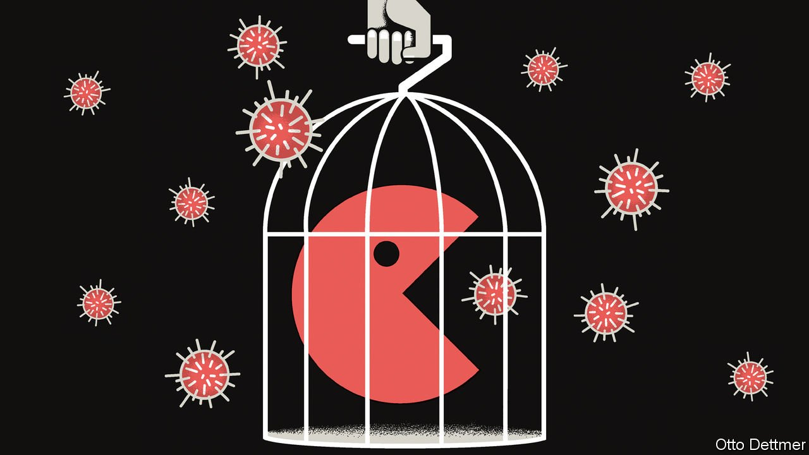

###### Free exchange

# How to think about vaccines and patents in a pandemic 

##### Do public-health crises call for a departure from the rules? 

 

> Apr 22nd 2021 

WITH ANY luck, the world will be awash in covid-19 vaccines by the end of the year. For now, though, it is not, and of the billion or so doses that have been produced the vast majority have been administered in richer countries. Deaths, by contrast, are increasingly concentrated in poorer ones, like India, where only about nine in every 100 people have been jabbed, compared with 64 in America. Some governments are floating radical options to remedy the mismatch. India and South Africa, for instance, propose that members of the World Trade Organisation waive intellectual-property (IP) protections for covid-fighting technologies, including vaccines. Some in the rich world are warming to the idea; in America, ten Democratic senators recently urged President Joe Biden to back it. Drugmakers, however, warn that it would deal a crippling blow to innovation. Even though IP protections are not a big constraint on vaccine production today, the experience of covid-19 suggests that a re-examination of IP rights in the context of health emergencies is overdue.

The economic argument for IP protections seems compelling enough. Innovation is costly and risky. Pharmaceutical companies invest heavily in drug development with no guarantee of success. If other firms could freely copy a newly discovered treatment, then its price would quickly fall to the marginal cost of production, leaving the innovator unable to cover the costs of development. A short-term monopoly on production granted to innovating firms is needed to make the upfront investments economically worthwhile. Patents provide this protection.


IP protections do not always work in quite this way, however. Studies routinely find little or no evidence that strengthening them boosts subsequent innovation, argue Michele Boldrin and David Levine of Washington University in St Louis; pharmaceuticals, where IP rights are often assumed to be essential, are no exception. Patents award rich profits to firms even though private investment accounts for only about a third of spending on American biomedical research, they estimate. Other rewards to innovation, such as financial prizes, could yield more breakthrough drugs at lower cost. Yet for now, IP protections are crucial to the businesses of most of the firms developing covid-19 vaccines.

Should some of these be waived in a pandemic that continues to claim more than 10,000 lives a day? Advocates argue that the pandemic is clearly an extreme event that warrants an exemption from IP laws. The rapid creation and production of so many covid-19 vaccines is a testament to the long years of private investment in the associated technologies and the urgency with which experts at biotech firms moved when the pandemic began. But there is no ignoring the vast public resources that made these efforts possible, from support for basic research to piles of government cash. Nor would a waiver endanger pharma firms’ viability. Pfizer would still be highly profitable even if you excluded its expected vaccine-related profits of $4bn in 2021.

Yet industry interests are right to say that liberating vaccine IP would not unleash a flood of new production. Most of the world’s vaccine-making capacity is already in use, in some cases because developers signed licensing agreements with other manufacturers. AstraZeneca, for instance, struck just such a deal with the , the world’s largest vaccine-maker. Other constraints on production have bound more tightly than IP rules, including the limited availability of raw materials and expertise needed to safely produce doses. Some of those have been imposed by governments themselves, through export restrictions that interfere with supply chains.

Moreover, the biggest obstacle to expanding capacity is not IP protections, but proprietary resources and other know-how, which are not shielded by patents. Many poorer countries face no patent barriers to using the mRNA technologies employed by Pfizer and Moderna; the obstacle is instead a lack of familiarity with new techniques. Similarly, would-be producers of adenovirus-type vaccines, such as that developed by AstraZeneca, lack access to the specially developed cell lines needed to create them.

A patently bad idea

This state of affairs illustrates deficiencies in how both drugmakers and governments have handled the vaccine effort. Firms have been reluctant to share cell lines, data and tacit know-how with producers that could one day pose a competitive threat, slowing the creation of new, and life-saving, production capacity. In some cases trade rules permit governments to grant compulsory licences—the right to use a patented invention without the inventor’s consent, for a price. But such licences are of no use if developers do not also share the other information and resources needed to produce doses. An initiative to aid such sharing set up by the World Health Organisation, for instance, has been all but ignored by the industry.

Yet the experience of the past year also suggests how governments might do better when they next negotiate contracts, say for vaccines to counter new variants. Having invested so much in development, they neglected to include measures in contracts to compel drugmakers to share the information other manufacturers need to quickly produce vast amounts of vaccines. Nor have they sought to press firms to transfer the technology needed to expand manufacturing. In the meantime, governments could do more to rethink the ground rules for technology transfer and the sharing of intellectual property, so as to be prepared for the next pandemic. Costly errors were made, their toll measured in lives. But they need not be repeated. ■

Dig deeper

All our stories relating to the pandemic and the vaccines can be found on our . You can also listen to , our new podcast on the race between injections and infections, and find trackers showing ,  and the virus’s spread across  and .

