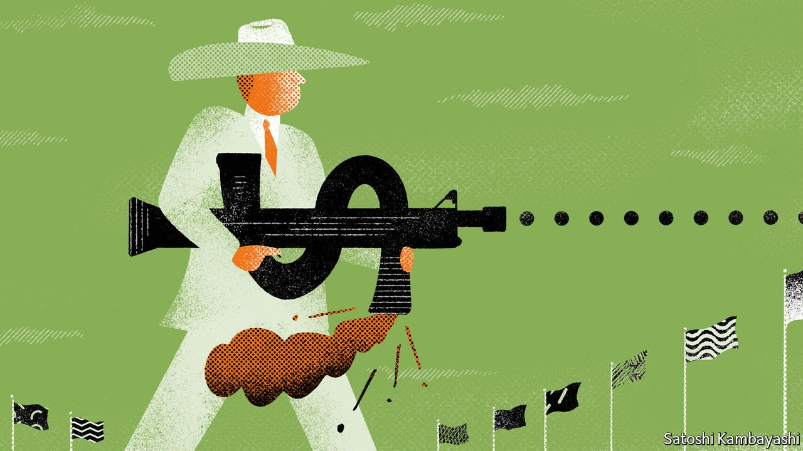
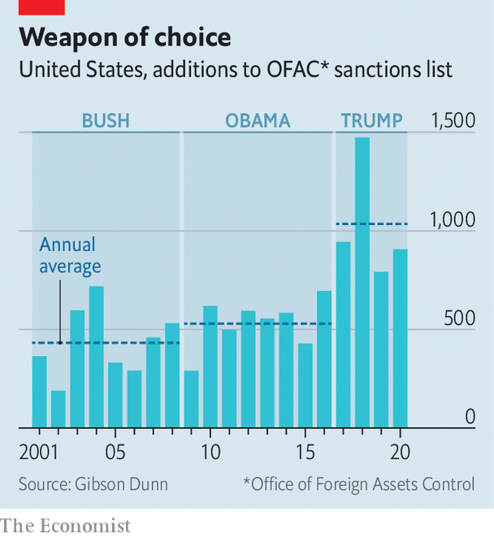
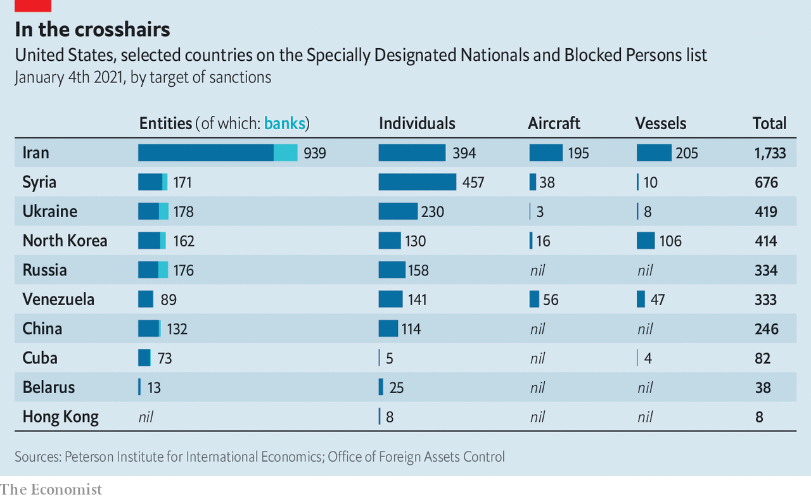

###### Handle with care

# Sanctions are now a central tool of governments’ foreign policy 

##### The more they are used, however, the less effective they become 

 

> Apr 22nd 2021 

IN 2016 JACK LEW, America’s then treasury secretary, reflected on how his country had, over decades, “refined our capacity to apply sanctions effectively”. But he also gave a warning: overuse “could undermine our leadership position within the global economy, and the effectiveness of our sanctions themselves”.

If the message was “proceed with caution”, it was lost on Donald Trump, who became president soon after.The screw was turned against , , ,  and others. The steady increase in sanctions “proved to be a rare constant” on Mr Trump’s watch, says Adam Smith of Gibson Dunn, a law firm. During Mr Trump’s four-year term, the Office of Foreign Assets Control (OFAC), which oversees American sanctions programmes, targeted roughly twice as many entities and individuals a year as it had during the two-term presidencies of George W. Bush and Barack Obama (see chart).


Those who thought Joe Biden would sound a retreat were quickly set straight. True, his administration, hoping to revive a nuclear deal with Iran struck by Mr Obama but abandoned by Mr Trump, is talking to the Islamic Republic about easing his predecessor’s “maximum pressure” sanctions. However, his first few months in office have also seen a host of new sanctions.

 


On April 15th America announced  for election-meddling, cyber-attacks and more. A month earlier America and Western allies had imposed asset freezes and travel bans on several Chinese officials for their role in human-rights abuses in Xinjiang. Since Mr Biden took office America has also sanctioned officials deemed to have undermined Hong Kong’s autonomy; announced curbs on China’s access to American technology for supercomputers; and targeted companies linked to the junta behind Myanmar’s coup.

Such measures show how sanctions have become a central tool of foreign policy. Governments increasingly see them as a way to try to change other states’ behaviour in situations where diplomacy alone is insufficient, but military intervention is seen as too risky or heavy-handed.


As the use of sanctions has grown, so has their variety. What was once a smattering of trade embargoes has become a global mesh of coercive tools, some covering countries or whole economic sectors, others single firms or individuals. Mr Trump’s targets included Huawei, a Chinese 5G-network provider, and TikTok, a video app; Mr Biden’s sanctions cover a Russian troll farm and a Pakistan-based firm that allegedly creates fake IDs used by trolls.

Mr Biden is likely to make use of America’s Magnitsky Act (named after a lawyer who died in a Russian prison) to move against foreign officials accused of corruption or serious human-rights abuses. Western countries—including Britain as it looks to forge a post-EU sanctions policy—are increasingly adopting “thematic, values-based policies” that target such miscreants, says Emil Dall of the Royal United Services Institute (RUSI), a think-tank.

This sophistication is partly a matter of necessity. Targets were once mostly economic small fry, such as Cuba and North Korea; now they include much bigger fish, such as China and Russia. As targets have grown, so has the potential for collateral damage. A blanket embargo on China for locking up Uyghurs, say, could produce intolerable economic blowback.

Large targets, however, also feel more emboldened to hit back.  with counter-measures against European politicians, diplomats and a think-tank. Its growing economic clout means it can wound when it retaliates. It may also, over the longer term, have a corrosive effect on sanctions: the more the large targets respond by seeking to reduce their reliance on American finance and technology, the weaker America’s global economic leverage becomes—and the less potent sanctions’ impact.

The first recorded use of sanctions was in 432BC, when the Athenian Empire banned traders from Megara from its marketplaces, thereby strangling the rival city-state’s economy. However, “not until the 20th century did modern concepts of international sanctions—a collective denial of economic access designed to enforce global order—become prominent,” writes Benjamin Coates, a historian, in an essay published last year.

The League of Nations led in forging multilateral sanctions in the early 20th century. The UN later did the same against obnoxious regimes from white-supremacist Rhodesia to Saddam Hussein’s Iraq. America, for its part, stepped up its unilateral sanctions after the second world war. OFAC was created in 1950, a decade after a forerunner had been set up to freeze the US assets of the Danish and Norwegian governments, in order to stop the Nazis seizing them. During the cold war, Congress gave the president new powers to impose sanctions. Cuba was a favourite target.

 


Use intensified in the 1990s, with America targeting Iran as it flirted with nuclear-bomb-making. But the most dramatic shift in America’s approach followed the 9/11 terror attacks in 2001. The Patriot Act, passed soon after, targeted terrorist coffers. Thus began an era of more carefully tailored, or “smart”, sanctions that sought to hamstring terrorists, dictators and others by restricting their access to American-owned or influenced financial plumbing (an example of the latter being the SWIFT interbank network). This change of tack “made sanctions so much more powerful than they were before”, says Mr Coates.

Double-edged swords

Another inflection point came around 2010, as America upped its use of “secondary sanctions”, which target not only the perceived bad guys but also threaten anyone doing business with them with financial excommunication. Their power was most apparent in Iran: European firms saw golden opportunities there after the 2015 nuclear deal but backed away in droves after Mr Trump reimposed sanctions, and added secondary ones, in 2018.

American policy has undergone two further shifts over the past decade. The first, sparked by Russia’s annexation of Crimea in 2014, was to go after bigger fish. America and other Western powers unveiled sanctions against dozens of Russian agencies, companies and members of Mr Putin’s circle. In doing so they were taking on an economy more than twice the size of any other previously targeted with such comprehensive sanctions.

The second shift was Mr Trump’s splattergun approach. So varied were his targets and so devoid of diplomacy his manner (he once threatened to “obliterate” the economy of Turkey, a NATO ally, during a spat over Syria) that sanctions wonks were left wondering if there was any method in the madness. But his administration undeniably displayed creativity. “What Trump came upon were nuances in ways to target big players like Russia and China, with sanctions that were not quite sanctions,” says a former OFAC official. His restrictions on Chinese tech and telecoms firms, for instance, hit their ability to design chips, source components or operate effectively in many Western countries.

They also greatly added to the stress on banks and companies that have to comply with sanctions. Unlike conventional sanctions, which work by freezing trade, the financial sort “turn private actors into enforcers”, says Mr Coates. The cost of steering clear of blacklisted people and entities has risen relentlessly, especially for banks. An executive at one global bank says that after being caught and fined for breaching American sanctions, it has spent “a couple of billion” dollars on hiring more compliance people and installing better screening technology to avoid a repeat.

A big outlay, to be sure, but falling foul of OFAC can cost even more. Until around a decade ago, sanctions enforcement was a technocratic backwater. Today penalties can run into the billions, with operating restrictions often tacked on to increase the pain. In 2014 BNP Paribas, a French bank, pleaded guilty to processing thousands of transactions involving countries blacklisted by America, paid an $8.9bn fine and was forced to suspend its dollar-clearing operations in New York for a year.

The cost would be easier to bear if sanctions usually achieved their aims. Measuring success is difficult; even American government departments involved in sanctions don’t carry out their own assessments. But it is clear that many fail. The maximum-pressure measures against Iran have neither dislodged its theocratic regime nor halted its nuclear ambitions; the country has more enriched uranium now than when Mr Trump took office.

Moreover, sanctions provoke counter-measures. The most direct way is for the target country to issue counter-sanctions. An alternative is to use legal mechanisms to negate sanctions. “Blocking statutes” aim to shield domestic companies by prohibiting them from complying with another country’s sanctions. The EU’s statute dates back to the 1990s, and was strengthened after Mr Trump pulled out of the Iran accord. It has sparked litigation in Britain, Germany and the Netherlands, and several cases are before the European Court of Justice (ECJ). In Britain, Metro Bank is being sued by a group of Iranian clients who argue that the bank’s closure of their accounts without warning—after Metro found it had breached American sanctions—violated the blocking statute. The outcomes will have big implications for European firms operating in Iran, or wishing to, but caught between competing sanctions regimes. China issued a blocking statute in January (based on Europe’s), but is yet to flesh out the extraterritorial measures to which it applies.

The use of courts to challenge sanctions goes beyond blocking statutes. Maya Lester, a London-based barrister, has worked on several cases on the impact of sanctions on commercial contracts, and many more involving individuals and entities—including Iranian banks—suing to be removed from blacklists. Several have succeeded. There are legal challenges in America, too. Last year a court halted Mr Trump’s attempted blacklisting of TikTok. In March a federal judge suspended a similar ban on Xiaomi, a smartphone-maker.

The biggest long-term threat to sanctions’ effectiveness involves efforts by targets to circumvent them. A time-honoured way to do this is to trade through sanctions-busters: black-marketeers using shell companies, fake trade paperwork and other dark arts. Turkey and Dubai—particularly the latter’s trading houses and free-trade zones—have been weak links in enforcing Western sanctions on Iran.

More important, countries targeted by sanctions, and those that want to trade with them, are exploring ways to decouple economically from those that impose them, particularly America. China has responded to American technology bans by scaling up plans to invest in producing chips at home. It is also trying to reduce its reliance on the dollar and American banks by, for instance, making the yuan more appealing in international finance.

Digitisation might help it do so. China’s central bank is a world leader in developing a digital currency, which is being tested in several cities. It “could fundamentally change how Chinese companies do business by 2022 or 2023”, says the head of one globally active bank. If successful, it may then start to be adopted in other parts of Asia and later farther afield. China would also like to loosen America’s grip on the cross-border payments infrastructure. It has its own version of SWIFT, called CIPS, which simplifies cross-border payments in yuan.

Europe, too, is seeking to strengthen its single currency’s role in global commerce. The euro is now used to settle some international oil shipments, for instance by commodities firms buying from Russia. (The oil trade has traditionally been denominated in dollars.) Russia’s capital markets have become much less reliant on foreign investors since the Crimea-linked sanctions were imposed seven years ago—one reason why its markets shrugged off America’s latest restrictions.

It would be easy to exaggerate this trend. The EU’s attempt to create a barter mechanism to help its firms get around American sanctions has failed to take off. China’s financial system is opaque and largely closed. The yuan accounts for just 2.4% of global payments, while the dollar makes up 38%. CIPS is minuscule. Still, the direction of travel is clear.

For now, the sanctions-compliance world remains fixated on policy in Washington. There are few signs of a significant let-up in the pressure applied by the Trump administration, except perhaps, with strict conditions, on Iran. That said, Mr Biden is likely to work harder than his predecessor to “pair sanctions with diplomacy”, says RUSI’s Mr Dall.

The changes in China’s approach to sanctions, however, may be more dramatic. It shows signs of becoming more assertive, including by being quicker to retaliate. It has growing leverage as a huge market for foreign firms hawking everything from consumer goods to commodities, and as financier-in-chief of America’s national debt. It may also be developing a taste for pre-emptive sanctions. A report by the Centre for a New American Security, a think-tank, counted ten such cases in 2010-18, triple the number in 1978-2000. In 2019 China announced sanctions on American arms-makers that supply Taiwan. More recently, it imposed an unofficial ban on Australian coal over Canberra’s “offensive” anti-China rhetoric.

China will also continue to try to turn Western sanctions to its advantage. They have helped it advance its interests abroad, for instance by filling the economic void left by American sanctions on Iran and Venezuela. In March China reportedly signed a $400bn, 25-year deal to invest in Iran’s energy sector and upgrade its transport and manufacturing infrastructure.

This increased muscle-flexing underlines that the world of sanctions is becoming less unipolar. China’s reach may be limited by its small role in international finance, relative to trade. But its share is growing, and it is not alone in looking for ways to reduce reliance on the greenback. A China no longer reliant on America or other outsiders for financial plumbing or critical technologies is likely to feel more emboldened to, say, attack Taiwan.

And this raises the spectre of the irreversible shift Mr Lew warned of: that a tool designed to be one of the most forceful expressions of American power instead fatally undermines its economic hegemony. The stakes could hardly be higher. ■

A version of this article was published online on April 21st, 2021.

