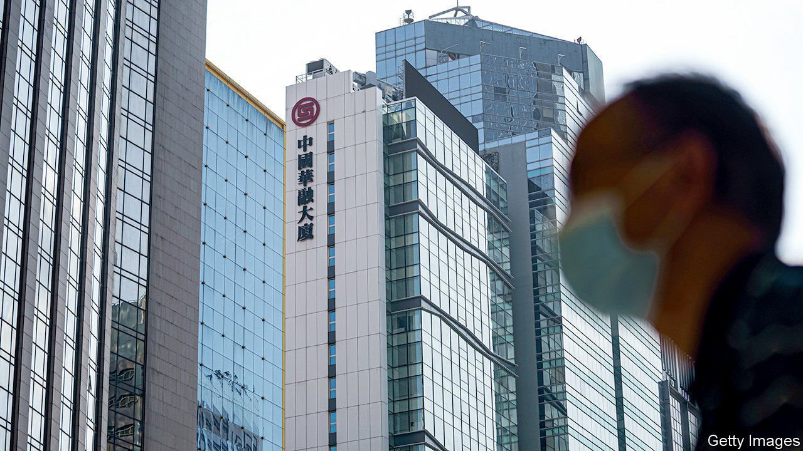

###### Huarongs and rights

# The woes of Huarong pose dilemmas for Beijing 

##### Will China bail out a giant financial octopus—or teach reckless actors a lesson? 

 

> Apr 22nd 2021 

THE EXECUTIVES of Huarong Asset Management have not been able to hide from China’s authorities. A corruption probe into the state-owned financier in April 2018 sent senior staff and business partners scattering abroad, only to be rounded up in an international dragnet. One casino tycoon with close links to Huarong was captured in Cambodia. Its former chairman, Lai Xiaomin, was put to death in January for what a Chinese court called egregious financial crimes and bigamy. Until recently the company proved much better at hiding its debt and disguising losses. Huarong, which as of June had 1.7trn yuan ($262bn) in assets, is thought to have lent with abandon to some of China’s riskiest borrowers. Three years after regulators began mucking out the mess left by its previous management, the risks are spilling into global markets.

The first sign of trouble came when the company failed to issue its financial statements for 2020 by the deadline of March 31st. It attributed the delay to a “relevant transaction” that auditors needed more time to assess. Then, Caixin, a financial publication, reported that a significant restructuring was being discussed, sending its bond prices to record lows. By mid-April its debt securities were trading at junk prices (though its state backing meant that it kept its investment-grade rating). Regulators kept mum for weeks, allowing panic to spread to other state-owned securities, before declaring on April 16th that Huarong had ample liquidity. This eased some concerns over the $22bn in offshore bonds held by global investors. On April 20th Huarong’s offshore financing unit sought to allay worries further, saying it returned to profit in the first quarter.


Yet the spectre of restructuring or default at a group in which the Ministry of Finance has nearly a 60% stake continues to rattle markets. Larry Hu of Macquarie, an investment bank, noted that  is “likely to be the beginning of a series of credit events in 2021”.

The concerns are justified. Huarong, one of four distressed-asset management companies (AMCs), is among China’s most powerful financial institutions. Created in the late 1990s to deal with 1.3trn yuan in bad debts from the country’s four largest commercial banks, the groups have thrived as  continued to produce mounds of dud credit (as of June, Huarong alone held 841bn yuan worth of distressed assets). Originally designed to be wound down as the first cache of toxic assets were worked out or liquidated, the AMCs have instead become sprawling conglomerates, both within China and in Hong Kong. Under the direction of Mr Lai, Huarong transformed into an investment bank with dozens of subsidiaries doing everything from real-estate and securities broking to insurance and high-yield cross-border lending. Many of its losses are thought to be linked with loans it made to companies that have since gone bust.

The AMC business model has been highly controversial. Instead of merely buying soured debts from commercial banks, they began borrowing at low rates from banks and then lending last-resort funds at high cost to troubled companies. A recent paper by Ben Charoenwong of the National University of Singapore and others concludes that AMCs have been in the business of concealing banks’ bad assets from regulators, and often reselling them at inflated prices to investors that borrow heavily from the same banks. This and other bad practices have led to a non-performing loan rate for commercial banks that could be two to four times higher than the officially reported 1.84% or 2.7trn yuan, at the end of 2020. What is more, China’s banks have largely recapitalised the AMCs through bond purchases, notes Andrew Collier of Orient Capital Research.

Officials are growing more comfortable with defaults at state-owned enterprises. Late last year the default of Yongcheng Coal sent a clear signal that even important regional state firms could be allowed to fail. But Huarong presents a much bigger and more systemic challenge for Beijing. The suggestion of a restructuring has already started to reshape how investors view the country’s most powerful financial institutions. Centrally controlled state firms have long been considered too big and too important to fail, and therefore seen as prime targets for investment. Any shift in that sense of security would force global investors to rethink how they invest in China.

Regulators are “walking a very fine line” between financial stability and moral hazard, says Ming Tan of S&amp;P Global, a rating agency. They must weigh the potential for great financial instability if an institution of Huarong’s size collapses, against the effects of bailing out a reckless conglomerate, along with global investors. They may have learnt, too, that bad assets, however well disguised, cannot stay hidden for ever.

A version of this article was published online on April 20th, 2021.

